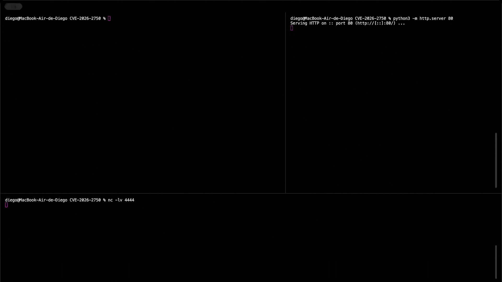

# Exploits for CVE-2026-2749, CVE-2026-2751 and CVE-2026-2750 

This repository contains exploits for CVE-2026-2749, CVE-2026-2751, and CVE-2026-2750 in Centreon, exploiting Path Traversal, SQL Injection, and Command Injection vulnerabilities.

## Vulnerable Versions

- All versions prior to 25.10

- 24.10

- 24.04

# CVE-2026-2749

**Path Traversal to RCE** — Arbitrary file write via path traversal in Open Tickets upload, leading to remote code execution.

**Usage:**

```
$ python3 CVE-2026-2749/pathtraversal_rce.py --url http://target/centreon --cookie PHPSESSID --cmd "id"
```


---

# CVE-2026-2750

**Command Injection via CLAPI generatetraps** — OS command injection via `passthru()` in CLAPI generatetraps.

**Usage:**

```
$ python3 CVE-2026-2750/cmdi_rce.py --url http://target/centreon --cookie PHPSESSID --cmd "id"
```



---

# CVE-2026-2751

**Blind SQL Injection via Array Keys** — Blind SQL injection via unsanitized array keys in Service Dependencies, allowing credential dumping.

**Usage:**

```
$ python3 CVE-2026-2751/sqli_dump.py --url http://target/centreon --cookie PHPSESSID
```


---

# Disclaimer

This tool is for educational and research purposes only. Use it only on systems you own or have explicit permission to test. The author is not responsible for any misuse or damage caused by this program.

# QuimeraX Intelligence

QuimeraX Intelligence is an advanced EASM and Cyber Threat Intelligence platform specializing in identifying critical vulnerabilities in complex systems. The platform proactively monitors, detects, and alerts clients about security threats, ensuring transparency and rapid response to potential risks. Clients receive immediate notifications and comprehensive reports if their systems are found vulnerable, enabling them to take protective action. [learn more](https://hakaisecurity.io/quimera-team/)

# Hakai Security

[Hakai Security](https://hakaisecurity.io/) is a cybersecurity company founded by security professionals, committed to technical excellence. We offer tailored security solutions including advanced penetration testing, realistic Red Team simulations, and secure development practices to proactively protect our clients' assets from evolving cyber threats.

# References 

- https://thewatch.centreon.com/latest-security-bulletins-64/cve-2026-2749-centreon-open-tickets-critical-severity-5493
- https://thewatch.centreon.com/latest-security-bulletins-64/cve-2026-2751-centreon-web-high-severity-5504
- https://thewatch.centreon.com/latest-security-bulletins-64/cve-2026-2750-centreon-web-critical-severity-5503
- https://www.cve.org/cverecord?id=CVE-2026-2749
- https://www.cve.org/cverecord?id=CVE-2026-2750
- https://www.cve.org/cverecord?id=CVE-2026-2751