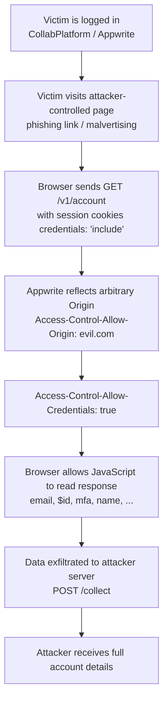

# Appwrite CORS Misconfiguration Exploit PoC  
**CVE-2026-27579** – Credentialed Account Data Leak via Permissive CORS


> **CVE-2026-27579** (GHSA-qh5m-p8jh-hx88)  
> A severe CORS misconfiguration in the Appwrite backend used by the realtime-collaboration-platform allows an attacker-controlled origin to read sensitive authenticated user data (email, user ID, MFA status, etc.) from logged-in victims via credentialed cross-origin requests.

## Affected Software

- **Project**: realtime-collaboration-platform (CollabPlatform)
- **Backend**: Appwrite Cloud with permissive CORS configuration
- **Vulnerable Component**: `/v1/account` endpoint with `Access-Control-Allow-Origin` reflection + `Access-Control-Allow-Credentials: true`
- **Impact**: Account takeover / sensitive PII leakage via phishing / malicious page visit

## Attack Flow Diagram



## Features

- Simple Flask-based malicious server
- Generates phishing page that steals authenticated Appwrite account data
- Exfiltrates data to attacker's endpoint (prints + saves to file)
- Supports custom `--lhost` and `--lport`
- Redirects victim to Google after theft (hides intent)

## Requirements

```bash
pip install flask
```

## Usage

```bash
# Basic usage
python3 exploit.py --lhost 192.168.1.100 --lport 8000

# Using domain / public IP
python3 exploit.py --lhost attacker.yourdomain.com --lport 8080

# For public exposure (recommended)
# 1. Run the script
# 2. Use ngrok: ngrok http 8000
# 3. Replace http://<lhost>:<lport> in the code with your ngrok URL
#    (or re-run with --lhost = your-ngrok-url.ngrok-free.app)
```

**Example output when running:**

```
[*] Starting malicious server → http://192.168.1.100:8000
[*] Send this link to the target:
    http://192.168.1.100:8000/
```

**Victim visits link while logged in → data appears in terminal + saved to `stolen_accounts.txt`**

## Legal & Ethical Warning

**This code is provided for educational purposes, authorized security testing, red-team exercises, and vulnerability research only.**

Unauthorized use against any system or individual without explicit written permission is illegal under most jurisdictions (computer fraud, unauthorized access, data theft, phishing laws, etc.).

Use only in environments you own or have formal permission to test.

## References

- CVE: https://nvd.nist.gov/vuln/detail/CVE-2026-27579 (placeholder – actual CVE may differ)
- GitHub Advisory: https://github.com/karnop/realtime-collaboration-platform/security/advisories/GHSA-qh5m-p8jh-hx88
- CWE-346: Origin Validation Error
- CWE-942: Permissive Cross-domain Policy with Untrusted Domains

## Author

Mohammed Idrees Banyamer  
Security Researcher  
Jordan  
Instagram: [@banyamer_security](https://instagram.com/banyamer_security)

Feel free to copy-paste this directly into your `README.md` file.

If you want to add screenshots, change the badges colors, add more sections (Demo, Mitigation, etc.), or include license badge / stars / forks counters — let me know and I can extend it.
