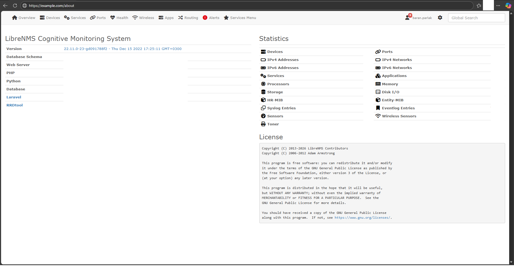
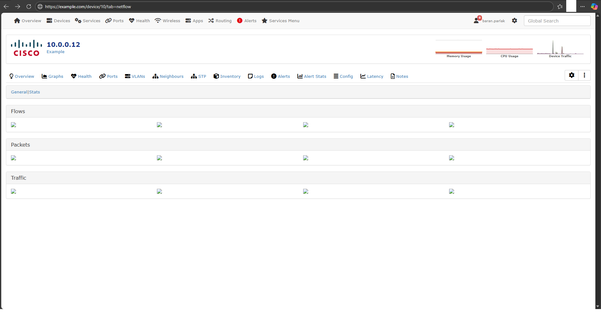
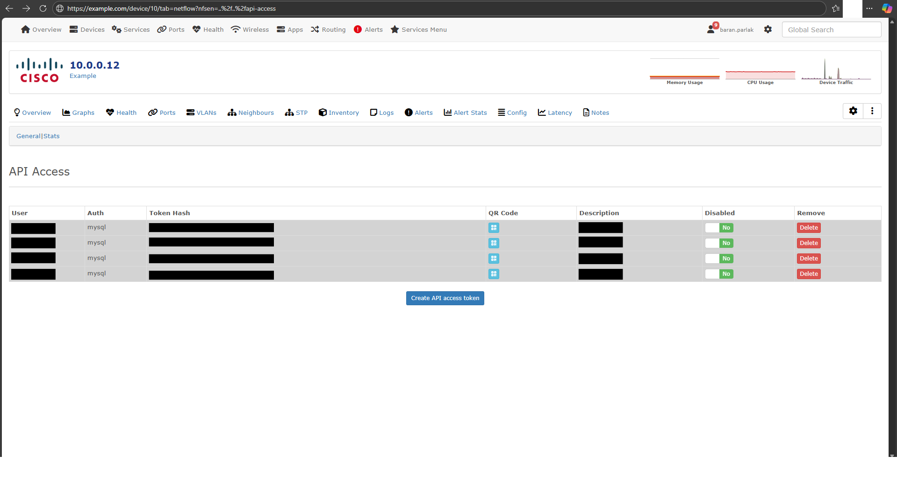
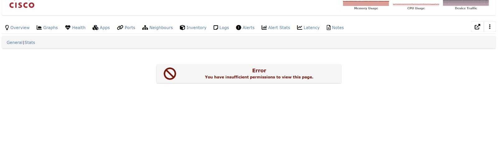

# CVE-2026-30480: LibreNMS Local File Inclusion (LFI) via Path Traversal

## Overview

A Local File Inclusion (LFI) vulnerability exists in the NFSen module of LibreNMS. An authenticated attacker can exploit path traversal sequences to include arbitrary PHP files from the server filesystem.

| Field | Value |
|-------|-------|
| **Product** | LibreNMS |
| **Vendor** | LibreNMS Project |
| **Vulnerability Type** | Local File Inclusion (LFI) / Path Traversal |
| **CWE** | CWE-98, CWE-22 |
| **CVSS Score** | 7.5 - 8.5 (High) |
| **Authentication Required** | Yes |
| **Discovery Date** | 2026-02-01 |

## Affected Component

**File:** `includes/html/pages/device/nfsen.inc.php`  
**Lines:** 46-48

```php
if (is_file('includes/html/pages/device/nfsen/' . $vars['nfsen'] . '.inc.php')) {
    include 'includes/html/pages/device/nfsen/' . $vars['nfsen'] . '.inc.php';
} else {
    include 'includes/html/pages/device/nfsen/general.inc.php';
}
```

## Vulnerability Description

The `$vars['nfsen']` parameter is derived from user input (`$_GET`/`$_POST`) and is directly concatenated into the `include()` statement without proper sanitization. The only validation performed is an `is_file()` check, which does not prevent path traversal sequences.

### Root Cause

1. User input flows directly into file path construction
2. No sanitization of path traversal characters (`../`)
3. No whitelist validation of allowed values
4. `is_file()` only checks existence, not path safety

## Proof of Concept

### Prerequisites
- Authenticated LibreNMS user
- Access to at least one device with Netflow/NFSen tab

### Steps to Reproduce

1. Login to LibreNMS as any authenticated user
2. Navigate to any device's Netflow tab:
   ```
   https://[TARGET]/device/[DEVICE_ID]/tab=netflow
   ```

3. Append the malicious parameter:
   ```
   https://[TARGET]/device/[DEVICE_ID]/tab=netflow?nfsen=..%2f..%2fapi-access
   ```

4. Observe that the API Access page content is loaded instead of NFSen content

### Expected vs Actual Behavior

| Scenario | Expected | Actual |
|----------|----------|--------|
| Normal request | NFSen General page (Flows, Packets, Traffic) | NFSen General page |
| Malicious request | NFSen General page | **API Access page content** |

## Impact

| Impact Type | Description |
|-------------|-------------|
| **Information Disclosure** | Include and execute arbitrary `.inc.php` files |
| **Privilege Escalation** | Access admin-only pages as low-privileged user |
| **Potential RCE** | If attacker can control content of any `.inc.php` file |

## Screenshots

### 0. LibreNMS Version
**URL:** `https://[REDACTED]/about`

**Version:** `22.11.0-23-gd091788f2` (Thu Dec 15 2022)

**Description:** LibreNMS version information showing the tested version. This version is **after** the CVE-2021-44278 patch (v21.12.0), confirming this is a new, unpatched vulnerability.



---

### 1. Normal NFSen Page
**URL:** `https://[REDACTED]/device/114/tab=netflow`

**Description:** Normal NFSen/Netflow page showing Flows, Packets, and Traffic sections. This is the expected behavior without exploitation.



---

### 2. Exploited - API Access Page (Admin User)
**URL:** `https://[REDACTED]/device/114/tab=netflow?nfsen=..%2f..%2fapi-access`

**Payload:** `..%2f..%2fapi-access` (URL encoded path traversal)

**Description:** When the malicious payload is injected, the API Access page content is loaded instead of NFSen content. This demonstrates successful Local File Inclusion - the `api-access.inc.php` file was included instead of `general.inc.php`.



---

### 3. Exploited - Permission Error (Global Read User)
**URL:** `https://[REDACTED]/device/114/tab=netflow?nfsen=..%2f..%2fapi-access`

**Payload:** `..%2f..%2fapi-access` (URL encoded path traversal)

**Description:** Same exploit attempted with a lower-privileged user (Global Read). The page shows "You have insufficient permissions to view this page" error. This confirms:
1. The LFI vulnerability worked (file was included)
2. The target file's internal permission check was triggered
3. Different content is displayed compared to normal NFSen page



## Affected Versions

- LibreNMS versions containing the NFSen module
- **Tested on: 22.11.0-23-gd091788f2** (Dec 15, 2022)
- Vulnerability exists in current master branch
- **Note:** This is a different vulnerability from CVE-2021-44278 (which affected `showconfig.inc.php` and was patched in v21.12.0). This vulnerability affects `nfsen.inc.php` and remains unpatched.

## Remediation

### Recommended Fix

Implement whitelist-based validation:

```php
$allowed_pages = ['general', 'stats', 'channel'];

if (in_array($vars['nfsen'], $allowed_pages, true)) {
    include 'includes/html/pages/device/nfsen/' . $vars['nfsen'] . '.inc.php';
} else {
    include 'includes/html/pages/device/nfsen/general.inc.php';
}
```

### Alternative Fix

Use `basename()` to strip path traversal:

```php
$nfsen_page = basename($vars['nfsen']);
if (is_file('includes/html/pages/device/nfsen/' . $nfsen_page . '.inc.php')) {
    include 'includes/html/pages/device/nfsen/' . $nfsen_page . '.inc.php';
}
```

## Timeline

| Date | Action |
|------|--------|
| 2026-02-01 | Vulnerability discovered |
| 2026-04-14 | CVE published, vendor notified |
| 2026-04-14 | Public disclosure |

## References

- [CWE-98: Improper Control of Filename for Include/Require Statement](https://cwe.mitre.org/data/definitions/98.html)
- [CWE-22: Improper Limitation of a Pathname to a Restricted Directory](https://cwe.mitre.org/data/definitions/22.html)
- [OWASP Path Traversal](https://owasp.org/www-community/attacks/Path_Traversal)
- [LibreNMS Official Website](https://www.librenms.org/)

## Disclaimer

This vulnerability report is provided for educational and authorized security research purposes only. The researcher followed responsible disclosure practices by notifying the vendor before public disclosure.

## Credit

**Discovered by:** Ömer Baran Parlak  
**Contact:** omerbaranparlak@gmail.com  
**GitHub:** [parlakbarann](https://github.com/parlakbarann)
