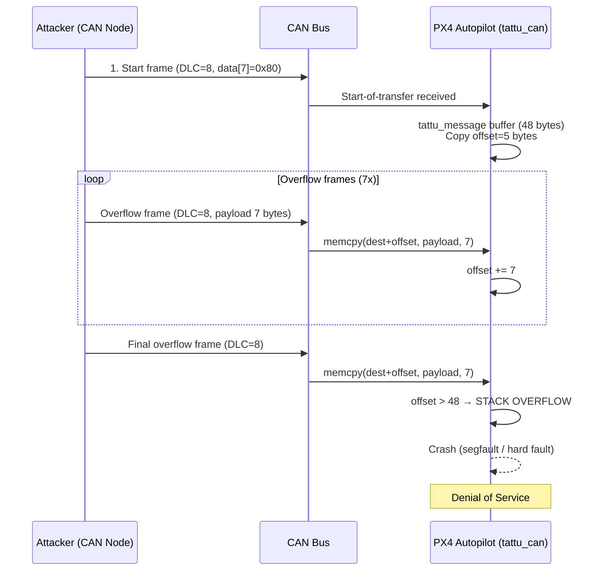

[](https://nvd.nist.gov/vuln/detail/CVE-2026-32707)
[-orange)](https://www.first.org/cvss/calculator/3.1#CVSS:3.1/AV:N/AC:L/PR:N/UI:N/S:U/C:N/I:N/A:H)
[](https://cwe.mitre.org/data/definitions/121.html)
[](https://www.python.org/)
[](https://kernel.org/)
[](LICENSE)
[](https://github.com/mbanyamer)

# CVE-2026-32707 - PX4-Autopilot tattu_can Stack Buffer Overflow (DoS)

```
╔════════════════════════════════════════════════════════════════════════════════════════════╗
║                                                                                            ║
║   ██████╗  █████╗ ███╗   ██╗██╗   ██╗ █████╗ ███╗   ███╗███████╗██████╗                     ║
║   ██╔══██╗██╔══██╗████╗  ██║╚██╗ ██╔╝██╔══██╗████╗ ████║██╔════╝██╔══██╗                    ║
║   ██████╔╝███████║██╔██╗ ██║ ╚████╔╝ ███████║██╔████╔██║█████╗  ██████╔╝                    ║
║   ██╔══██╗██╔══██║██║╚██╗██║  ╚██╔╝  ██╔══██║██║╚██╔╝██║██╔══╝  ██╔══██╗                    ║
║   ██████╔╝██║  ██║██║ ╚████║   ██║   ██║  ██║██║ ╚═╝ ██║███████╗██║  ██║                    ║
║   ╚═════╝ ╚═╝  ╚═╝╚═╝  ╚═══╝   ╚═╝   ╚═╝  ╚═╝╚═╝     ╚═╝╚══════╝╚═╝  ╚═╝                    ║
║                                                                                            ║
║                         [ b a n y a m e r _ s e c u r i t y ]                              ║
║                                                                                            ║
║                  ▸ Silent Hunter  |  Shadow Presence  |  Digital Intel ◂                  ║
║                                                                                            ║
║   Operator : Mohammed Idrees Banyamer  •  Jordan 🇯🇴                                       ║
║   Handle   : @banyamer_security                                                           ║
║                                                                                            ║
╚════════════════════════════════════════════════════════════════════════════════════════════╝
```

## Description

This repository contains a **proof‑of‑concept (PoC) exploit** for **CVE‑2026‑32707**, a stack‑based buffer overflow in the `tattu_can` driver of the **PX4‑Autopilot** flight controller firmware (versions **≤ 1.17.0‑rc1**). The vulnerability resides in the multi‑frame message assembly routine: when reassembling a `Tattu12SBatteryMessage` structure on the stack, the driver performs unbounded `memcpy()` operations without checking the cumulative offset against the buffer size (48 bytes). An attacker with the ability to inject CAN frames into the same bus can trigger the overflow, causing a stack corruption and subsequent crash (Denial of Service) of the PX4 process.

## Attack Flow Diagram



## Vulnerable & Fixed Versions

- **Affected**: PX4‑Autopilot versions ≤ 1.17.0‑rc1 with `tattu_can` driver enabled
- **Fixed**: PX4‑Autopilot ≥ 1.17.0‑rc2 (commit [`3f04b7a`](https://github.com/PX4/PX4-Autopilot/commit/3f04b7a95ace454f228b393310c4915991b85163))

## Requirements

- **Python 3** with `python-can` library
- **Linux** with SocketCAN support (most distributions)
- **Root privileges** (`CAP_NET_RAW`) to send raw CAN frames
- A CAN interface (physical `can0` or virtual `vcan0`)

## Installation

```bash
# Clone the repository
git clone https://github.com/mbanyamer/CVE-2026-32707-PoC.git
cd CVE-2026-32707-PoC

# Install python-can
pip3 install python-can

# (Optional) Create a virtual CAN interface for testing
sudo ip link add dev vcan0 type vcan
sudo ip link set up vcan0
```

## Usage

```bash
sudo python3 exploit.py <can_interface>
```

### Example

```bash
# Exploit via virtual CAN interface (for simulation/testing)
sudo python3 exploit.py vcan0

# Exploit via physical CAN bus
sudo python3 exploit.py can0
```

## How the Exploit Works

1. **Start‑of‑transfer frame** – The first CAN frame (DLC=8) has its last byte set to `0x80`, which signals the driver to begin assembling a new `Tattu12SBatteryMessage` and copies the first 5 bytes into the stack buffer.
2. **Overflow frames** – Seven subsequent CAN frames (each DLC=8) are sent. The driver copies 7 bytes per frame (DLC‑1) into the buffer starting at offset 5. After the 7th frame, the cumulative offset exceeds 48 bytes.
3. **Final trigger** – An extra frame triggers the last `memcpy()` that writes past the buffer boundary, corrupting the stack frame.
4. **Result** – The PX4 process crashes (segmentation fault or hard fault). On a real flight controller, this leads to a denial of service (loss of control).

## Expected Output

```
[*] Sending start-of-transfer frame on vcan0 (can_id=0x00000123)
[*] Sending 7 overflow frames (each copies 7 bytes)...
[*] Sending final overflow frame...
[+] Attack sequence completed. The PX4 tattu_can driver should now crash.
```

## Mitigation

- **Update** PX4‑Autopilot to version **1.17.0‑rc2** or later.
- **Disable** the `tattu_can` driver if not required (`tattu_can stop` or remove from build).
- **Apply patch** manually (bounds check added in commit `3f04b7a`):

```diff
while (receive(&received_frame) > 0) {
+   if (received_frame.payload_size == 0) {
+       break;
+   }
    size_t payload_size = received_frame.payload_size - 1;
-   // TODO: add check ...
+   if (offset + payload_size > sizeof(tattu_message)) {
+       break;
+   }
    memcpy(((char *)&tattu_message) + offset, received_frame.payload, payload_size);
    offset += payload_size;
}
```

## References

- [GitHub Security Advisory GHSA-wxwm-xmx9-hr32](https://github.com/PX4/PX4-Autopilot/security/advisories/GHSA-wxwm-xmx9-hr32)
- [Fix commit `3f04b7a`](https://github.com/PX4/PX4-Autopilot/commit/3f04b7a95ace454f228b393310c4915991b85163)
- [Vulnerable source file (before fix)](https://github.com/PX4/PX4-Autopilot/blob/bf4fac7e61413ef35959505b337c1168d0fd76bb/src/drivers/tattu_can/TattuCan.cpp)
- [CVE-2026-32707 entry (NVD)](https://nvd.nist.gov/vuln/detail/CVE-2026-32707)

## Credits

- **Discoverer & PoC Author** – Mohammed Idrees Banyamer  
- **Country** – Jordan 🇯🇴  
- **Instagram** – [@banyamer_security](https://instagram.com/banyamer_security)  
- **GitHub** – [mbanyamer](https://github.com/mbanyamer)

## Disclaimer

This proof‑of‑concept is provided **for educational and security testing purposes only**. Use it only on systems you own or have explicit permission to test. The author is not responsible for any misuse or damage caused by this code.
