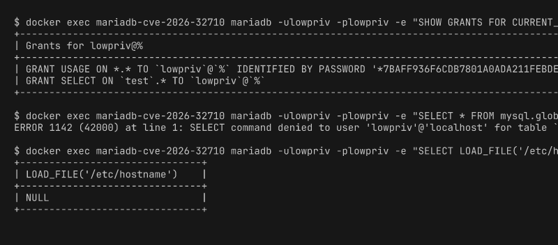
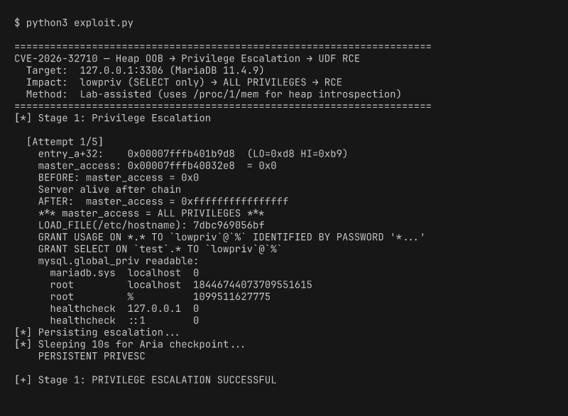
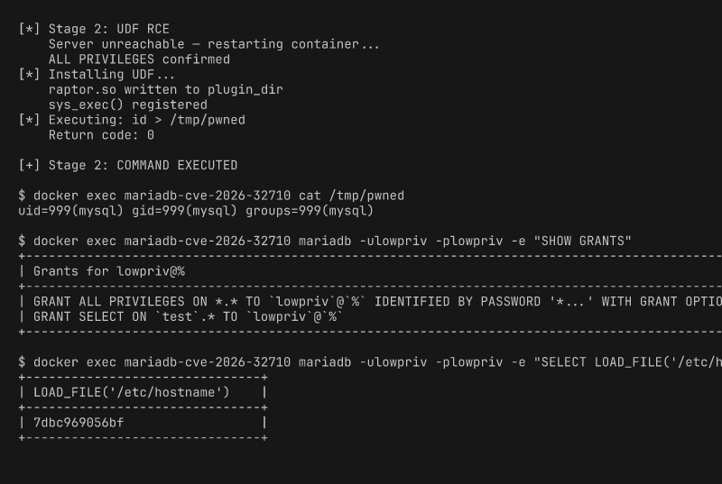
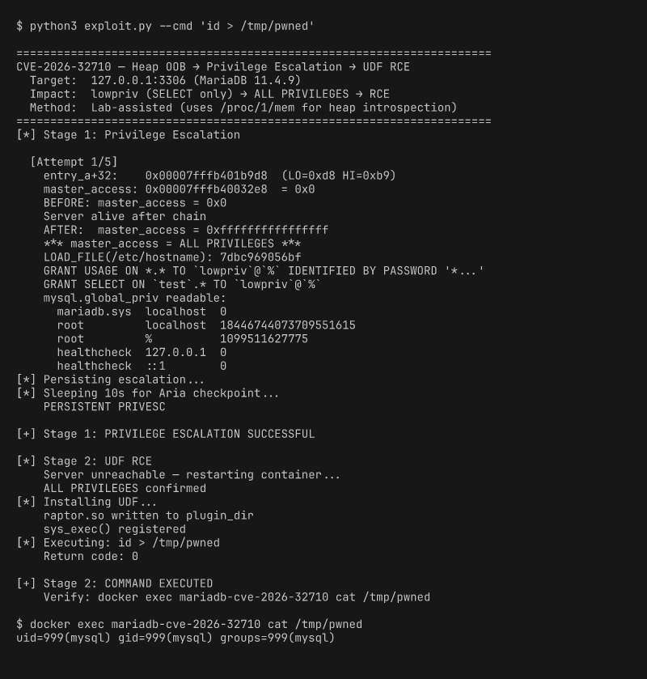

# CVE-2026-32710

**Heap buffer overflow in MariaDB `JSON_SCHEMA_VALID()` → persistent privilege escalation → UDF RCE**

| | |
|---|---|
| **Affected** | MariaDB 11.4.x (confirmed on 11.4.9) |
| **Bug** | OOB write in `json_get_normalized_string()` — `strncpy` into 128-byte `DYNAMIC_STRING` with no bounds check |
| **Impact** | `SELECT`-only user → `ALL PRIVILEGES WITH GRANT OPTION` → arbitrary command execution via UDF |
| **Source** | `sql/json_schema_helper.cc:91` |

> **Lab-assisted.**  The script uses Docker / root introspection to read
> `/proc/1/mem` and discover heap layout per connection.  The actual exploit
> chain is pure SQL over TCP.  A weaponized exploit would need an info-leak
> primitive to replace the memory introspection step.

## Before

`lowpriv` can only `SELECT` on the `test` database. System tables are denied.



## Exploit

A single Python script performs heap grooming, a two-hop arbitrary write
through user-variable metadata, persists the escalation via `GRANT ALL`,
and achieves code execution through a UDF:

```
python3 exploit.py
```



## After

`lowpriv` now has `ALL PRIVILEGES WITH GRANT OPTION`, can read system tables,
read/write arbitrary files, and execute OS commands as the `mysql` user.
The grant survives server restart.



<details>
<summary>Full exploit output</summary>



</details>

## Stages

### Stage 1: Privilege Escalation

```
┌──────────────────────────────────────────────────────────────────┐
│  SELECT  json_schema_valid(overflow),                           │
│          @ccc...c := hop1,                                      │
│          @aaa...a := hop2                                       │
└──────────────────────────────────────────────────────────────────┘
         │                    │                   │
         ▼                    ▼                   ▼
   ┌───────────┐     ┌──────────────┐    ┌──────────────┐
   │ 192-byte  │     │ Write to @c  │    │ Write to @a  │
   │ overflow   │     │ through the  │    │ through the  │
   │ corrupts   │     │ corrupted    │    │ redirected   │
   │ entry_c's  │     │ pointer:     │    │ pointer:     │
   │ value ptr  │     │              │    │              │
   │ (2-byte    │     │ entry_a →    │    │ master_access│
   │  partial   │     │   .value =   │    │   = 0xFFFF.. │
   │  overwrite)│     │   &master_   │    │ (ALL PRIVS)  │
   │            │     │   access     │    │              │
   └───────────┘     │   .length= 9 │    └──────────────┘
                      └──────────────┘
```

1. **Heap groom** — 100+ user variables exhaust tcache, forcing
   `Entry_a → Value_a → Entry_b → Value_b → Entry_c → Value_c` to be
   allocated consecutively.

2. **Overflow** — `JSON_SCHEMA_VALID` triggers a 192-byte `strncpy` past
   the 128-byte buffer, corrupting `entry_c→value` (2-byte partial pointer
   overwrite within the same 64 KB page) to point at `entry_a + 32`.

3. **Hop 1** — Assigning to `@c` writes 126 bytes through the corrupted
   pointer into `entry_a`'s metadata, setting:
   - `entry_a→value  = &Security_context::master_access`
   - `entry_a→length = 9`

4. **Hop 2** — Assigning to `@a` writes 8 bytes of `0xFF` through the
   redirected `entry_a→value` pointer → `master_access = ALL PRIVILEGES`.

5. **Persist** — The session now holds all privileges. `GRANT ALL` commits
   the escalation to the Aria-backed `mysql.global_priv` table. The session
   eventually crashes during cleanup (residual heap corruption), but the
   GRANT is already checkpointed and survives the restart.

### Stage 2: UDF RCE

After persistence, the server is restarted (crash recovery), and the
escalated privileges are used to install a UDF shared library:

1. `LOAD_FILE('/tmp/raptor_udf.so') INTO DUMPFILE '/usr/lib/mysql/plugin/raptor.so'`
2. `CREATE FUNCTION sys_exec RETURNS INTEGER SONAME 'raptor.so'`
3. `SELECT sys_exec('id > /tmp/pwned')`

### Key constraints solved

| Constraint | Solution |
|---|---|
| `STRING_RESULT` does `length++` before realloc check | Payload is N−1 bytes so N−1+1 = N matches stored length → no realloc on corrupted pointer |
| 126-byte hop2 corrupts THD fields past `Security_context` | Set `entry_a→length = 9` in hop1 so hop2 writes only 8 bytes (master_access) + 1 NUL |
| `master_access` offset in `Security_context` | 1712 bytes from struct base (`priv_user[384]` + `proxy_user[645]` + `priv_host[256]` + `priv_role[384]` + padding + pointers) |
| Aria crash recovery rolls back uncommitted writes | `GRANT ALL` + 10 s `SLEEP` allows Aria checkpoint before session cleanup crash |
| Heap layout varies between connections (even with ASLR=0) | Inline per-attempt `/proc/1/mem` scan discovers entry_a and master_access for each connection |
| plugin_dir is root-owned | Dockerfile pre-sets `chmod 777` (lab convenience) |

## Lab setup

```bash
# 1. Build and start the container
./setup.sh

# 2. Disable ASLR on the Docker host
sudo sh -c 'echo 0 > /proc/sys/kernel/randomize_va_space'

# 3. Run the exploit (auto-calibrates per attempt)
python3 exploit.py

# 4. Custom command
python3 exploit.py --cmd 'cat /etc/passwd > /tmp/out'
```

### Requirements

- Docker (x86_64)
- Python 3
- ASLR disabled on the Docker **host** (`/proc/sys/kernel/randomize_va_space = 0`)
- Container runs with `--cap-add SYS_PTRACE` (for `/proc/1/mem` access)

### Options

```
--calibrate      Measure heap layout constants and exit
--cmd CMD        Command for Stage 2 UDF execution (default: id > /tmp/pwned)
--stage1-only    Run privilege escalation only, skip UDF RCE
--attempts N     Max stage 1 attempts (default: 5)
--host HOST      MariaDB host (default: 127.0.0.1)
--port PORT      MariaDB port (default: 3306)
```

### What the lab assistance provides

The exploit script shells into the container as root to read `/proc/1/mem`.
This is used for two things:

1. **Heap layout discovery** — locating the three sentinel `user_var_entry`
   structs and verifying they are adjacent (entry_a+32 within same 64KB page
   as entry_c→value for the 2-byte partial overwrite).
2. **`Security_context` address** — finding the `master_access` field to
   target with the two-hop write.

The scan runs inline for each attempt because heap layout varies between
connections (even with ASLR=0) due to MariaDB's thread pool assigning
different arenas. The actual exploit chain — overflow + hop1 + hop2 — is
pure SQL executed over a TCP connection.

In a real-world scenario, an attacker would need a separate info-leak
vulnerability (or a side-channel) to obtain these addresses.

## Files

| File | Description |
|---|---|
| `exploit.py` | Two-stage exploit: privesc (TCP SQL) + UDF RCE |
| `raptor_udf.c` | UDF source — `sys_exec()` calls `system()` |
| `Dockerfile` | Lab container image (compiles UDF, opens plugin_dir) |
| `init.sql` | Creates the `lowpriv` user |
| `setup.sh` | Builds and starts the lab |
| `screenshots/` | Terminal screenshots |
