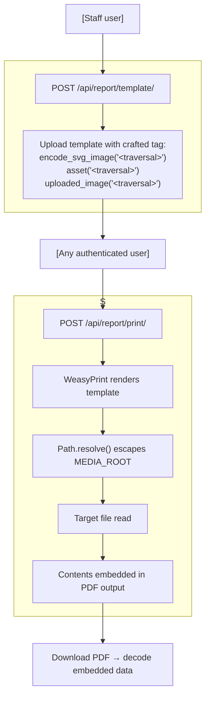

```mermaid
flowchart TB
 subgraph subGraph0["<br>"]
        C@{ label: "Upload template with crafted tag:<br>encode_svg_image('&lt;traversal&gt;')<br>asset('&lt;traversal&gt;')<br>uploaded_image('&lt;traversal&gt;')" }
        B["POST /api/report/template/"]
  end
 subgraph S["S"]
        F["WeasyPrint renders template"]
        E["POST /api/report/print/"]
        G["Path.resolve() escapes MEDIA_ROOT"]
        H["Target file read"]
        I["Contents embedded in PDF output"]
  end
    A["[Staff user]"] --> B
    B --> C
    C --> D["[Any authenticated user]"]
    D --> E
    E --> F
    F --> G
    G --> H
    H --> I
    I --> J["Download PDF → decode embedded data"]

    C@{ shape: rect}
```
