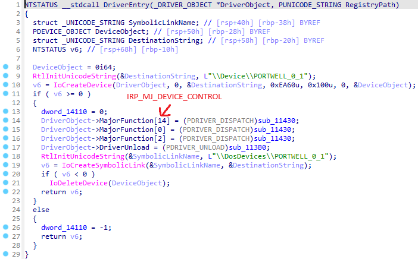
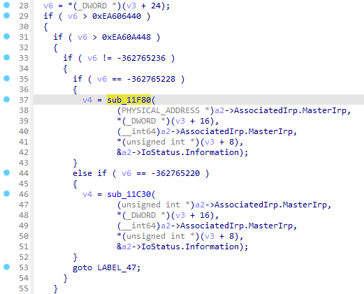
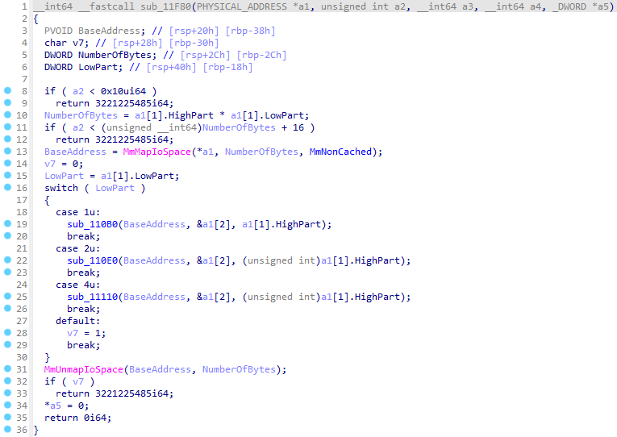
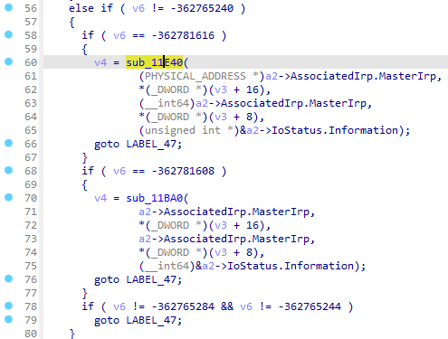
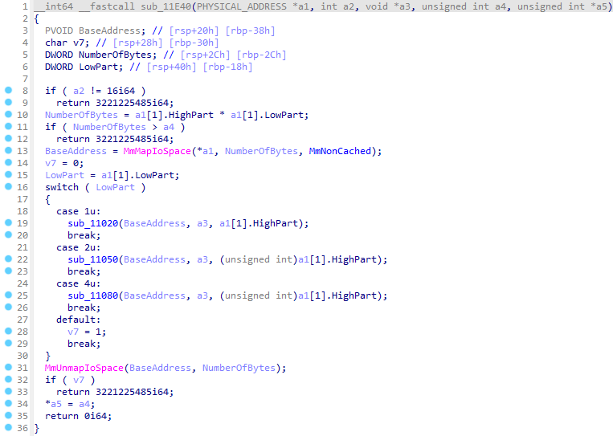

# cve-2026-3437

Arbitrary physical memory read/write in `portwell.sys` (Portwell Engineering Toolkits v4.8.2) via `MmMapIoSpace`. Enables LPE/SYSTEM escalation and BYOVD by interacting with the driver's IOCTL interface.

## analysis

The driver registers a dispatch routine for `IRP_MJ_DEVICE_CONTROL` to handle `DeviceIoControl` calls from usermode.



Inside the dispatch routine we can find a call to `sub_11F80`.



Looking inside this function reveals the following:

- Arbitrary physical memory write via `MmMapIoSpace` using user-supplied physical address and data
- No proper validation of user-supplied arguments



Going back to the dispatch routine, we can also find a call to `sub_11E40`.



Looking inside this function reveals the following:

- Arbitrary physical memory read via `MmMapIoSpace`
- No proper validation of user-supplied arguments



## usage

```powershell
sc create portwell binPath=C:\windows\temp\portwell.sys type=kernel
sc start portwell

.\cve-2026-3437.exe
```

## references

- 🔍 [SentinelOne Analysis](https://www.sentinelone.com/vulnerability-database/cve-2026-3437/)
- 🛡️ [LOLDrivers](https://www.loldrivers.io/drivers/84f92ac1-1e72-420d-9cc0-65c838b90a4d/)
- 📋 [NVD Record](https://nvd.nist.gov/vuln/detail/CVE-2026-3437)