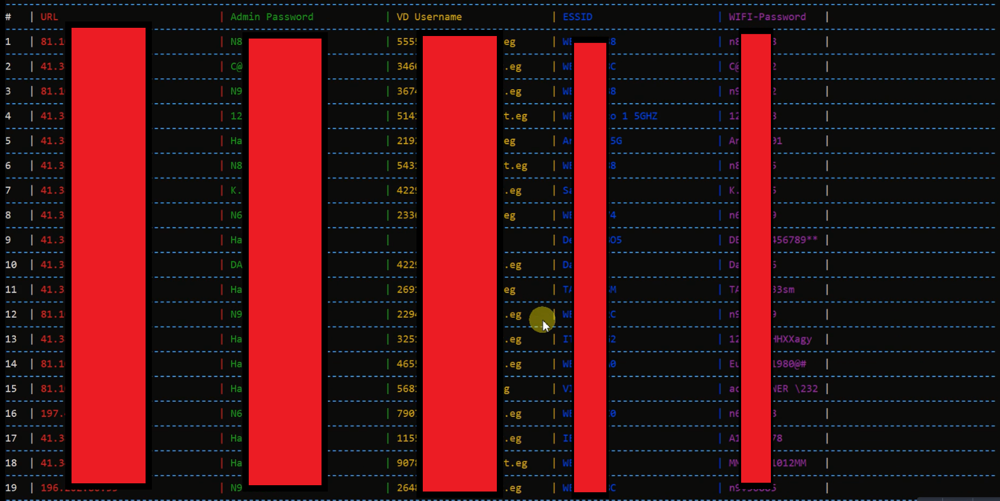

# CVE-2026-34472

Technical breakdown of `CVE-2026-34472`, an auth bypass via leaked credentials affecting `ZTE ZXHN H188A V6` firmware.

## Summary

In the tested `H188A` V6 builds, unauthenticated requests to the root path can reach pre-login wizard handlers and disclose sensitive data including:

- WLAN PSKs
- SSIDs
- PPPoE usernames
- the Wi-Fi password later reused as the default administrator password after uppercasing it

This is why the issue leads to auth bypass instead of stopping at disclosure: on this router, the leaked Wi-Fi password becomes the default administrator password once uppercased. The leak crosses the authentication boundary by exposing the exact secret the router later expects for authorized access.

The decompiled root cause is broader: root-path routing trusts attacker-controlled `_type` and `_tag` values, and the `QuickSetupEnable` gate only runs in the fallback path used when `_type` is absent. That makes the pre-login wizard handler family reachable in cases where it should not be.

At the time of the original report, roughly `500` publicly exposed `H188A` router interfaces were reachable on the internet.

## Patch status

As of `2026-05-18`, I could not find a public ZTE advisory or fixed firmware release for `CVE-2026-34472`. The public record still consists of the CVE/NVD entries and disclosure references.

## Affected firmware

- `ZXHN H188A V6.0.10P2_TE`
- `ZXHN H188A V6.0.10P3N3_TE`

## Root cause

The vulnerable chain shown in the local analysis is:

1. `router_logic_impl.lua` accepts `_type` and `_tag` directly for empty-path requests.
2. `urlpath_2type_modifier.lua` only applies `QuickSetupEnable` when `_type` is missing.
3. `Tedata_notLogin_wizard_page_manage.lua` loads the requested wizard data file for unauthenticated users.
4. Wizard handlers then expose credential-bearing read actions such as `getPassword`, `wlan_get`, and `ppp_get`.

The returned Wi-Fi credential is what turns the leak into auth bypass on the validated H188A path because that same value becomes the default administrator password after uppercasing it. WLAN and PPPoE secrets also matter because they extend the impact beyond the web panel and into network access.

The same handler family also contains write paths using `cmapi.setinst`, which is why the underlying authorization failure is larger than a single leaking endpoint.

## Repo layout

- `index.html`: main public writeup
- `assets/`: page CSS and JS
- `images/`: redacted screenshots used by the writeup
- `poc/`: public PoC notes and a cleaned extraction script

## Public references

- CVE Record: <https://www.cve.org/CVERecord?id=CVE-2026-34472>
- NVD: <https://nvd.nist.gov/vuln/detail/CVE-2026-34472>
- Public disclosure Gist: <https://gist.github.com/minanagehsalalma/7a8516b9b00d0008f2f25750320560c9>
- ZTE PSIRT contact page: <https://www.zte.com.cn/china/about/trust-center/ztepsirt.html>

## Timeline

- `2024-04-26` to `2024-05-02`: local validation screenshots and PoC artifacts created
- `2024-05`: original report sent to ZTE PSIRT
- `2024-05-10`: later MITRE escalation record states ZTE stopped responding after this point
- `2026-01-17`: evidence package escalated to MITRE
- `2026-02-02`: ZTE PSIRT explicitly declined assignment
- `2026-03-27`: MITRE assigned `CVE-2026-34472`
- `2026-03-30`: public disclosure reference submitted
