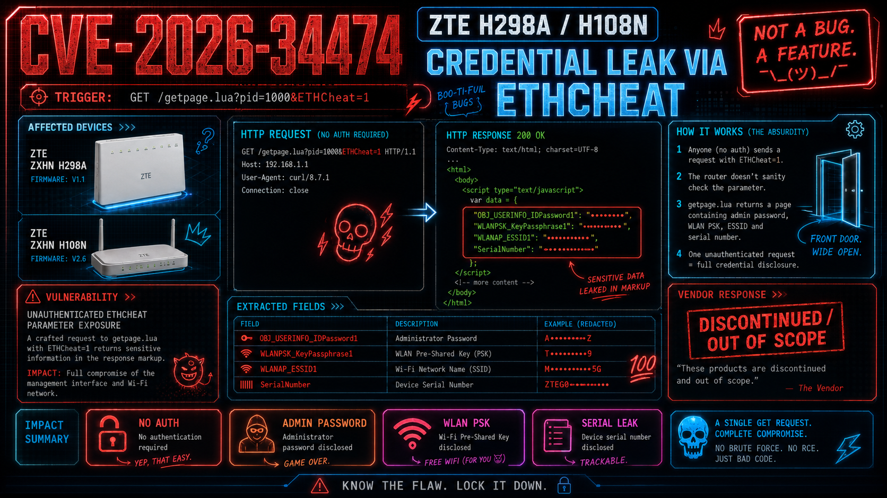

# CVE-2026-34474: ZTE H298A / H108N Secret Leak via ETHCheat

Technical breakdown of `CVE-2026-34474`, where an unauthenticated `ETHCheat=1` request causes affected ZTE ZXHN `H298A 1.1` and `H108N 2.6` routers to return the live administrator password, ESSID, and WLAN PSK in the response markup.

## Summary

The observed exploit path is an unauthenticated management-page disclosure. A crafted GET request to `getpage.lua?pid=1000&ETHCheat=1` returns HTML containing fields such as `OBJ_USERINFO_IDPassword1`, `WLANPSK_KeyPassphrase1`, and `WLANAP_ESSID1`. On the reported H298A and H108N builds, that means the router discloses the live administrator password and WLAN PSK directly to an unauthenticated caller.

The local PoC material also includes a companion request to `wizard_page/wizard_overETHfail_set_lua.lua`, which exposes the serial number in structured output. Some same-model variants reportedly leaked a reduced identifier set instead of the full password-and-PSK combination, but the authentication boundary still failed in the same direction.

## Patch status

As of `2026-05-18`, the public record shows `CVE-2026-34474` as published on `2026-05-06`. ZTE's stated position in the 2026 correspondence was that the impacted products had been discontinued in `2022` and `2023`, and it declined vendor-side CVE assignment on that basis.

## Affected devices

- `ZXHN H298A 1.1`
- `ZXHN H108N 2.6`

## Root cause

The currently preserved evidence supports the following chain:

1. An unauthenticated client requests `GET /getpage.lua?pid=1000&ETHCheat=1`.
2. The router returns credential-bearing HTML fields in the response body.
3. The extraction script reads the admin password, ESSID, and WLAN PSK directly from the returned markup.
4. A related wizard endpoint also exposes serial information.

This is why the issue crosses from information disclosure into practical compromise: the management interface itself returns the live secrets an attacker needs for administrator and Wi-Fi access.

## Repo layout

- `index.html`: main public write-up
- `assets/`: page CSS and JavaScript
- `images/`: local screenshots and sanitized publication artwork
- `poc/`: extraction scripts and validation notes

## Public references

- CVE Record: <https://www.cve.org/CVERecord?id=CVE-2026-34474>
- NVD: <https://nvd.nist.gov/vuln/detail/CVE-2026-34474>
- Public advisory Gist: <https://gist.github.com/minanagehsalalma/7a8516b9b00d0008f2f25750320560c9>
- ZTE EOS notice: <https://support.zte.com.cn/support/news/NewsDetail.aspx?newsId=1018804>
- ZTE EOS notice: <https://support.zte.com.cn/support/news/NewsDetail.aspx?newsId=1022344>

## Timeline

- `2024-05-02`: original report sent to ZTE PSIRT
- `2024-05-06`: ZTE acknowledged receipt
- `2024-05-08`: ZTE verified the issue and referenced EOS announcements
- `2026-01-17`: MITRE service request `1980204` opened with the H298A / H108N package
- `2026-02-02`: ZTE declined vendor-side CVE assignment due to product discontinuation
- `2026-03-27`: MITRE assigned `CVE-2026-34474`
- `2026-03-30`: public reference sent to MITRE and follow-up opened under service request `2016046`
- `2026-05-06`: `CVE-2026-34474` published on `cve.org`

## Notes

The strongest current technical evidence in this repo is the preserved response behavior and the field names extracted from the returned markup. Recovering the exact server-side implementation for the `ETHCheat` branch remains an open reverse-engineering track.
