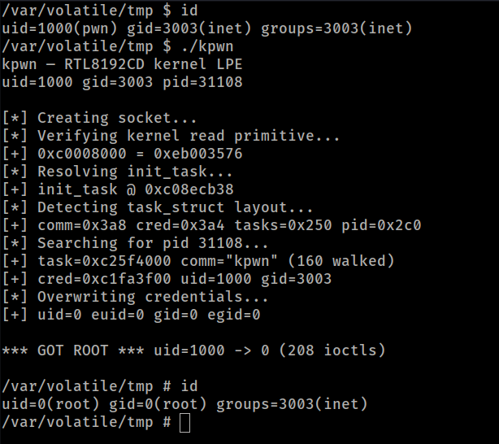

# CVE-2026-36355: Realtek rtl819x Jungle SDK - Unauthenticated Kernel Memory Read/Write via Debug ioctls

- **CVE**: CVE-2026-36355
- **CWE**: CWE-782, CWE-787, CWE-200
- **Discoverer**: Daniil Gordeev
- **Disclosed**: 2026-05-03

## Summary

The `rtl8192cd` Wi-Fi kernel driver in the Realtek rtl819x out-of-tree "Jungle SDK" exposes two IOCTLs — `write_mem` (`0x89F5`) and `read_mem` (`0x89F6`) - with no access-control checks. Any local user able to open a wireless network interface backed by the driver can read or write **arbitrary kernel virtual memory**, leading directly to root.

The handlers are gated by `_IOCTL_DEBUG_CMD_` in `8192cd_cfg.h`, which is defined unconditionally (no `#ifdef DEBUG`), so the debug command set is compiled into all production builds.

A reference exploit (`kpwn`) achieves `uid=0` from an unprivileged shell, with **zero hardcoded addresses** - `task_struct` layout and `init_task` location are both auto-detected at runtime, making it portable across kernel versions and OEM builds.

## Affected Products

The vulnerability lives in the **Realtek rtl819x Jungle SDK** kernel Wi-Fi driver, all known versions through v3.4.14B. No fix at the time of disclosure. Mainline Linux `rtlwifi` / `rtw88` / `rtw89` are different codebases and **not** affected.

The shared driver core compiles into multiple variants (`rtl8192cd`, `rtl8192es`, `rtl8192ee`, `rtl8192fe`, `rtl8188ee`, etc.). Any Jungle SDK build that includes the Wi-Fi driver is affected.

### Likely affected — require per-product verification

The Realtek Jungle SDK is widely redistributed under OEM contracts. Vendors documented in the CVE-2021-35395 vendor list (which targeted a different, userspace component of the same SDK) include D-Link, TOTOLINK, Tenda, NEC, I-O DATA, Elecom, Buffalo, Humax, H3C and IP-COM. Whether each specific product line ships the vulnerable kernel driver requires inspection of the per-product GPL source release; this advisory does not assert that without independent verification.

## Test Environment

| | |
|---|---|
| Device | Ortel 4G LTE CPE (OEM: MeiG Smart FORGE_SLT711) |
| SoC | Qualcomm MDM9607, ARMv7 Cortex-A7 |
| Kernel | Linux 3.18.48 |
| Module | `rtl8192es.ko` |
| Date | 2026-02-23 |

Confirmed: write of `0xDEADBEEF` to module `.bss` with read-back and restore; full LPE from `uid=1000` to `uid=0` via `init_task` walk and credential overwrite, from an unprivileged shell.

## Technical Details

### Root cause

In `8192cd_cfg.h`:

```c
#define _IOCTL_DEBUG_CMD_
```

Not gated by `#ifdef DEBUG`. The debug command set ships in every production build.

### Vulnerable handlers

The driver's `rtl_ioctl()` dispatcher routes `0x89F5` and `0x89F6` (in the standard `SIOCDEVPRIVATE+5/+6` private-IOCTL range used by wireless drivers for vendor extensions) to `write_mem` and `read_mem`. The handlers parse a user-supplied string:

- Read: `dw,<addr>,<count>` — read `count` 32-bit words from kernel virtual address `addr`
- Write: `dw,<addr>,<count>,<value>` — write `count` 32-bit words of `value` to `addr`

The address is parsed with `_atoi(base 16)`, passed to `memcpy()` against the kernel virtual address space, and the result is `copy_to_user()`'d back. There is:

- No `capable()` check
- No `access_ok()` check on the address
- No bounds check on the address range
- No locking — all 59 IOCTLs in the debug command set share a single 2000-byte global buffer (`tmpbuf1`) in `.bss`

The read primitive is capped at 128 bytes per call; the write primitive accepts arbitrary length.

The same access-control gap applies to other handlers in the debug set (hardware register R/W via `0x89F3`/`0x89F4`/`0x89F8`–`0x89FD`, MIB writes via `0x89F1`, eFuse R/W, manufacturing test mode). They are reachable via the same code path and warrant a full audit by anyone patching this bug.

## Proof of Concept



Reference exploit `kpwn.c` (published alongside this advisory):

- Runs as any unprivileged user, no root needed.
- Auto-detects `task_struct` offsets (`comm`, `cred`, `tasks`, `pid`) by walking `init_task`, which is itself located by brute-force scan of kernel `.data`.
- Auto-detects the vulnerable interface by probing each `/sys/class/net/*` for the read primitive.
- 44 IOCTLs when `/proc/kallsyms` is readable, ~7600 IOCTLs when `kptr_restrict=2` (full `.data` scan path). Yields a root shell unconditionally on every test run.

```sh
# Build:
arm-linux-gnueabi-gcc -static -O2 -o kpwn kpwn.c

# Run as unprivileged user:
$ id
uid=1000(pwn) gid=3003(inet) ...
$ /tmp/kpwn
kpwn — RTL8192CD kernel LPE
[*] Scanning interfaces...
[+] wlan0 — read primitive confirmed
[*] Resolving init_task...
[+] init_task @ 0xc08ecb38
[+] comm=0x3a8 cred=0x3a4 tasks=0x250 pid=0x2c0
[+] cred=0xed3a4500 uid=1000 gid=3003
[*] Overwriting credentials...
[+] uid=0 euid=0 gid=0 egid=0
*** GOT ROOT *** uid=1000 -> 0 (44 ioctls)
# id
uid=0(root) gid=0(root) groups=0(root)
```

