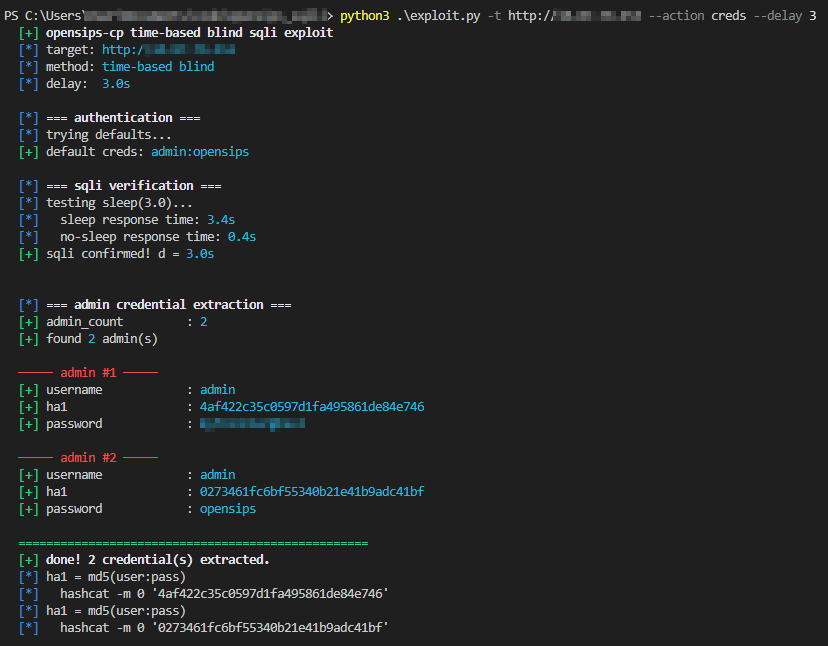

# CVE-XXXX-XXXX

A time-based blind SQL injection exploit for the **OpenSIPS Control Panel**.

---

This exploit abuses an authenticated sql injection vulnerability within the `alias_management.php` module of opensips. The `table` GET parameter is improperly sanitized, allowing an attacker to inject a crafted derived table payload.



---

## Pre-Requisites
- Python 3.x
- `requests` library (`pip install requests`)

## Post-Exploitation
The exploit will dump the `ha1` hashes for administrative users. These are stored in the format `md5(username:password)`. You can easily crack these using hashcat:

```bash
hashcat -m 0 hashes.txt /usr/share/wordlists/rockyou.txt
```

## Disclaimer

This script is intended *strictly* for educational purposes and authorized security auditing. Do not use this tool against targets without explicit permission. The author assumes no liability for the misuse of this software.
