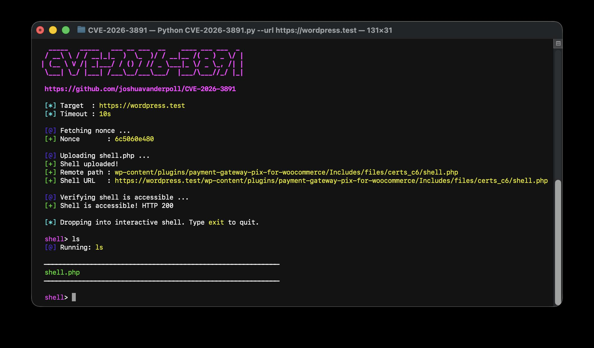

<h1 align="center">Pix for WooCommerce <= 1.5.0 - Unauthenticated Arbitrary File Upload (CVE-2026-3891) PoC</h1>

<p align="center">
    
    <a href="https://www.python.org/">
      
    </a>
</p>

## 📜 Description

CVE-2026-3891 is an unauthenticated arbitrary file upload vulnerability in the **Pix for WooCommerce** WordPress plugin. The plugin exposes an AJAX endpoint (`lkn_pix_for_woocommerce_c6_save_settings`) that accepts certificate file uploads without any authentication. A nonce can be obtained unauthenticated via a second exposed endpoint (`lkn_pix_for_woocommerce_generate_nonce`), allowing a fully unauthenticated attacker to upload arbitrary files — including PHP webshells — directly to the web root.

**Affected versions:** payment-gateway-pix-for-woocommerce <= 1.5.0

## ✨ Features

- **Unauthenticated** — No credentials or session required
- **Auto nonce retrieval** — Fetches a valid WordPress nonce without authentication
- **PHP webshell upload** — Uploads a webshell to a predictable, web-accessible path
- **Interactive shell** — Drop into a live shell session on the target after exploitation
- **Single command mode** — Run a one-off command and exit with `--command`

<!-- BEGIN:PYTHON -->
## OSX/Linux
```bash
git clone https://github.com/joshuavanderpoll/CVE-2026-3891.git
cd CVE-2026-3891
python3 -m venv .venv
source .venv/bin/activate
pip3 install -r requirements.txt
```

## Windows
```bash
git clone https://github.com/joshuavanderpoll/CVE-2026-3891.git
cd CVE-2026-3891
python3 -m venv .venv
.venv\Scripts\activate
pip3 install -r requirements.txt
```
<!-- END:PYTHON -->

## ⚙️ Usage

```
python3 CVE-2026-3891.py --url <TARGET_URL> [--command <CMD>] [--timeout <SECONDS>] [--useragent <UA>]
```

---

### Interactive Shell

Exploit the target and drop into a persistent interactive shell session to run multiple commands.

```bash
python3 CVE-2026-3891.py --url 'https://target.com'
```


---

### Single Command

Run a single command on the target and print the output, useful for scripting or quick checks.

```bash
python3 CVE-2026-3891.py --url 'https://target.com' --command whoami
```


## 🐋 Docker PoC

A self-contained Docker Compose environment with the vulnerable software for local testing.
Check [DOCKER.md](/docker/DOCKER.md) for more details

```bash
cd docker/
docker compose up -d
python3 CVE-2026-3891.py --url 'http://localhost:8080'
```

## 🕵🏼 References

- [Pix for WooCommerce — WordPress Plugin](https://wordpress.org/plugins/payment-gateway-pix-for-woocommerce/)
- [NVD — CVE-2026-3891](https://nvd.nist.gov/vuln/detail/CVE-2026-3891)
- [WordFence](https://www.wordfence.com/threat-intel/vulnerabilities/wordpress-plugins/payment-gateway-pix-for-woocommerce/pix-for-woocommerce-150-unauthenticated-arbitrary-file-upload)
- [HackIndex.io — CVE-2026-3891](https://hackindex.io/vulnerabilities/CVE-2026-3891)

## 📢 Disclaimer

This tool is provided for educational and research purposes only. The creator assumes no responsibility for any misuse or damage caused by this tool.