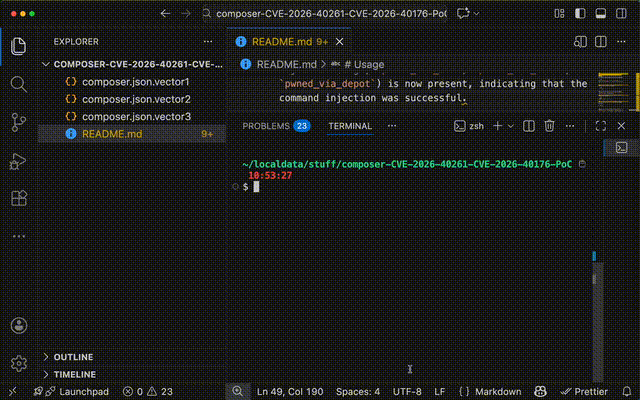
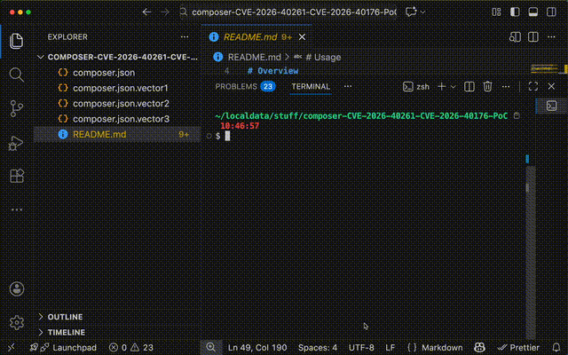
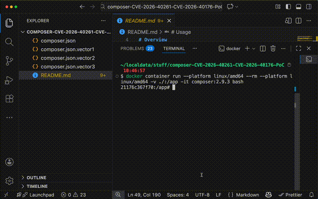
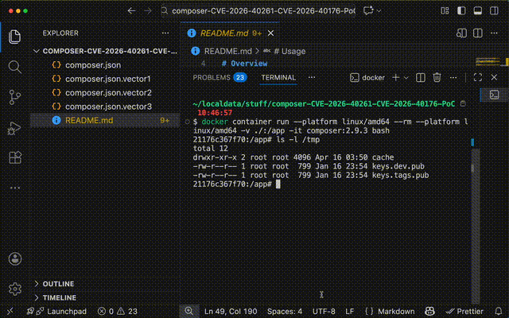
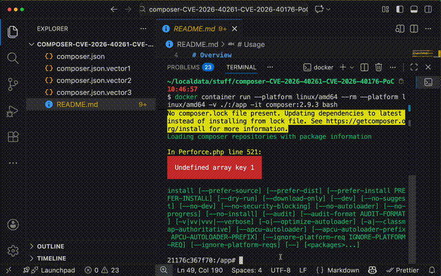

> [!CAUTION]
> THIS REPOSITORY CONTAINS PROOF-OF-CONCEPT CODE FOR VULNERABILITIES [CVE-2026-40261](HTTPS://GITHUB.COM/COMPOSER/COMPOSER/SECURITY/ADVISORIES/GHSA-GQW4-4W2P-838Q) AND [CVE-2026-40176](HTTPS://GITHUB.COM/COMPOSER/COMPOSER/SECURITY/ADVISORIES/GHSA-WG36-WVJ6-R67P) IN COMPOSER.

> [!CAUTION]
> THE CODE IS INTENDED FOR EDUCATIONAL AND TESTING PURPOSES ONLY.

> [!CAUTION]
> DO NOT USE THIS CODE IN PRODUCTION ENVIRONMENTS OR AGAINST SYSTEMS WITHOUT PROPER AUTHORIZATION.

> [!CAUTION]
> ALWAYS ENSURE YOU HAVE PERMISSION BEFORE TESTING ANY SECURITY VULNERABILITIES.

# Overview
This repository demonstrates two vulnerabilities in Composer related to command injection via the Perforce VCS driver.

There are three vectors of attack:
1. VECTOR 1 — inject via 'url' (becomes -p <port>). Old code did not sanitize the URL value when constructing the command string for the Perforce driver.
2. VECTOR 2 — inject via 'p4user' (becomes -u <user>). Old code appended user value directly into the command string.

# PoC Details
The `composer.json.vector1` and `composer.json.vector2` files contain the payloads for each of the two vectors. Each payload is designed to execute a command that creates a file in the `/tmp` directory, demonstrating successful command injection.

# Usage
To test the vulnerabilities, you can use the following steps. Make sure you have Docker installed on your system to run the Composer container.

## 1. Specify which vector you want to test by using the corresponding `composer.json` file.
For example, to test VECTOR 1, copy `composer.json.vector1` to `composer.json` by running:
```bash
cp composer.json.vector1 composer.json
```



## 2. Run the Composer container with vulnerable version of Composer that includes the vulnerable Perforce driver.
For example, using composer version 2.9.3 (which is vulnerable to both CVE-2026-40261 and CVE-2026-40176):

```bash
docker container run --rm --platform linux/amd64 -v ./:/app -it composer:2.9.3 bash
```



## 3. Inside the container, verify the PoC file is not present before running the command:

```bash
ls -l /tmp/
```

Expect to see that the file created by the command injection (e.g., `pwned_via_url`, or `pwned_via_user`) is not present.



## 4. Inside the container, run the Composer command to trigger the vulnerability:

```bash
composer install --prefer-dist
```



## 5. Verify that the payload was executed by checking for the presence of the file created by the command injection:

```bash
ls -l /tmp/
```

Expect to see the file created by the command injection (e.g., `pwned_via_url` or `pwned_via_user`) is now present, indicating that the command injection was successful.

