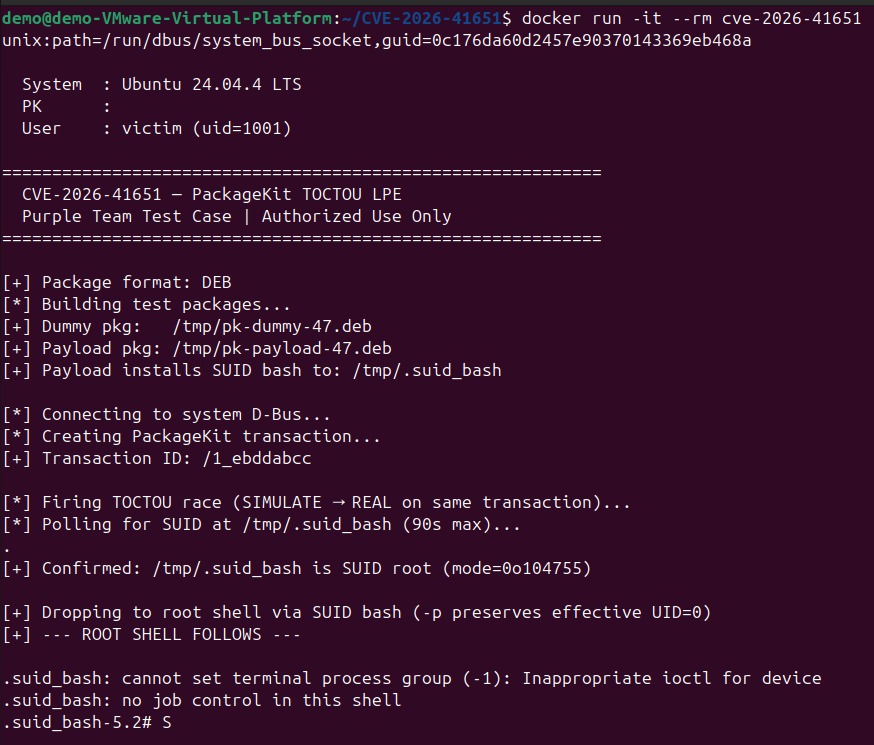

# CVE-2026-41651 — PackageKit TOCTOU Local Privilege Escalation

> **Classification:** Purple Team Assessment Artifact  
> **Authorized use only.** This document and the accompanying test script are intended solely for internal security validation on systems where written authorization has been obtained.

---

## Proof of Exploitation



---

## Table of Contents

1. [Vulnerability Overview](#vulnerability-overview)
2. [Technical Analysis](#technical-analysis)
3. [Test Script Description](#test-script-description)
   - [Behavior](#behavior)
   - [Hardened Environment Support](#hardened-environment-support)
   - [Compatibility](#compatibility)
4. [Indicators of Compromise](#indicators-of-compromise)
   - [File System](#file-system)
   - [Process & Execution](#process--execution)
   - [D-Bus Activity](#d-bus-activity)
   - [Audit Log Patterns](#audit-log-patterns)
   - [Package Manager Artifacts](#package-manager-artifacts)
   - [Privilege Escalation Artifacts](#privilege-escalation-artifacts)
5. [Detection Logic](#detection-logic)
6. [Affected Systems & Versions](#affected-systems--versions)
7. [Remediation](#remediation)
8. [References](#references)

---

## Vulnerability Overview

| Field              | Value                                                                 |
|--------------------|-----------------------------------------------------------------------|
| **CVE ID**         | CVE-2026-41651                                                        |
| **CWE**            | CWE-367 — Time-of-check Time-of-use (TOCTOU) Race Condition          |
| **Component**      | PackageKit (`packagekitd`, D-Bus service)                             |
| **Affected**       | PackageKit ≤ 1.3.4                                                    |
| **Fixed in**       | PackageKit 1.3.5                                                      |
| **Impact**         | Local Privilege Escalation → root                                     |
| **Attack Vector**  | Local / D-Bus (unprivileged user session)                             |
| **Disclosed**      | 2026-04-22 (Deutsche Telekom Red Team)                                |
| **Advisory**       | GHSA-f55j-vvr9-69xv                                                   |
| **Fix commit**     | `76cfb675fb31acc3ad5595d4380bfff56d2a8697`                            |

PackageKit is a D-Bus abstraction layer for system package management, present by default on GNOME-based desktops across Debian, Ubuntu, Fedora, RHEL, SUSE, and Arch Linux. Because it mediates privileged package operations on behalf of unprivileged users, a flaw in its authorization flow has system-wide root impact.

---

## Technical Analysis

### Root Cause

`pk-transaction.c` (pre-1.3.5) did not enforce a state guard on action method re-invocation. A D-Bus client could call `InstallFiles` (or other action methods) **multiple times on the same transaction object** after it had already transitioned out of `PK_TRANSACTION_STATE_NEW`.

### Attack Chain

```
Attacker (unprivileged)
  │
  ├─① CreateTransaction()          → PackageKit returns transaction object path (tid)
  │
  ├─② InstallFiles(tid, FLAG_SIMULATE=4, [dummy.pkg])
  │       PackageKit queues a polkit authorization check for dummy.pkg.
  │       No installation occurs yet — SIMULATE means dry-run only.
  │
  ├─③ InstallFiles(tid, FLAG_NONE=0, [payload.pkg])   ← TOCTOU window
  │       Re-invokes on the same tid before auth resolves.
  │       Vulnerable versions overwrite the queued parameters with payload.pkg.
  │
  └─④ polkit grants authorization (user approved or auto-authorized)
          packagekitd installs payload.pkg as root.
          payload postinst/post script: install -m 4755 /bin/bash /tmp/.suid_bash
          Attacker executes /tmp/.suid_bash -p  →  root shell.
```

### Why the Race Wins

Steps ② and ③ are sent as **non-blocking async D-Bus calls** on the same connection and flushed in a single write. The two messages arrive at `packagekitd` before it can process ② and advance the state machine, leaving the TOCTOU window open. The fix in 1.3.5 adds an explicit state check that returns `PK_TRANSACTION_ERROR_INVALID_STATE` on any re-invocation after `PK_TRANSACTION_STATE_NEW`.

---

## Test Script Description

**File:** `cve-2026-41651-purpleteam.py`  
**Language:** Python 3  
**Dependencies:** `python3-gi` (GObject introspection / GLib/Gio bindings)

### Purpose

Demonstrates exploitability of CVE-2026-41651 on a prepared test system for the purposes of:

- Validating whether the installed PackageKit version is vulnerable
- Generating realistic IOC telemetry for SIEM/EDR tuning
- Testing detection coverage before and after patching

### Behavior

| Phase         | Action                                                                          |
|---------------|---------------------------------------------------------------------------------|
| **Setup**     | Probes `/proc/mounts` to select a SUID/exec-capable drop directory, sets `umask(022)`, applies explicit `chmod` on all build artifacts, then builds a dummy and a payload package in `/tmp` |
| **Exploit**   | Opens a system D-Bus connection, creates a PackageKit transaction, fires the two-call race |
| **Payload**   | Package post-install script copies `/bin/bash` to `<drop_dir>/.suid_bash` with mode `04755`, owner `root`. Drop directory is resolved at runtime (see [Hardened Environment Support](#hardened-environment-support)) |
| **Escalation**| Polls for the SUID binary (90 s timeout), then `execl`s into it with `-p` for a root shell |
| **Cleanup**   | Removes the temporary `.deb`/`.rpm` files on exit (success or failure)         |

### Hardened Environment Support

Default-hardened systems can block the exploit at two independent points. The script handles both automatically.

#### 1. Restrictive umask (`027` / `077`)

A process-inherited umask of `027` or `077` causes `mkdir()` to produce `750` or `700` directories. Both `dpkg-deb` and `rpmbuild` must traverse the full build tree — if any directory is unreadable the build fails silently.

**Fix applied:** `os.umask(0o022)` is called at startup before any file or directory is created. Additionally, every directory and file in the build tree receives an explicit `chmod` immediately after creation (`0o755` for directories and scripts, `0o644` for data files), so the correct permissions are guaranteed regardless of the inherited umask.

#### 2. `nosuid` / `noexec` mount flags on `/tmp`

| Flag | Effect on exploit |
|------|-------------------|
| `nosuid` | Kernel silently strips the SUID bit from any file stored on that filesystem — the copied bash never becomes root |
| `noexec` | The SUID binary cannot be executed at all |

**Fix applied:** At startup, `_find_suid_dir()` reads `/proc/mounts` and tests candidate directories in preference order until it finds one whose filesystem has neither flag set. The resolved path is then baked into the payload's post-install script and used for polling and execution.

| Priority | Candidate | Typical hardening |
|----------|-----------|-------------------|
| 1 | `/var/tmp` | Rarely carries `nosuid`/`noexec`; survives reboots |
| 2 | `/dev/shm` | tmpfs, usually permissive; cleared on reboot |
| 3 | `/tmp` | Often hardened on CIS/STIG systems |
| 4 | `$HOME` | Last resort; always writable by the user |

If all candidates are blocked the script exits with a clear error rather than silently failing.

### Compatibility

| Distribution Family | Package Tool   | Tested |
|---------------------|----------------|--------|
| Debian / Ubuntu     | `dpkg-deb`     | ✓      |
| RHEL / Fedora       | `rpmbuild`     | ✓      |
| SUSE / openSUSE     | `rpmbuild`     | ✓      |

---

## Indicators of Compromise

> IOCs are listed from generic/infrastructure-level down to script-specific artifacts. Detections built on the generic indicators will catch this CVE regardless of which PoC variant is used.

### File System

| IOC | Path / Pattern | Notes |
|-----|---------------|-------|
| SUID binary in world-writable directory | `<drop_dir>/.suid_bash` — drop directory is `/var/tmp`, `/dev/shm`, `/tmp`, or `$HOME` depending on mount flags | Script selects the first directory without `nosuid`/`noexec`; widen detections to cover all four candidates |
| Transient package file in `/tmp` | `/tmp/*.deb`, `/tmp/*.rpm` | Built by unprivileged user; legitimate package operations use `/var/cache` or download paths |
| dpkg build tree | `/tmp/pkbuild_*`, `/tmp/build_*` | Staging directories for `dpkg-deb -b` |
| rpmbuild tree in `/tmp` | `/tmp/rpmbuild_*` | Staging directories for `rpmbuild` invoked outside `~/rpmbuild` |
| postinst / %post script in `/tmp` | `/tmp/*/DEBIAN/postinst`, `/tmp/*/SPECS/*.spec` | Scripts that copy or chmod system binaries are high-confidence |

### Process & Execution

| IOC | Detail |
|-----|--------|
| `dpkg-deb` spawned by non-root, non-apt process | Parent is a user Python/shell process, not `apt`, `dpkg`, or `unattended-upgrades` |
| `rpmbuild` spawned by unprivileged user | Without a packaging-related parent (`mock`, `koji`, CI runner) this is anomalous |
| `packagekitd` spawning `/bin/sh` or `/bin/bash` from `/tmp` path | `packagekitd` runs postinst scripts; source path in `/tmp` is the anomaly |
| `bash` process where `UID ≠ EUID` | SUID execution; `EUID=0`, `UID=<attacker>` |
| `bash -p` invocation | The `-p` flag enables privileged mode when SUID is set — rarely used legitimately |
| Short-lived `.suid_bash` process ancestry | Grandparent is `packagekitd`, parent is attacker's shell |

### D-Bus Activity

| IOC | Detail |
|-----|--------|
| `org.freedesktop.PackageKit.Transaction.InstallFiles` called twice on same object path | Both calls arrive within milliseconds; legitimate clients call once per transaction |
| `FLAG_SIMULATE (4)` followed immediately by `FLAG_NONE (0)` on same `tid` | This sequence has no legitimate use case |
| `CreateTransaction` → rapid double `InstallFiles` pattern | Detectable via D-Bus monitor (`dbus-monitor --system`) or audit `dbus` rules |
| `InstallFiles` with a file path under `/tmp` | Legitimate GUI package installers (GNOME Software, Discover) use paths in `$HOME` or `/var/cache` |

### Audit Log Patterns

> Enable with: `auditctl -a always,exit -F arch=b64 -S all -F path=/usr/bin/packagekitd`  
> Or use the rules below in `/etc/audit/rules.d/`:

```
# Detect SUID file creation in all candidate drop directories
-a always,exit -F arch=b64 -S chmod,fchmod,fchmodat -F a2&04000 -F dir=/tmp -k suid_drop
-a always,exit -F arch=b64 -S chmod,fchmod,fchmodat -F a2&04000 -F dir=/var/tmp -k suid_drop
-a always,exit -F arch=b64 -S chmod,fchmod,fchmodat -F a2&04000 -F dir=/dev/shm -k suid_drop

# Detect dpkg-deb / rpmbuild by non-root
-w /usr/bin/dpkg-deb -p x -k pkg_build_nonroot
-w /usr/bin/rpmbuild -p x -k pkg_build_nonroot

# Detect SUID bash execution from any candidate drop directory
-a always,exit -F arch=b64 -S execve -F dir=/tmp -F uid!=0 -F euid=0 -k priv_esc_drop
-a always,exit -F arch=b64 -S execve -F dir=/var/tmp -F uid!=0 -F euid=0 -k priv_esc_drop
-a always,exit -F arch=b64 -S execve -F dir=/dev/shm -F uid!=0 -F euid=0 -k priv_esc_drop
```

### Package Manager Artifacts

| IOC | Detail |
|-----|--------|
| Package named `pk-dummy-*` or `pk-payload-*` in dpkg/rpm history | Script-specific but variants will use different names |
| Package installed from local file (`/tmp/*.deb` or `/tmp/*.rpm`) | `dpkg -l` or `rpm -qa --last` — look for packages with no repository origin |
| Package installed with no changelog / empty description | Crafted packages use minimal metadata; `dpkg -s <pkg>` or `rpm -qi <pkg>` |
| Package removed immediately after install or never appears in package DB | Failed exploit attempts may leave partial state |
| `packagekit` transaction log entries for local-file installs | `/var/log/PackageKit/transactions.db` or journald `packagekitd` entries |

### Privilege Escalation Artifacts

| IOC | Detail |
|-----|--------|
| `.suid_bash` in any candidate drop directory | Drop path is chosen at runtime from `/var/tmp`, `/dev/shm`, `/tmp`, `$HOME` based on mount flags — check all four: `find /var/tmp /dev/shm /tmp $HOME -uid 0 -perm -4000 2>/dev/null` |
| Any file owned by `root` with SUID bit in a user-writable directory | Should always return empty on clean systems |
| `bash` process tree with `euid=0` and no PAM / sudo / su ancestor | Indicates SUID execution path rather than legitimate privilege transition |
| polkit grant for `org.freedesktop.packagekit.package-install` to non-admin user | Unexpected if user is not in `sudo` / `wheel` group |

---

## Detection Logic

### SIEM Pseudo-Rule (Generic — covers all CVE-2026-41651 variants)

```
(
  event.category == "process"
  AND process.name IN ("dpkg-deb", "rpmbuild")
  AND process.user.id != "0"
  AND NOT process.parent.name IN ("apt", "apt-get", "dpkg", "rpm", "dnf", "yum", "zypper", "mock", "koji")
)
OR
(
  event.category == "file"
  AND file.path LIKE "/tmp/%" OR file.path LIKE "/var/tmp/%" OR file.path LIKE "/dev/shm/%"
  AND file.owner == "root"
  AND (file.mode LIKE "04%")
)
OR
(
  event.category == "process"
  AND process.name == "bash"
  AND process.real_user.id != "0"
  AND process.effective_user.id == "0"
  AND NOT process.parent.name IN ("sudo", "su", "sshd", "login", "pam")
)
```

### EDR Behavioral Chain

```
packagekitd
  └─ sh / bash  (cwd or arg matches /tmp, /var/tmp, /dev/shm, or $HOME)
       └─ install / cp / chmod  (target has SUID + owner root)
```

Flag the full chain. Any individual step alone may be benign; the parent-child relationship through `packagekitd` to a SUID-setting command is high-fidelity regardless of which drop directory was selected. Widen path-based rules to cover all four candidates.

---

## Affected Systems & Versions

| Distribution             | Default PackageKit | Vulnerable | Patched version available |
|--------------------------|--------------------|------------|---------------------------|
| Ubuntu 24.04 LTS         | 1.3.x              | Yes        | Via `apt upgrade`          |
| Ubuntu 22.04 LTS         | 1.2.x              | Yes        | Backport in progress       |
| Debian 12 (Bookworm)     | 1.2.x              | Yes        | Security tracker pending   |
| Fedora 41                | 1.3.x              | Yes        | `dnf upgrade packagekit`   |
| RHEL 9 / CentOS Stream 9 | 1.2.x              | Yes        | RHSA pending               |
| SUSE Linux Enterprise 15 | 1.1.x              | Likely     | SUSE advisory pending      |
| Arch Linux               | 1.3.x              | Yes        | AUR / pacman updated       |

> Check installed version: `pkcon backend-details` or `packagekit --version`  
> Vulnerable if reported version is **≤ 1.3.4**.

---

## Remediation

**Primary:** Upgrade PackageKit to 1.3.5 or apply the vendor-specific backport.

```bash
# Debian / Ubuntu
apt update && apt install --only-upgrade packagekit

# Fedora / RHEL
dnf upgrade packagekit

# SUSE
zypper update packagekit
```

**Mitigations (if patching is not immediately possible):**

| Mitigation | Command / Config | Caveat |
|------------|-----------------|--------|
| Disable PackageKit service | `systemctl disable --now packagekitd` | Breaks GNOME Software / Discover GUI updates |
| Restrict D-Bus access | Add `deny` rule in `/etc/dbus-1/system.d/org.freedesktop.PackageKit.conf` for unprivileged users | May break legitimate user-facing package tools |
| Polkit hardening | Set `org.freedesktop.packagekit.package-install` to `auth_admin` (require admin password always) | Reduces convenience but narrows the attack surface |
| Audit monitoring | Deploy audit rules from the [Audit Log Patterns](#audit-log-patterns) section | Detective only, not preventive |

---

## References

| Resource | Link |
|----------|------|
| OSS-Security disclosure | https://www.openwall.com/lists/oss-security/2026/04/22/6 |
| GitHub Security Advisory | GHSA-f55j-vvr9-69xv |
| Fix commit | https://github.com/PackageKit/PackageKit/commit/76cfb675fb31acc3ad5595d4380bfff56d2a8697 |
| PackageKit 1.3.5 release | https://github.com/PackageKit/PackageKit/releases/tag/v1.3.5 |
| Public PoC reference | https://github.com/CipherCloak/CVE-2026-41651 |
| CWE-367 | https://cwe.mitre.org/data/definitions/367.html |
| polkit documentation | https://www.freedesktop.org/software/polkit/docs/latest/ |

---

*Generated: 2026-04-24 | Updated: 2026-04-25 | Purple Team Assessment | Internal Use Only*
