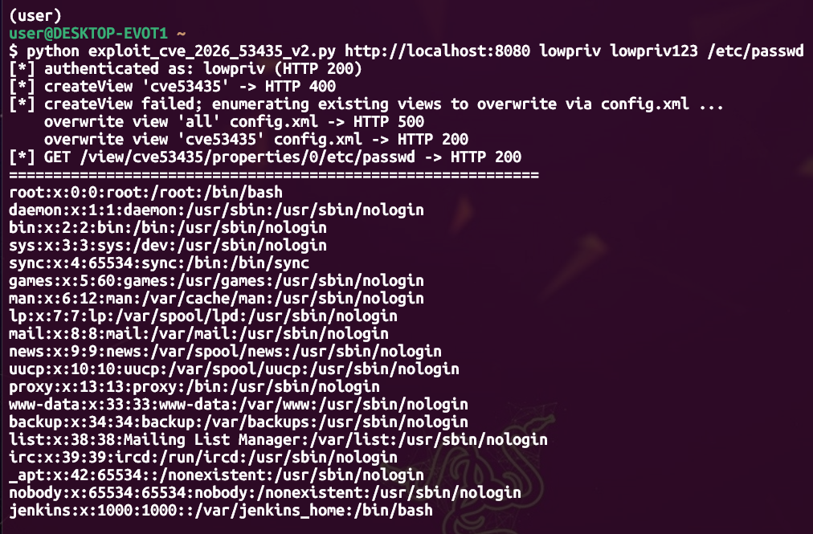

# CVE-2026-53435 — Jenkins Deserialization → Arbitrary File Read (PoC)

> **First public proof-of-concept** for CVE-2026-53435, built when only the
> advisory existed and no PoC was published anywhere.
> Reconstructed from a vague one-line advisory over **~8.5 hours** on a Friday
> night — not by writing the exploit by hand, but by **directing an AI** through
> the dead ends, pivots, and verification until a working chain fell out.



> *The PoC reaching `/etc/passwd` on the controller — arbitrary file read confirmed.*

| | |
|---|---|
| **CVE** | CVE-2026-53435 (Jenkins SECURITY-3707) |
| **Class** | Unsafe deserialization (ClassFilter bypass via config.xml) |
| **Impact (this PoC)** | Authenticated arbitrary file read on the controller |
| **Affected** | Jenkins weekly ≤ 2.567, LTS ≤ 2.555.2 |
| **Fixed** | Jenkins weekly 2.568, LTS 2.555.3 |
| **Advisory** | https://www.jenkins.io/security/advisory/2026-06-10/ (published 2026-06-10) |
| **Status at time of writing** | No public PoC existed (GitHub PoC repos: 0) |

---

## Why this repo exists

This is an experiment in showing the *process*, not just the artifact.

For years, an offensive researcher's output was a single finished exploit — the
8 hours of wrong turns that produced it vanished. This repo keeps the wrong
turns. The full, lightly-edited transcript of a human + AI working a fresh
n-day from advisory to working PoC is included as an appendix.

The point it makes is deliberately *not* "the AI did it." The 8 hours are the
evidence that it didn't. The AI never one-shot the chain. What carried the work
was domain expertise — knowing the advisory was hiding a deserialization sink,
knowing to look in Jenkins **core** types rather than plugins, knowing that a
`DescribableList` pre-patch wouldn't enforce its element type, and knowing how
to *verify* a claim instead of trusting it. The researcher's value didn't
disappear; it moved from **typing the exploit** to **steering, pruning, and
validating**.

That shift is the thing worth documenting.

---

## The vulnerability (root cause)

Jenkins protects deserialization with a custom `ClassFilter` that only permits
types defined in Jenkins core or plugins. CVE-2026-53435 is that this is *not
enough*: an attacker who can POST a `config.xml` can get Jenkins to deserialize
an **arbitrary core/plugin type into a context that never expected it**, and
then reach that object over HTTP via Stapler routing.

This PoC plants a `hudson.Plugin$DummyImpl` (a Jenkins-core type, so it passes
the location whitelist) into a `ListView`'s `<properties>` list — a
`DescribableList<ViewProperty>` that, pre-patch, does not enforce its element
type. The planted object carries `baseResourceURL=file:/`. Routing an HTTP
request to it then serves files straight off the controller's filesystem.

A generic ysoserial chain does **not** work here — the gadget must be a
Jenkins/plugin-resident type to survive the filter. That constraint is the
whole game.

---

## Scope & responsible disclosure

- This PoC demonstrates the **arbitrary file read** impact only.
- The advisory also describes **user impersonation** and **Script Console RCE**
  via the same primitive. Those chains were reached during research but are
  **intentionally withheld** here: the CVE was patched only days before
  publication, and a turnkey RCE would mainly serve mass exploitation of
  unpatched instances. File read is sufficient to prove the impact.
- The vulnerability is **already patched**. All testing was done against a
  **local, isolated lab** (see below) on the author's own machine. No external
  or third-party systems were touched.

**Use only against systems you own or are explicitly authorized to test.**

---

## Proof: it works on vulnerable, fails on patched

The exploit was run against two identical-config containers — vulnerable
`2.555.2` and patched `2.555.3` — to confirm it exercises *this* CVE and not
some unrelated file-read primitive:

| | **2.555.2 (vulnerable)** | **2.555.3 (patched)** |
|---|---|---|
| `createView` | HTTP 200 | HTTP 200 |
| Stored `<properties>` | `<hudson.Plugin_-DummyImpl/>` — **survives** | `<properties/>` — **stripped** |
| Trigger → `/etc/passwd` | `root:x:0:0:...` — **read** | empty — **blocked** |

The patched build accepts the request but the fix **rejects the planted type at
deserialization time**, so the properties list comes back empty and there is
nothing to route to. The failure lands exactly on the mechanism the advisory
describes — which is what makes this a genuine PoC for CVE-2026-53435.

---

## Usage

```bash
python3 exploit_cve_2026_53435_v2.py <base_url> <user> <pass> <remote_file> [view_name]

# example (against your own lab):
python3 exploit_cve_2026_53435_v2.py http://127.0.0.1:8080 <user> <pass> /etc/passwd
```

- `base_url` — `http://host:port` of the target (plain HTTP; do not prefix `https`
  unless the instance actually terminates TLS).
- requires an account with permission to POST a view `config.xml`
  (View/Configure), plus Overall/Read.

---

## Reproduce the lab

```bash
docker compose -f lab/docker-compose.yml up -d
#   vulnerable:  http://127.0.0.1:8080   (Jenkins LTS 2.555.2)
#   patched:     http://127.0.0.1:8081   (Jenkins LTS 2.555.3, negative control)
```

The lab provisions a local-only user database via Groovy init so the
authenticated-low-privilege path can be exercised without an external IdP.

---

## Timeline — ~8.5 hours, one Friday night

```
2026-06-12 (Fri)  15:00 → 23:23   ≈ 8h 20m

  15:00–15:12   Lab built (docker: vuln 2.555.2 / patched 2.555.3) + first recon
  15:12–21:00   Deserialization sink & gadget analysis
                  (Commons-Collections bypass attempts failed → pivot
                   from properties to actions and back)
  21:00–22:30   ClassFilter analysis + gadget re-hunt, restricted to core types
  22:30–23:00   Working PoC (v1 → v2) + differential verification (vuln vs patched)
```

Most of those hours were *analysis*, not typing. The exploit itself came
together in the last ~30 minutes — once the right sink and gadget were known.

---

## How this was built

Built with **Claude Code** (Anthropic), driven interactively by the author:

- **Main model:** Claude **Opus 4.8** (Claude Max)
- **Portions:** Claude **Fable 5** (Mythos-class tier)

<!-- If you actually ran on Claude Mythos 5 (approved-org access), change the
     line above to "Claude Mythos 5". Otherwise leave as Fable 5 — Mythos 5 is
     not what a standard Claude Max session uses. -->

The complete, lightly-edited working transcript is in
[`transcript/`](./transcript/) — kept raw, including the dead ends. (Edited only
to soften a few lines of tone and to mask local network details; nothing
technical was removed.)

---

## Disclaimer

For authorized security testing, research, and education only. The author and
contributors accept no liability for misuse. The targeted vulnerability is
patched — update to Jenkins LTS 2.555.3 / weekly 2.568 or later.
