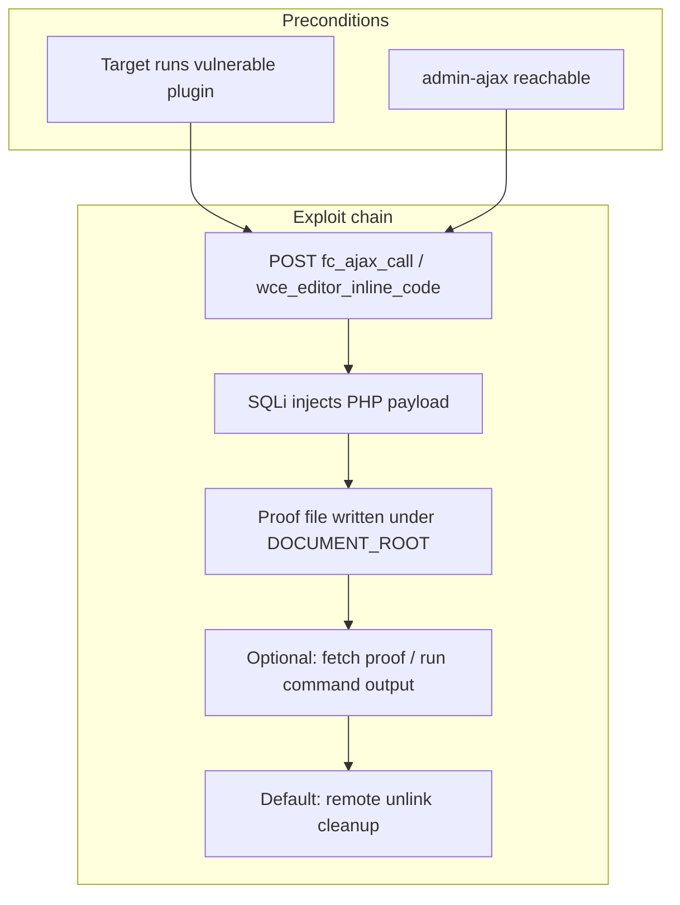

<div align="center">

# CVE-2026-6433 — Proof of Concept

**FlipperCode — Custom CSS, JS & PHP** · Unauthenticated **SQL injection** → **RCE** (via `eval()`)

[](https://cve.mitre.org/cgi-bin/cvename.cgi?name=CVE-2026-6433)
[](https://www.python.org/)
[](https://wordpress.org/plugins/)
[](https://github.com/murrez)

<sub>Affected: **FlipperCode Custom CSS, JS & PHP ≤ 2.0.7** · WordPress plugin surface via `admin-ajax.php`</sub>

</div>

---

## At a glance

| Item | Detail |
|------|--------|
| **Vector** | Unauthenticated SQLi tunneled through plugin AJAX actions |
| **Impact** | Remote code execution on the WordPress host (payload written to docroot, then executed in PHP context) |
| **Script** | [`CVE-2026-6433.py`](CVE-2026-6433.py) — stdlib only (`urllib`, `ssl`, `threading`, `concurrent.futures`) |
| **Modes** | Single URL **or** **bulk** file with **multi-threaded** workers |
| **Discovery** | Dr. John Umoru, **ClarenSec Limited** |
| **Bulk / threading** | [github.com/murrez](https://github.com/murrez) |



---

## Why this README looks “colorful”

On GitHub, **badges**, **tables**, and **diagrams** render with strong visual contrast. This document is structured so you can **skim** (badges + tables) or **read deeply** (sections below).

---

## Requirements

- **Python 3.x** (no `pip install` required — standard library only)
- Network access to the WordPress site under test
- **Legal authorization** to test the target (see disclaimer)

---

## Quick start

Clone or download this folder, then:

```bash
# Help / all flags
python CVE-2026-6433.py --help
```

### Single target

```bash
# PHP-only proof (writes a small proof file; good for locked-down shells)
python CVE-2026-6433.py https://target.example --php-only --no-cleanup

# Run an OS command and print captured output (if execution functions exist remotely)
python CVE-2026-6433.py https://target.example --command "id"

# Only attempt to delete the proof file (cleanup mode)
python CVE-2026-6433.py https://target.example --cleanup-only
```

### Bulk scan (multi-threaded)

Use a text file with **one base URL per line**. Lines starting with `#` and blank lines are ignored.

```bash
python CVE-2026-6433.py --bulk targets.txt --threads 8
```

Example `targets.txt`:

```text
# Lab hosts — replace with authorized systems only
https://site-a.example
https://site-b.example
```

**Notes:**

- Do **not** pass a positional URL **and** `--bulk` at the same time.
- Worker count is capped at the number of targets (`min(threads, len(targets))`).
- Exit code **`1`** if any bulk target fails.

---

## Command-line reference

| Flag | Meaning |
|------|---------|
| `target` | Single WordPress **base URL** (omit when using `--bulk`) |
| `--command CMD` | Run shell command remotely (uses `shell_exec`, `exec`, `system`, `passthru`, or `popen` when available) |
| `--php-only` | Write PHP metadata proof instead of relying on `--command` |
| `--no-cleanup` | Do **not** delete the remote proof file after a successful run |
| `--proof-name NAME` | Remote filename (default: `rce-proof.txt`) |
| `--cleanup-only` | Only send unlink payload and report whether the file is gone |
| `--bulk FILE` | Read many targets from `FILE` |
| `--threads N` | Concurrent workers for `--bulk` (default: **5**) |

---

## What success / failure looks like

### Single target

- On failure you’ll see `FAIL: …` and the process exits with code **`1`**.
- On success you’ll see either the **proof URL**, **command output**, or **cleanup** status depending on flags.

### Bulk mode

- Lines prefixed with `[Bulk scan]` summarize progress.
- Each host prints **`[OK]`** or **`[FAIL]`** with a reason.

---

## Operational & safety notes

- The script **disables TLS certificate verification** for convenience in lab setups. **Do not** treat that as a production-safe pattern.
- Default behavior tries to **delete** the proof file after exploitation — use `--no-cleanup` when you must preserve evidence **in an authorized** engagement.
- If the plugin is inactive, blocked by a WAF, or the host hardens PHP execution, steps may fail with clear error messages in stdout/stderr.

---

## Credits

| Role | Credit |
|------|--------|
| **Original discovery** | Dr. John Umoru — **ClarenSec Limited** |
| **Bulk / multi-threaded harness** | [github.com/murrez](https://github.com/murrez) |

---

> [!WARNING]
> **Legal & ethical use only**
>
> This proof-of-concept exists for **education**, **defensive research**, and **authorized security testing**.  
> Running it against systems **without explicit written permission** may violate computer misuse laws in your jurisdiction.  
> The authors and contributors **accept no liability** for misuse.

---

<div align="center">

<sub>Last README structure tuned for **readability**: badges · tables · flowchart · explicit flags.</sub>

</div>
