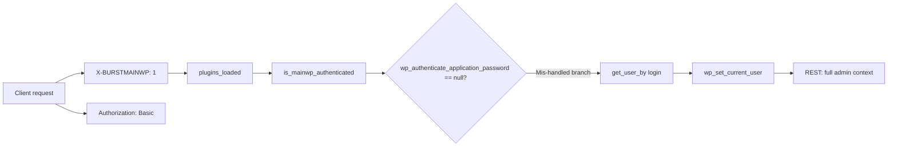
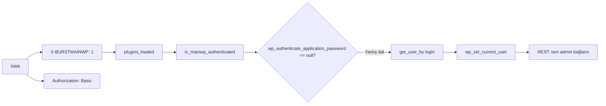

<!-- README: CVE-2026-8181 Burst Statistics PoC | bilingual doc: mürrez -->

<div align="center">

  <a href="https://www.wordfence.com/">
    
  </a>

  <br/>

  

  <br/>

  

  <br/><br/>

  
  
  
  

  <p align="center">
    <strong>EN:</strong> Controlled PoC and brief technical notes for <strong>authorized security testing</strong> of the authentication bypass in <strong>Burst Statistics</strong>.<br/><br/>
    <strong>TR:</strong> <strong>Burst Statistics</strong> eklentisindeki kimlik doğrulama atlatası için <strong>yetkili güvenlik testi</strong> amaçlı kontrollü PoC ve kısa teknik özet.
  </p>

</div>

---

## Project overview / Proje özeti

### English

| Field | Detail |
|:---:|:---|
| **What** | **Authentication bypass** (CWE-287) in [Burst Statistics](https://wordpress.org/plugins/burst-statistics/): crafted headers can escalate REST requests to **full admin context**. |
| **Versions** | **Vulnerable:** `3.4.0`, `3.4.1`, `3.4.1.1` · **Use:** **`3.4.2` or newer** |
| **Severity** | CVSS ~9.8 (Critical); remote, unauthenticated in applicable conditions. |
| **This repo** | `CVE-2026-8181.py` — lab automation: single target, bulk list, thread pool, selective TXT output. |

> **Note:** The **[200,000+ active installs](https://wordpress.org/plugins/burst-statistics/)** figure on WordPress.org is the **entire user base** of the plugin — it does **not** mean every site runs a **vulnerable version**. Real impact requires checking **version + environment** (HTTP / application-password availability, etc.).

### Türkçe

| Alan | Detay |
|:---:|:---|
| **Ne** | [Burst Statistics](https://wordpress.org/plugins/burst-statistics/) için **kimlik doğrulama atlatası** (CWE-287). Özel başlıklar ile REST isteğinde **tam yönetici bağlamı**. |
| **Sürüm** | **Etkilenir:** `3.4.0`, `3.4.1`, `3.4.1.1` · **Önerilir:** **`3.4.2` ve üzeri** |
| **Ciddiyet** | CVSS ~9.8 (Critical); uygun koşullarda uzaktan ve kimlik gerektirmeden. |
| **Bu depo** | `CVE-2026-8181.py` — lab otomasyonu: tek hedef, liste taraması, iş parçacığı havuzu, seçici TXT çıktısı. |

> **Not:** WordPress.org’daki **[200.000+ aktif kurulum](https://wordpress.org/plugins/burst-statistics/)** sayısı eklentinin **tüm kullanıcı tabanıdır**; sitelerin **tamamının zafiyetli sürümde** olduğu anlamına **gelmez**. Gerçek etki için **sürüm + ortam** (HTTP, uygulama parolası uygunluğu vb.) doğrulanmalıdır.

---

## Visuals / Dokümantasyon görselleri

### English

GitHub-flavored Markdown does not embed binary **GIFs** without a file in the repo. The **Typing SVG** snippets above (CDN) simulate motion. To add your own screen capture:

```markdown

```

### Türkçe

GitHub Markdown, repoda dosya olmadan **GIF** gömmeyi desteklemez. Üstteki **Typing SVG** (CDN) yazı animasyonu verir. Kendi demosun için:

```markdown

```

---

## Attack chain (Mermaid) / Saldırı zinciri

### English — diagram labels



### Türkçe — aynı akış



---

## Tool features / Araç yetenekleri

### English

| Feature | Description |
|--------|-------------|
| **Single target** | `-u` base URL |
| **Bulk targets** | `-f targets.txt` (one URL per line; `#` comments) |
| **Concurrency** | `-j N` workers (capped) |
| **Combined file** | `-o file.txt` — with `-f`, **only successful exploits** are appended |
| **Per-host files** | `--output-dir` — **only successes** get `host.txt` (failures skipped) |
| **New admin** | `--create-user` — random user via REST (password then appears in report) |
| **TLS (lab)** | `-k` disables certificate verification (trusted labs only) |

With `-f`, **`-o` and `--output-dir` are mutually exclusive.**

### Türkçe

| Özellik | Açıklama |
|--------|-----------|
| **Tek hedef** | `-u` kök adres |
| **Çoklu hedef** | `-f targets.txt` (satır başına URL; `#` yorumu) |
| **Paralellik** | `-j N` işçi (üst sınırlı) |
| **Tek dosya** | `-o dosya.txt` — `-f` ile **yalnızca başarılı exploit** eklenir |
| **Klasör çıktısı** | `--output-dir` — **sadece başarılılar** `host.txt` alır |
| **Yeni admin** | `--create-user` — REST ile rastgele kullanıcı (şifre raporda) |
| **TLS (lab)** | `-k` sertifika doğrulamasını kapatır (yalnızca güvenilir lab) |

`-f` modunda **`-o` ile `--output-dir` aynı anda kullanılamaz.**

---

## Install / Kurulum

```bash
pip3 install requests urllib3
```

---

## Usage examples / Kullanım örnekleri

### English

```bash
# Single site, report file
python3 CVE-2026-8181.py -u http://lab.local -U admin -o report.txt -k

# Single site + new admin (lab)
python3 CVE-2026-8181.py -u http://lab.local -U admin --create-user -o report.txt -k

# Bulk + combined file (successes only)
python3 CVE-2026-8181.py -f targets.txt -j 20 -o successes.txt -k

# Bulk + per-host files in folder (successes only)
python3 CVE-2026-8181.py -f targets.txt -j 20 --output-dir ./results -k
```

### Türkçe

```bash
# Tek site, rapor
python3 CVE-2026-8181.py -u http://lab.local -U admin -o sonuc.txt -k

# Tek site + yeni yönetici (lab)
python3 CVE-2026-8181.py -u http://lab.local -U admin --create-user -o sonuc.txt -k

# Çoklu + birleşik dosya (yalnızca başarılılar)
python3 CVE-2026-8181.py -f targets.txt -j 20 -o basarili.txt -k

# Çoklu + klasörde site başına dosya (yalnızca başarılılar)
python3 CVE-2026-8181.py -f targets.txt -j 20 --output-dir ./results -k
```

---

## Empty `Password:` field / Boş parola satırı

### English

A successful bypass **does not leak the victim user’s real password** — the Basic password in the PoC is **fake**. The `Password:` line stays empty unless **`--create-user`** created a **new** account (then the generated password is written).

### Türkçe

Başarılı bypass **mevcut kullanıcının gerçek parolasını sızdırmaz** — PoC’taki Basic parola **sahtedir**. `Password:` satırı **`--create-user`** ile **yeni** hesap oluşturulmadıkça boş kalır; oluşturulduysa üretilen şifre yazılır.

---

## References / Kaynaklar

### English

- [Burst Statistics — WordPress Plugin Directory](https://wordpress.org/plugins/burst-statistics/)
- Often cited in coordinated disclosure: **Wordfence Threat Intelligence**, **PRISM**
- CVE: [MITRE CVE-2026-8181](https://cve.mitre.org/cgi-bin/cvename.cgi?name=CVE-2026-8181) · [NVD](https://nvd.nist.gov/vuln/detail/CVE-2026-8181)

### Türkçe

- [Burst Statistics — WordPress eklenti dizini](https://wordpress.org/plugins/burst-statistics/)
- Koordineli açıklamada sık geçen: **Wordfence Threat Intelligence**, **PRISM**
- CVE: [MITRE CVE-2026-8181](https://cve.mitre.org/cgi-bin/cvename.cgi?name=CVE-2026-8181) · [NVD](https://nvd.nist.gov/vuln/detail/CVE-2026-8181)

---

## Disclaimer / Feragatname

### English

For **written-authorized** assessments and **your own lab** only. Unauthorized use is illegal in many jurisdictions. Authors and this README’s maintainer accept **no liability** for misuse.

### Türkçe

**Yazılı izinli** değerlendirmeler ve **kendi laboratuvarınız** içindir. İzinsiz kullanım birçok ülkede **yasadışıdır**. Yazarlar ve bu README’nin düzenleyicisi kötüye kullanımdan **sorumlu değildir**.
